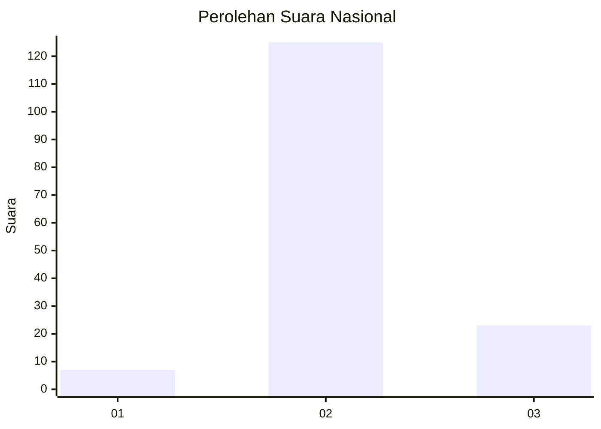

# Hasil

## Grafik

## Tabel

| No. | Nama Paslon    | Suara | Suara (raw) | Persentase |
|:--- |:-------------- | -----:| -----------:| ----------:|
| 1   | ANIES MUHAIMIN | 7     | [7][p-1]    | 4,52       |
| 2   | PRABOWO GIBRAN | 125   | [125][p-2]  | 80,65      |
| 3   | GANJAR MAHFUD  | 23    | [23][p-3]   | 14,84      |

[p-1]: https://github.com/gigit-pemilu/pemilu-2024/blob/main/pilpres/hitung-suara/sub/16-sumatera-selatan/sub/05-musi-rawas/sub/10-stl-ulu-terawas/sub/2014-sukamerindu/sub/006-tps/sub/paslon-1.txt
[p-2]: https://github.com/gigit-pemilu/pemilu-2024/blob/main/pilpres/hitung-suara/sub/16-sumatera-selatan/sub/05-musi-rawas/sub/10-stl-ulu-terawas/sub/2014-sukamerindu/sub/006-tps/sub/paslon-2.txt
[p-3]: https://github.com/gigit-pemilu/pemilu-2024/blob/main/pilpres/hitung-suara/sub/16-sumatera-selatan/sub/05-musi-rawas/sub/10-stl-ulu-terawas/sub/2014-sukamerindu/sub/006-tps/sub/paslon-3.txt

## Foto C Plano

https://sirekap-obj-formc.kpu.go.id/9055/pemilu/ppwp/16/05/10/20/14/1605102014006-20240215-025906--d0eb91f3-cdad-4456-afd2-b2f2009a8006.jpg

https://sirekap-obj-formc.kpu.go.id/9055/pemilu/ppwp/16/05/10/20/14/1605102014006-20240215-030051--92088f33-3f18-46ab-894a-036950b57309.jpg

https://sirekap-obj-formc.kpu.go.id/9055/pemilu/ppwp/16/05/10/20/14/1605102014006-20240215-030211--4087b9db-bc36-46cd-85c5-7752b043411e.jpg

## Metadata

| Key        | Value               |
| ---------- | ------------------- |
| Time Stamp | 2024-02-24 22:31:28 |

