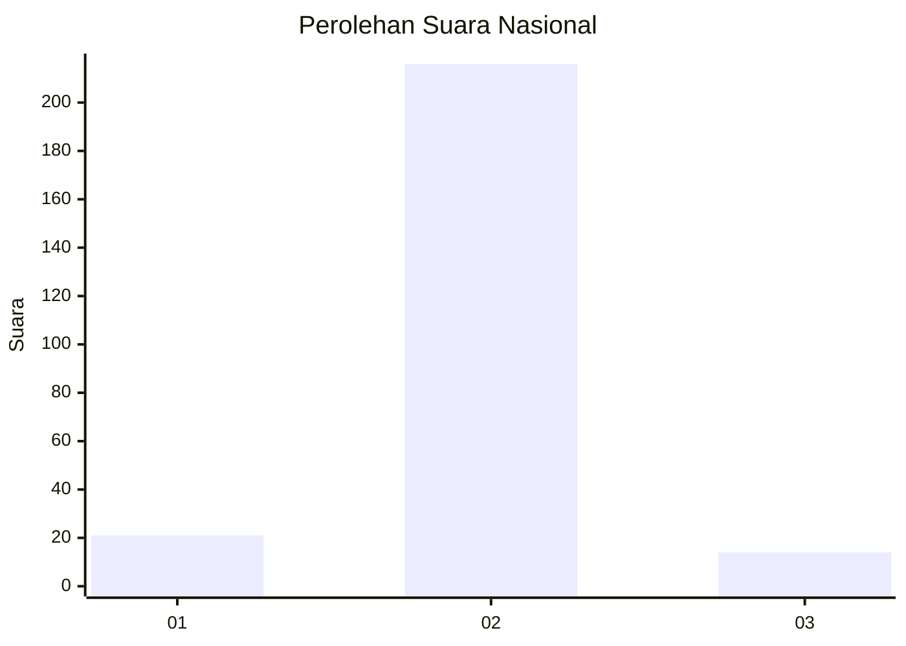
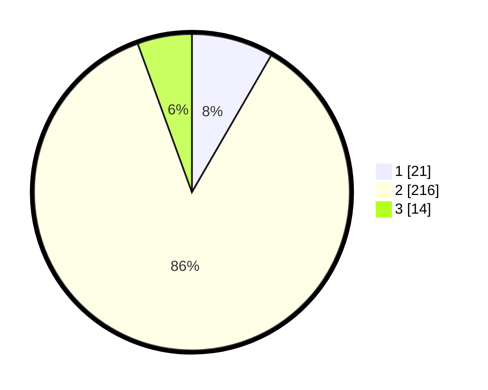

# Hasil

## Grafik

## Tabel

| No. | Nama Paslon    | Suara | Suara (raw) | Persentase |
|:--- |:-------------- | -----:| -----------:| ----------:|
| 1   | ANIES MUHAIMIN | 21    | [21][p-1]   | 8,37       |
| 2   | PRABOWO GIBRAN | 216   | [216][p-2]  | 86,06      |
| 3   | GANJAR MAHFUD  | 14    | [14][p-3]   | 5,58       |

[p-1]: https://github.com/gigit-pemilu/pemilu-2024/blob/main/pilpres/hitung-suara/sub/16-sumatera-selatan/sub/05-musi-rawas/sub/10-stl-ulu-terawas/sub/2018-pasenan/sub/003-tps/sub/paslon-1.txt
[p-2]: https://github.com/gigit-pemilu/pemilu-2024/blob/main/pilpres/hitung-suara/sub/16-sumatera-selatan/sub/05-musi-rawas/sub/10-stl-ulu-terawas/sub/2018-pasenan/sub/003-tps/sub/paslon-2.txt
[p-3]: https://github.com/gigit-pemilu/pemilu-2024/blob/main/pilpres/hitung-suara/sub/16-sumatera-selatan/sub/05-musi-rawas/sub/10-stl-ulu-terawas/sub/2018-pasenan/sub/003-tps/sub/paslon-3.txt

## Foto C Plano

https://sirekap-obj-formc.kpu.go.id/dc8d/pemilu/ppwp/16/05/10/20/18/1605102018003-20240221-101645--578b45e6-2f50-4d2f-a382-77a5211a0246.jpg

https://sirekap-obj-formc.kpu.go.id/dc8d/pemilu/ppwp/16/05/10/20/18/1605102018003-20240221-101748--a78a936f-e837-4dcf-a54d-4696e0fe4aca.jpg

https://sirekap-obj-formc.kpu.go.id/dc8d/pemilu/ppwp/16/05/10/20/18/1605102018003-20240221-101907--4be6cbad-85d8-4bf5-9453-a7f6e010f247.jpg

## Metadata

| Key        | Value               |
| ---------- | ------------------- |
| Time Stamp | 2024-02-24 22:31:28 |

