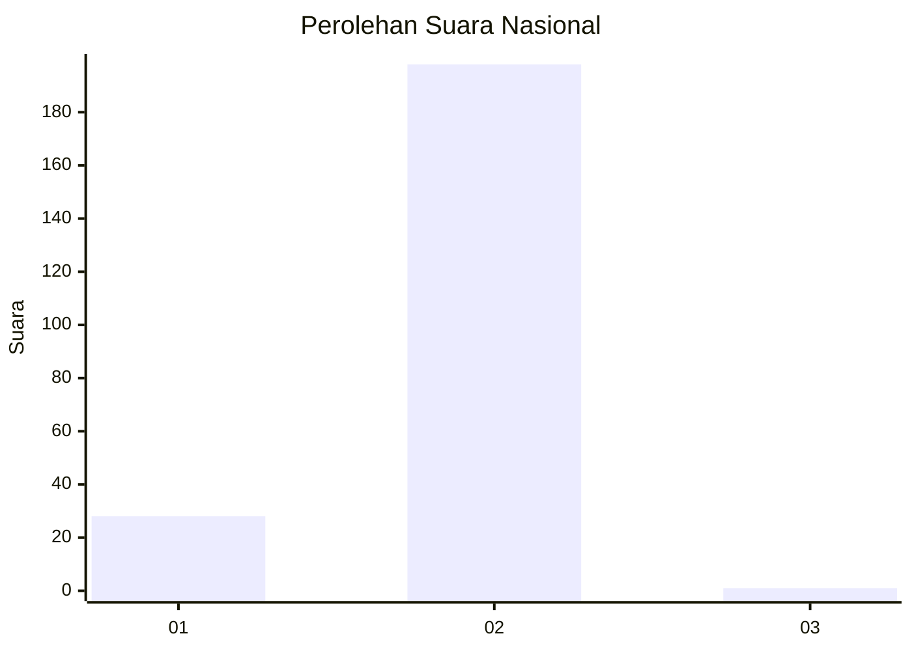
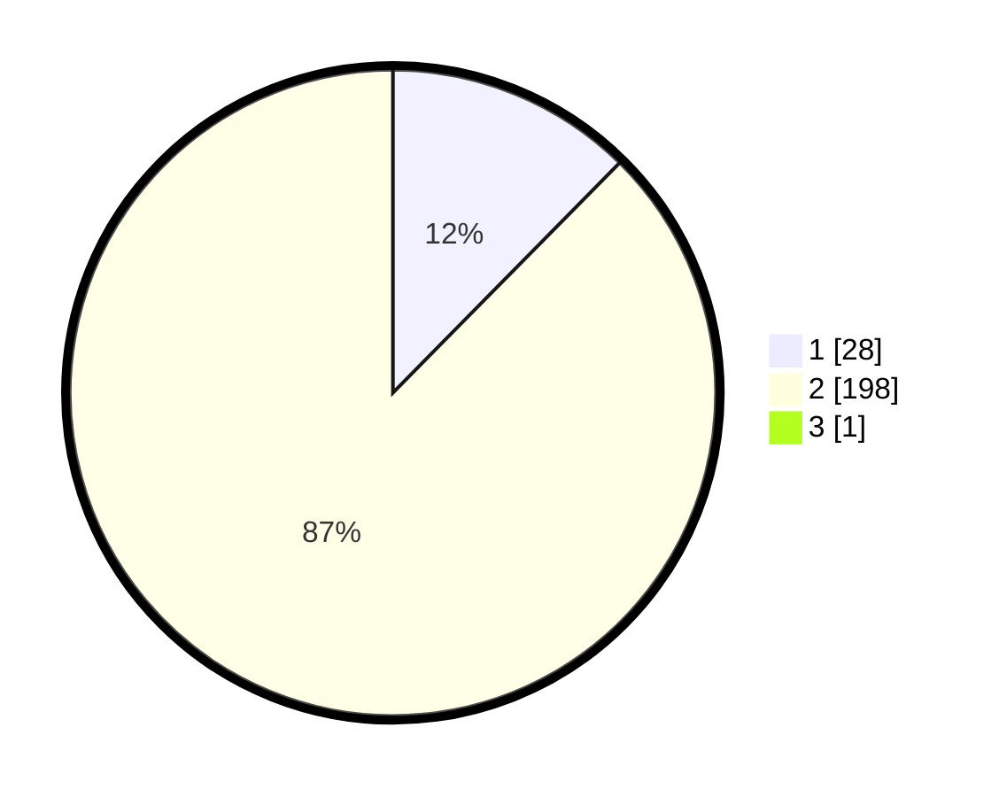

# Hasil

## Grafik

## Tabel

| No. | Nama Paslon    | Suara | Suara (raw) | Persentase |
|:--- |:-------------- | -----:| -----------:| ----------:|
| 1   | ANIES MUHAIMIN | 28    | [28][p-1]   | 12,33      |
| 2   | PRABOWO GIBRAN | 198   | [198][p-2]  | 87,22      |
| 3   | GANJAR MAHFUD  | 1     | [1][p-3]    | 0,44       |

[p-1]: https://github.com/gigit-pemilu/pemilu-2024/blob/main/pilpres/hitung-suara/sub/16-sumatera-selatan/sub/05-musi-rawas/sub/10-stl-ulu-terawas/sub/2018-pasenan/sub/005-tps/sub/paslon-1.txt
[p-2]: https://github.com/gigit-pemilu/pemilu-2024/blob/main/pilpres/hitung-suara/sub/16-sumatera-selatan/sub/05-musi-rawas/sub/10-stl-ulu-terawas/sub/2018-pasenan/sub/005-tps/sub/paslon-2.txt
[p-3]: https://github.com/gigit-pemilu/pemilu-2024/blob/main/pilpres/hitung-suara/sub/16-sumatera-selatan/sub/05-musi-rawas/sub/10-stl-ulu-terawas/sub/2018-pasenan/sub/005-tps/sub/paslon-3.txt

## Foto C Plano

https://sirekap-obj-formc.kpu.go.id/1a87/pemilu/ppwp/16/05/10/20/18/1605102018005-20240221-100336--1ce65560-c159-4a4d-86bc-d2efec1adced.jpg

https://sirekap-obj-formc.kpu.go.id/1a87/pemilu/ppwp/16/05/10/20/18/1605102018005-20240221-100420--14fc2713-25cd-4ec5-b960-dd226700ba63.jpg

https://sirekap-obj-formc.kpu.go.id/1a87/pemilu/ppwp/16/05/10/20/18/1605102018005-20240221-100803--8f62bbf7-e81d-4a76-b607-4461b4ba5bd8.jpg

## Metadata

| Key        | Value               |
| ---------- | ------------------- |
| Time Stamp | 2024-02-25 15:00:00 |

