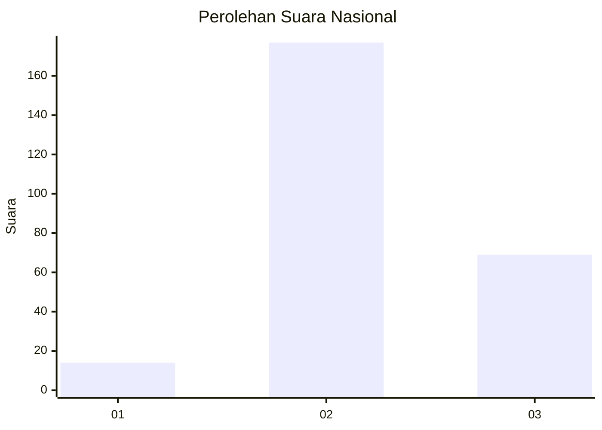

# Hasil

## Grafik

## Tabel

| No. | Nama Paslon    | Suara | Suara (raw) | Persentase |
|:--- |:-------------- | -----:| -----------:| ----------:|
| 1   | ANIES MUHAIMIN | 14    | [14][p-1]   | 5,38       |
| 2   | PRABOWO GIBRAN | 177   | [177][p-2]  | 68,08      |
| 3   | GANJAR MAHFUD  | 69    | [69][p-3]   | 26,54      |

[p-1]: https://github.com/gigit-pemilu/pemilu-2024/blob/main/pilpres/hitung-suara/sub/16-sumatera-selatan/sub/05-musi-rawas/sub/10-stl-ulu-terawas/sub/2020-sukamana/sub/008-tps/sub/paslon-1.txt
[p-2]: https://github.com/gigit-pemilu/pemilu-2024/blob/main/pilpres/hitung-suara/sub/16-sumatera-selatan/sub/05-musi-rawas/sub/10-stl-ulu-terawas/sub/2020-sukamana/sub/008-tps/sub/paslon-2.txt
[p-3]: https://github.com/gigit-pemilu/pemilu-2024/blob/main/pilpres/hitung-suara/sub/16-sumatera-selatan/sub/05-musi-rawas/sub/10-stl-ulu-terawas/sub/2020-sukamana/sub/008-tps/sub/paslon-3.txt

## Foto C Plano

https://sirekap-obj-formc.kpu.go.id/e622/pemilu/ppwp/16/05/10/20/20/1605102020008-20240215-111026--48ec47b6-7af2-49f4-a561-5569d04553ea.jpg

https://sirekap-obj-formc.kpu.go.id/e622/pemilu/ppwp/16/05/10/20/20/1605102020008-20240214-232827--7db6c3e7-2920-43b8-b9e8-dd5db18ef137.jpg

https://sirekap-obj-formc.kpu.go.id/e622/pemilu/ppwp/16/05/10/20/20/1605102020008-20240214-233025--2620bdc1-e7ce-4513-9c66-a0dd47c2257e.jpg

## Metadata

| Key        | Value               |
| ---------- | ------------------- |
| Time Stamp | 2024-02-25 17:00:00 |

