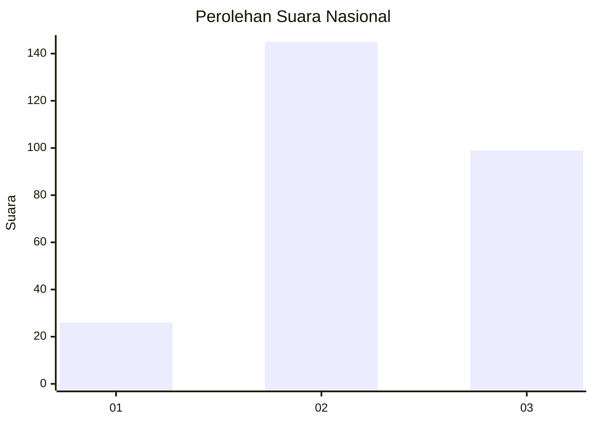
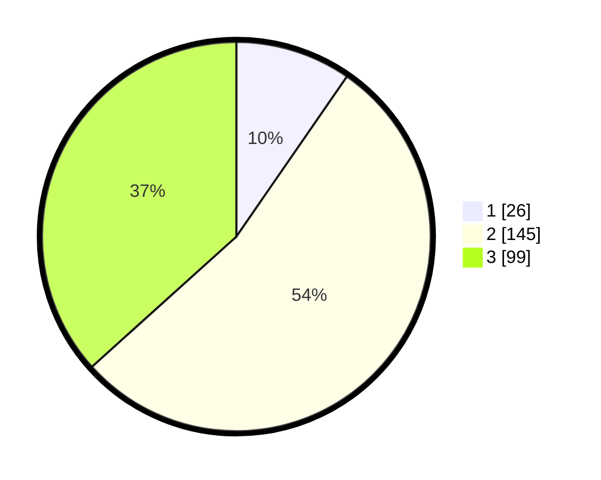

# Hasil

## Grafik

## Tabel

| No. | Nama Paslon    | Suara | Suara (raw) | Persentase |
|:--- |:-------------- | -----:| -----------:| ----------:|
| 1   | ANIES MUHAIMIN | 26    | [26][p-1]   | 9,63       |
| 2   | PRABOWO GIBRAN | 145   | [145][p-2]  | 53,70      |
| 3   | GANJAR MAHFUD  | 99    | [99][p-3]   | 36,67      |

[p-1]: https://github.com/gigit-pemilu/pemilu-2024/blob/main/pilpres/hitung-suara/sub/16-sumatera-selatan/sub/05-musi-rawas/sub/10-stl-ulu-terawas/sub/2020-sukamana/sub/010-tps/sub/paslon-1.txt
[p-2]: https://github.com/gigit-pemilu/pemilu-2024/blob/main/pilpres/hitung-suara/sub/16-sumatera-selatan/sub/05-musi-rawas/sub/10-stl-ulu-terawas/sub/2020-sukamana/sub/010-tps/sub/paslon-2.txt
[p-3]: https://github.com/gigit-pemilu/pemilu-2024/blob/main/pilpres/hitung-suara/sub/16-sumatera-selatan/sub/05-musi-rawas/sub/10-stl-ulu-terawas/sub/2020-sukamana/sub/010-tps/sub/paslon-3.txt

## Foto C Plano

https://sirekap-obj-formc.kpu.go.id/6c3c/pemilu/ppwp/16/05/10/20/20/1605102020010-20240215-040931--18d78ade-af28-48dc-9b71-de49b7289d83.jpg

https://sirekap-obj-formc.kpu.go.id/6c3c/pemilu/ppwp/16/05/10/20/20/1605102020010-20240215-041217--31322fd9-7867-45b9-9105-04be53e28881.jpg

https://sirekap-obj-formc.kpu.go.id/6c3c/pemilu/ppwp/16/05/10/20/20/1605102020010-20240215-041531--86fec212-9f26-4f6e-9dd5-f6c83f76d157.jpg

## Metadata

| Key        | Value               |
| ---------- | ------------------- |
| Time Stamp | 2024-02-20 18:00:00 |

