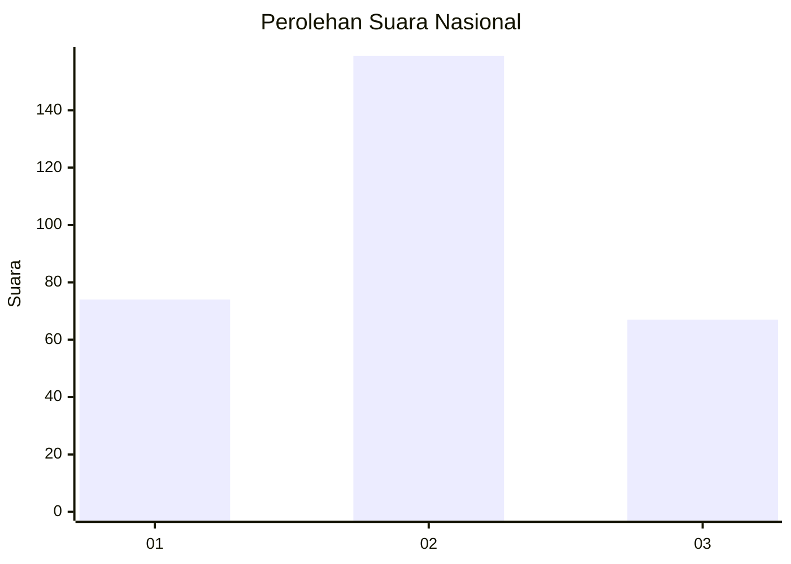
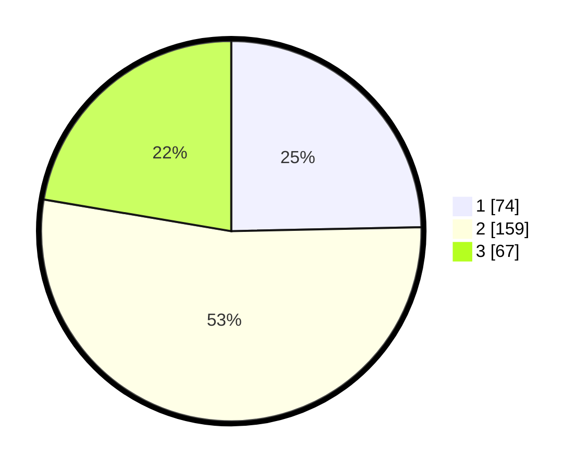

# Hasil

## Grafik

## Tabel

| No. | Nama Paslon    | Suara | Suara (raw) | Persentase |
|:--- |:-------------- | -----:| -----------:| ----------:|
| 1   | ANIES MUHAIMIN | 74    | [74][p-1]   | 24,67      |
| 2   | PRABOWO GIBRAN | 159   | [159][p-2]  | 53,00      |
| 3   | GANJAR MAHFUD  | 67    | [67][p-3]   | 22,33      |

[p-1]: https://github.com/gigit-pemilu/pemilu-2024/blob/main/pilpres/hitung-suara/sub/16-sumatera-selatan/sub/05-musi-rawas/sub/10-stl-ulu-terawas/sub/2022-sukaraya-baru/sub/005-tps/sub/paslon-1.txt
[p-2]: https://github.com/gigit-pemilu/pemilu-2024/blob/main/pilpres/hitung-suara/sub/16-sumatera-selatan/sub/05-musi-rawas/sub/10-stl-ulu-terawas/sub/2022-sukaraya-baru/sub/005-tps/sub/paslon-2.txt
[p-3]: https://github.com/gigit-pemilu/pemilu-2024/blob/main/pilpres/hitung-suara/sub/16-sumatera-selatan/sub/05-musi-rawas/sub/10-stl-ulu-terawas/sub/2022-sukaraya-baru/sub/005-tps/sub/paslon-3.txt

## Foto C Plano

https://sirekap-obj-formc.kpu.go.id/cbbd/pemilu/ppwp/16/05/10/20/22/1605102022005-20240215-154130--211e8ffc-4813-4f92-af0c-7b7508cc6655.jpg

https://sirekap-obj-formc.kpu.go.id/cbbd/pemilu/ppwp/16/05/10/20/22/1605102022005-20240215-154145--67615fd0-76ca-4ccb-9b2d-57f160be11a5.jpg

https://sirekap-obj-formc.kpu.go.id/cbbd/pemilu/ppwp/16/05/10/20/22/1605102022005-20240216-124136--7546041d-0849-40b2-b548-7890291e48fb.jpg

## Metadata

| Key        | Value               |
| ---------- | ------------------- |
| Time Stamp | 2024-02-16 12:51:22 |

