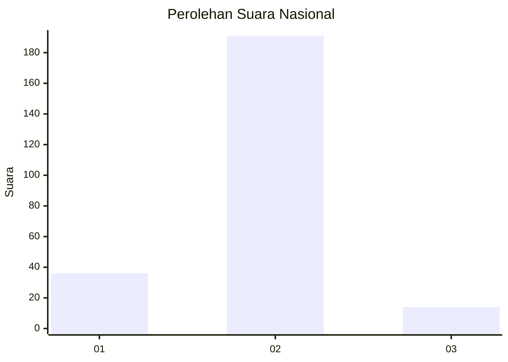
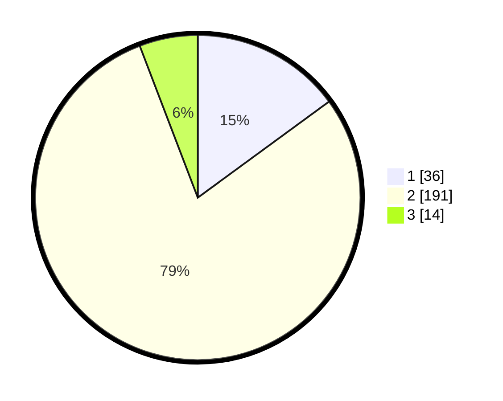

# Hasil

## Grafik

## Tabel

| No. | Nama Paslon    | Suara | Suara (raw) | Persentase |
|:--- |:-------------- | -----:| -----------:| ----------:|
| 1   | ANIES MUHAIMIN | 36    | [36][p-1]   | 14,94      |
| 2   | PRABOWO GIBRAN | 191   | [191][p-2]  | 79,25      |
| 3   | GANJAR MAHFUD  | 14    | [14][p-3]   | 5,81       |

[p-1]: https://github.com/gigit-pemilu/pemilu-2024/blob/main/pilpres/hitung-suara/sub/16-sumatera-selatan/sub/05-musi-rawas/sub/11-selangit/sub/1001-selangit/sub/004-tps/sub/paslon-1.txt
[p-2]: https://github.com/gigit-pemilu/pemilu-2024/blob/main/pilpres/hitung-suara/sub/16-sumatera-selatan/sub/05-musi-rawas/sub/11-selangit/sub/1001-selangit/sub/004-tps/sub/paslon-2.txt
[p-3]: https://github.com/gigit-pemilu/pemilu-2024/blob/main/pilpres/hitung-suara/sub/16-sumatera-selatan/sub/05-musi-rawas/sub/11-selangit/sub/1001-selangit/sub/004-tps/sub/paslon-3.txt

## Foto C Plano

https://sirekap-obj-formc.kpu.go.id/d8cb/pemilu/ppwp/16/05/11/10/01/1605111001004-20240215-151401--1dd0a7c7-83f4-4a1a-8bd9-834b1c984f38.jpg

https://sirekap-obj-formc.kpu.go.id/d8cb/pemilu/ppwp/16/05/11/10/01/1605111001004-20240215-140627--75f7ec84-6985-4906-ba9a-d650e05ecbcd.jpg

https://sirekap-obj-formc.kpu.go.id/d8cb/pemilu/ppwp/16/05/11/10/01/1605111001004-20240215-114117--ee0598b8-877c-4e63-b5db-d4e523663e4c.jpg

## Metadata

| Key        | Value               |
| ---------- | ------------------- |
| Time Stamp | 2024-02-25 20:00:00 |

