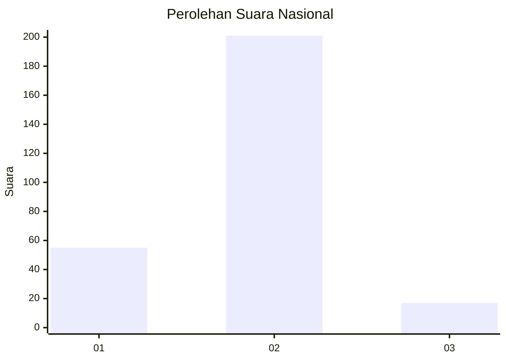

# Hasil

## Grafik

## Tabel

| No. | Nama Paslon    | Suara | Suara (raw) | Persentase |
|:--- |:-------------- | -----:| -----------:| ----------:|
| 1   | ANIES MUHAIMIN | 55    | [55][p-1]   | 20,15      |
| 2   | PRABOWO GIBRAN | 201   | [201][p-2]  | 73,63      |
| 3   | GANJAR MAHFUD  | 17    | [17][p-3]   | 6,23       |

[p-1]: https://github.com/gigit-pemilu/pemilu-2024/blob/main/pilpres/hitung-suara/sub/16-sumatera-selatan/sub/05-musi-rawas/sub/11-selangit/sub/2002-lubuk-ngin/sub/010-tps/sub/paslon-1.txt
[p-2]: https://github.com/gigit-pemilu/pemilu-2024/blob/main/pilpres/hitung-suara/sub/16-sumatera-selatan/sub/05-musi-rawas/sub/11-selangit/sub/2002-lubuk-ngin/sub/010-tps/sub/paslon-2.txt
[p-3]: https://github.com/gigit-pemilu/pemilu-2024/blob/main/pilpres/hitung-suara/sub/16-sumatera-selatan/sub/05-musi-rawas/sub/11-selangit/sub/2002-lubuk-ngin/sub/010-tps/sub/paslon-3.txt

## Foto C Plano

https://sirekap-obj-formc.kpu.go.id/b44b/pemilu/ppwp/16/05/11/20/02/1605112002010-20240214-202121--e40c0f16-df1b-4309-b0db-fa55e5fe2756.jpg

https://sirekap-obj-formc.kpu.go.id/b44b/pemilu/ppwp/16/05/11/20/02/1605112002010-20240214-202140--fd246df6-971d-4bd3-a006-94bd8748859b.jpg

https://sirekap-obj-formc.kpu.go.id/b44b/pemilu/ppwp/16/05/11/20/02/1605112002010-20240214-202156--3a12b74c-639a-4521-8ad4-d21f9ca5f8b7.jpg

## Metadata

| Key        | Value               |
| ---------- | ------------------- |
| Time Stamp | 2024-02-25 12:00:00 |

