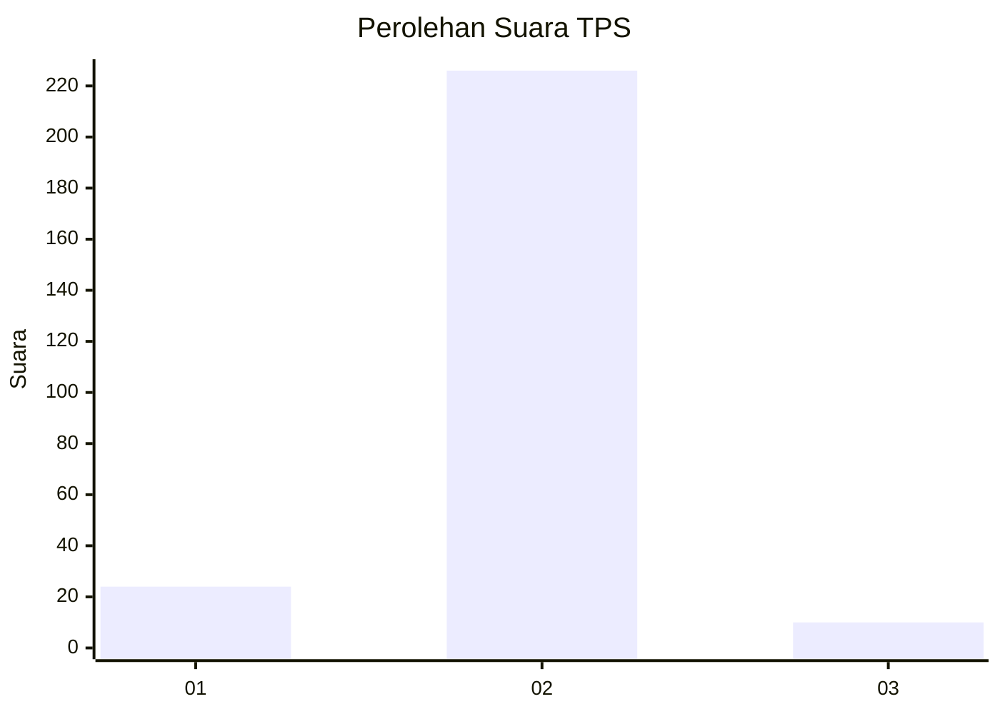
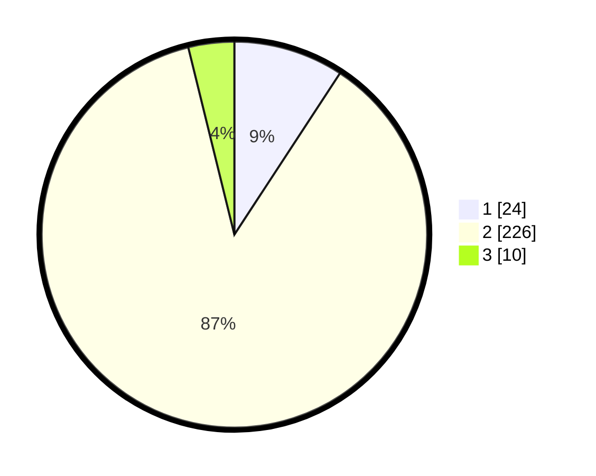

# Hasil

## Grafik

## Tabel

| No. | Nama Paslon    | Suara | Suara (raw) | Persentase |
|:--- |:-------------- | -----:| -----------:| ----------:|
| 1   | ANIES MUHAIMIN | 24    | [24][p-1]   | 9,23       |
| 2   | PRABOWO GIBRAN | 226   | [226][p-2]  | 86,92      |
| 3   | GANJAR MAHFUD  | 10    | [10][p-3]   | 3,85       |

[p-1]: https://github.com/gigit-pemilu/pemilu-2024-16-sumatera-selatan/blob/main/pilpres/hitung-suara/sub/16-sumatera-selatan/sub/05-musi-rawas/sub/11-selangit/sub/2003-napal-melintang/sub/001-tps/sub/paslon-1.txt
[p-2]: https://github.com/gigit-pemilu/pemilu-2024-16-sumatera-selatan/blob/main/pilpres/hitung-suara/sub/16-sumatera-selatan/sub/05-musi-rawas/sub/11-selangit/sub/2003-napal-melintang/sub/001-tps/sub/paslon-2.txt
[p-3]: https://github.com/gigit-pemilu/pemilu-2024-16-sumatera-selatan/blob/main/pilpres/hitung-suara/sub/16-sumatera-selatan/sub/05-musi-rawas/sub/11-selangit/sub/2003-napal-melintang/sub/001-tps/sub/paslon-3.txt

## Foto C Plano

https://sirekap-obj-formc.kpu.go.id/e67d/pemilu/ppwp/16/05/11/20/03/1605112003001-20240218-135536--1250920a-c837-44c1-bb82-6caf4c091d91.jpg

https://sirekap-obj-formc.kpu.go.id/e67d/pemilu/ppwp/16/05/11/20/03/1605112003001-20240218-140809--2445d432-5a6f-4fe3-8ef9-745c18f0abe0.jpg

https://sirekap-obj-formc.kpu.go.id/e67d/pemilu/ppwp/16/05/11/20/03/1605112003001-20240218-141449--6a64200a-4e50-4217-aeb2-cdcc6a20c97b.jpg

## Metadata

| Key        | Value               |
| ---------- | ------------------- |
| Time Stamp | 2024-02-19 06:16:00 |

