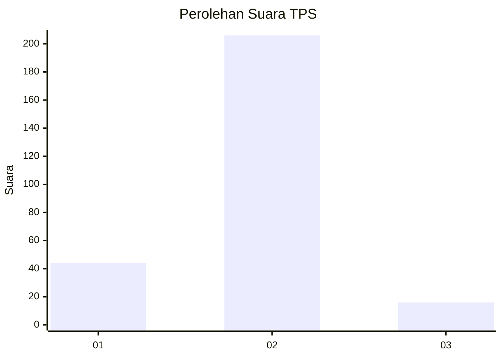
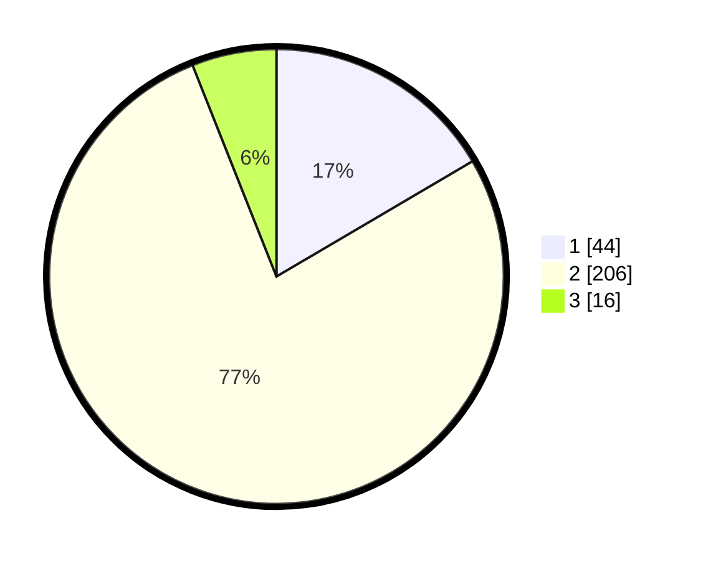

# Hasil

## Grafik

## Tabel

| No. | Nama Paslon    | Suara | Suara (raw) | Persentase |
|:--- |:-------------- | -----:| -----------:| ----------:|
| 1   | ANIES MUHAIMIN | 44    | [44][p-1]   | 16,54      |
| 2   | PRABOWO GIBRAN | 206   | [206][p-2]  | 77,44      |
| 3   | GANJAR MAHFUD  | 16    | [16][p-3]   | 6,02       |

[p-1]: https://github.com/gigit-pemilu/pemilu-2024-16-sumatera-selatan/blob/main/pilpres/hitung-suara/sub/16-sumatera-selatan/sub/05-musi-rawas/sub/11-selangit/sub/2008-muara-nilau/sub/005-tps/sub/paslon-1.txt
[p-2]: https://github.com/gigit-pemilu/pemilu-2024-16-sumatera-selatan/blob/main/pilpres/hitung-suara/sub/16-sumatera-selatan/sub/05-musi-rawas/sub/11-selangit/sub/2008-muara-nilau/sub/005-tps/sub/paslon-2.txt
[p-3]: https://github.com/gigit-pemilu/pemilu-2024-16-sumatera-selatan/blob/main/pilpres/hitung-suara/sub/16-sumatera-selatan/sub/05-musi-rawas/sub/11-selangit/sub/2008-muara-nilau/sub/005-tps/sub/paslon-3.txt

## Foto C Plano

https://sirekap-obj-formc.kpu.go.id/e2af/pemilu/ppwp/16/05/11/20/08/1605112008005-20240217-085641--f78e0a25-bb87-4766-bbdd-1920c5fed11d.jpg

https://sirekap-obj-formc.kpu.go.id/e2af/pemilu/ppwp/16/05/11/20/08/1605112008005-20240217-073128--447c29a9-c27c-48f6-8c3a-318a556b3348.jpg

## Metadata

| Key        | Value               |
| ---------- | ------------------- |
| Time Stamp | 2024-02-25 13:00:00 |

