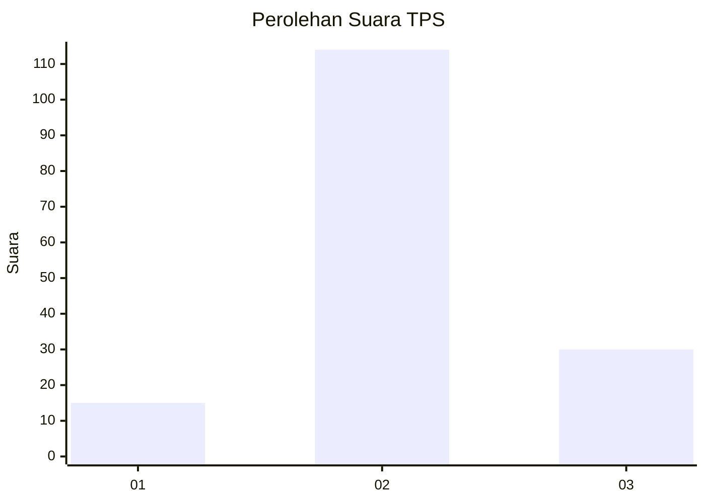
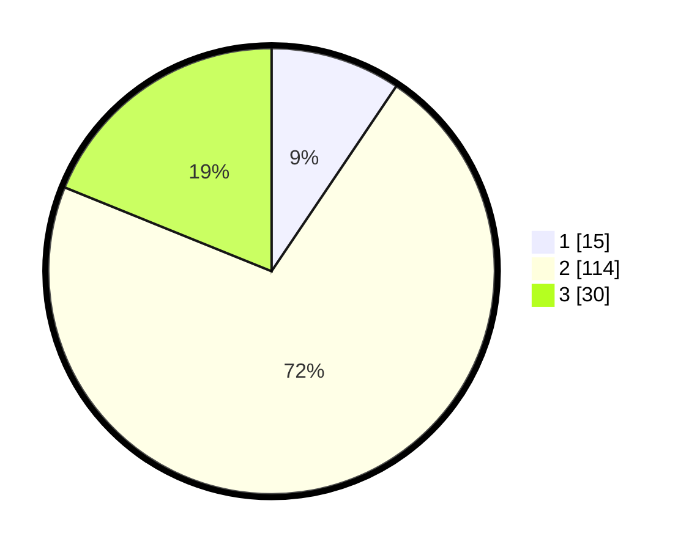

# Hasil

## Grafik

## Tabel

| No. | Nama Paslon    | Suara | Suara (raw) | Persentase |
|:--- |:-------------- | -----:| -----------:| ----------:|
| 1   | ANIES MUHAIMIN | 15    | [15][p-1]   | 9,43       |
| 2   | PRABOWO GIBRAN | 114   | [114][p-2]  | 71,70      |
| 3   | GANJAR MAHFUD  | 30    | [30][p-3]   | 18,87      |

[p-1]: https://github.com/gigit-pemilu/pemilu-2024-16-sumatera-selatan/blob/main/pilpres/hitung-suara/sub/16-sumatera-selatan/sub/05-musi-rawas/sub/12-megang-sakti/sub/1001-megang-sakti-i/sub/001-tps/sub/paslon-1.txt
[p-2]: https://github.com/gigit-pemilu/pemilu-2024-16-sumatera-selatan/blob/main/pilpres/hitung-suara/sub/16-sumatera-selatan/sub/05-musi-rawas/sub/12-megang-sakti/sub/1001-megang-sakti-i/sub/001-tps/sub/paslon-2.txt
[p-3]: https://github.com/gigit-pemilu/pemilu-2024-16-sumatera-selatan/blob/main/pilpres/hitung-suara/sub/16-sumatera-selatan/sub/05-musi-rawas/sub/12-megang-sakti/sub/1001-megang-sakti-i/sub/001-tps/sub/paslon-3.txt

## Foto C Plano

https://sirekap-obj-formc.kpu.go.id/cb94/pemilu/ppwp/16/05/12/10/01/1605121001001-20240214-194743--bf6c60b4-522e-4059-a39d-a6495a87d577.jpg

https://sirekap-obj-formc.kpu.go.id/cb94/pemilu/ppwp/16/05/12/10/01/1605121001001-20240214-194801--71e728e9-5a09-4f99-af77-807abd4f689c.jpg

https://sirekap-obj-formc.kpu.go.id/cb94/pemilu/ppwp/16/05/12/10/01/1605121001001-20240214-194812--60de2471-c4db-44f1-bb62-ffc1f6e906d4.jpg

## Metadata

| Key        | Value               |
| ---------- | ------------------- |
| Time Stamp | 2024-02-20 17:00:00 |

