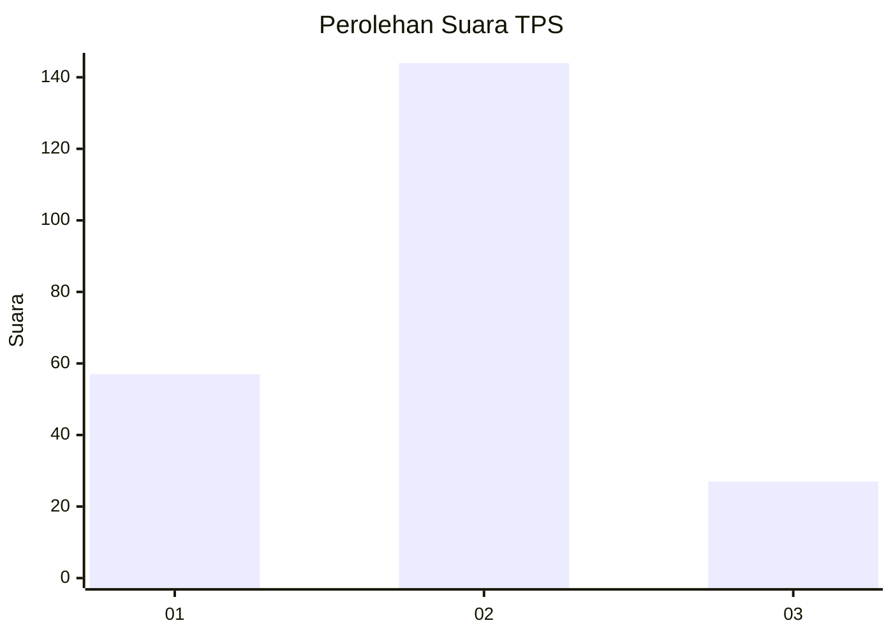
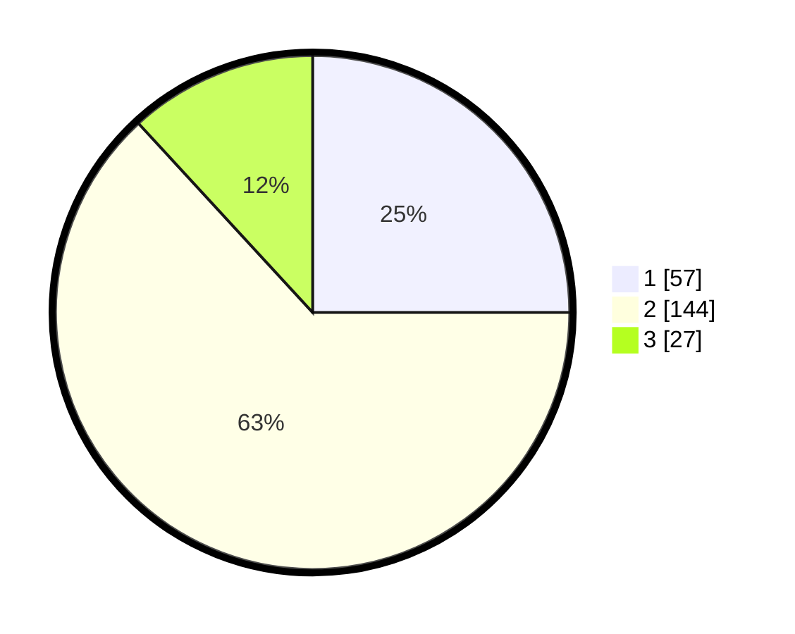

# Hasil

## Grafik

## Tabel

| No. | Nama Paslon    | Suara | Suara (raw) | Persentase |
|:--- |:-------------- | -----:| -----------:| ----------:|
| 1   | ANIES MUHAIMIN | 57    | [57][p-1]   | 25,00      |
| 2   | PRABOWO GIBRAN | 144   | [144][p-2]  | 63,16      |
| 3   | GANJAR MAHFUD  | 27    | [27][p-3]   | 11,84      |

[p-1]: https://github.com/gigit-pemilu/pemilu-2024-16-sumatera-selatan/blob/main/pilpres/hitung-suara/sub/16-sumatera-selatan/sub/05-musi-rawas/sub/12-megang-sakti/sub/1001-megang-sakti-i/sub/013-tps/sub/paslon-1.txt
[p-2]: https://github.com/gigit-pemilu/pemilu-2024-16-sumatera-selatan/blob/main/pilpres/hitung-suara/sub/16-sumatera-selatan/sub/05-musi-rawas/sub/12-megang-sakti/sub/1001-megang-sakti-i/sub/013-tps/sub/paslon-2.txt
[p-3]: https://github.com/gigit-pemilu/pemilu-2024-16-sumatera-selatan/blob/main/pilpres/hitung-suara/sub/16-sumatera-selatan/sub/05-musi-rawas/sub/12-megang-sakti/sub/1001-megang-sakti-i/sub/013-tps/sub/paslon-3.txt

## Foto C Plano

https://sirekap-obj-formc.kpu.go.id/4f8c/pemilu/ppwp/16/05/12/10/01/1605121001013-20240215-005652--7227ecc8-4dc1-41ef-98a4-b8d0f7b86dca.jpg

https://sirekap-obj-formc.kpu.go.id/4f8c/pemilu/ppwp/16/05/12/10/01/1605121001013-20240215-005721--02739d17-e5e2-4935-b261-071d2e7a6327.jpg

https://sirekap-obj-formc.kpu.go.id/4f8c/pemilu/ppwp/16/05/12/10/01/1605121001013-20240215-005750--506efa66-3727-4ba7-b4d0-e93cac0e39bf.jpg

## Metadata

| Key        | Value               |
| ---------- | ------------------- |
| Time Stamp | 2024-02-20 17:00:00 |

