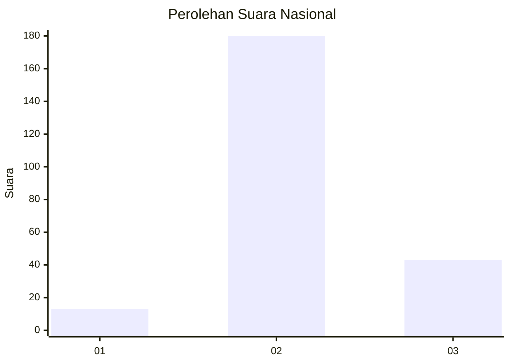

# Hasil

## Grafik

## Tabel

| No. | Nama Paslon    | Suara | Suara (raw) | Persentase |
|:--- |:-------------- | -----:| -----------:| ----------:|
| 1   | ANIES MUHAIMIN | 13    | [13][p-1]   | 5,51       |
| 2   | PRABOWO GIBRAN | 180   | [180][p-2]  | 76,27      |
| 3   | GANJAR MAHFUD  | 43    | [43][p-3]   | 18,22      |

[p-1]: https://github.com/gigit-pemilu/pemilu-2024/blob/main/pilpres/hitung-suara/sub/16-sumatera-selatan/sub/05-musi-rawas/sub/12-megang-sakti/sub/2004-megang-sakti-iii/sub/002-tps/sub/paslon-1.txt
[p-2]: https://github.com/gigit-pemilu/pemilu-2024/blob/main/pilpres/hitung-suara/sub/16-sumatera-selatan/sub/05-musi-rawas/sub/12-megang-sakti/sub/2004-megang-sakti-iii/sub/002-tps/sub/paslon-2.txt
[p-3]: https://github.com/gigit-pemilu/pemilu-2024/blob/main/pilpres/hitung-suara/sub/16-sumatera-selatan/sub/05-musi-rawas/sub/12-megang-sakti/sub/2004-megang-sakti-iii/sub/002-tps/sub/paslon-3.txt

## Foto C Plano

https://sirekap-obj-formc.kpu.go.id/263b/pemilu/ppwp/16/05/12/20/04/1605122004002-20240214-215114--e6451fde-9990-4d6e-8b52-bef05fc025eb.jpg

https://sirekap-obj-formc.kpu.go.id/263b/pemilu/ppwp/16/05/12/20/04/1605122004002-20240214-214932--28f651b4-aabc-4d22-b74f-4bf62fa4e345.jpg

https://sirekap-obj-formc.kpu.go.id/263b/pemilu/ppwp/16/05/12/20/04/1605122004002-20240214-215000--f42990a0-89c3-4b39-8e59-30ac995dd14d.jpg

## Metadata

| Key        | Value               |
| ---------- | ------------------- |
| Time Stamp | 2024-02-25 21:00:00 |

