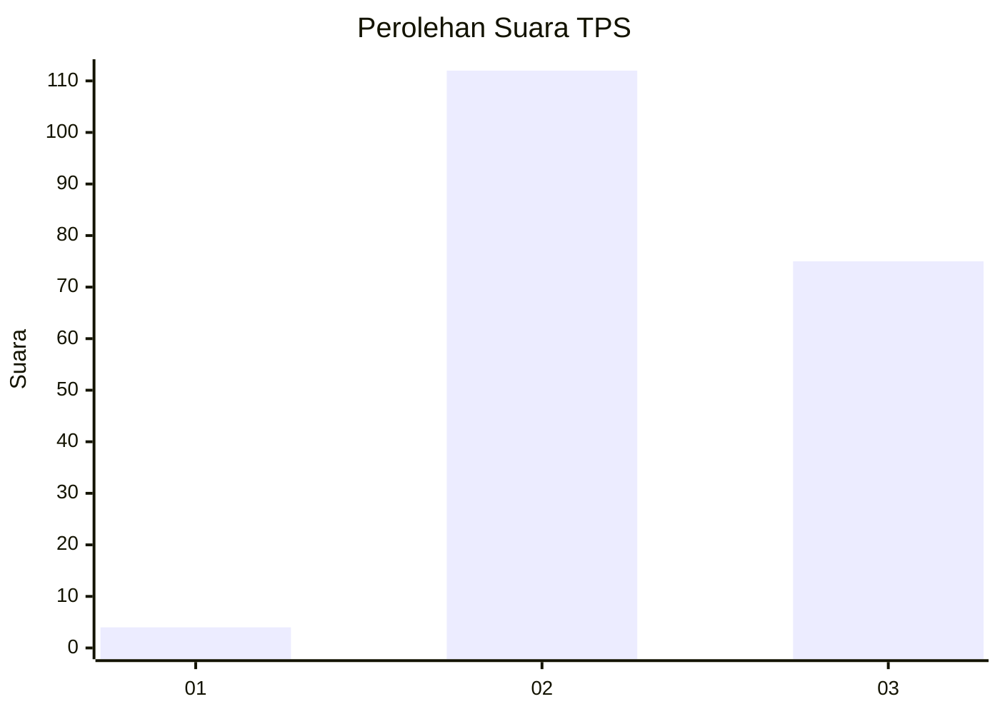
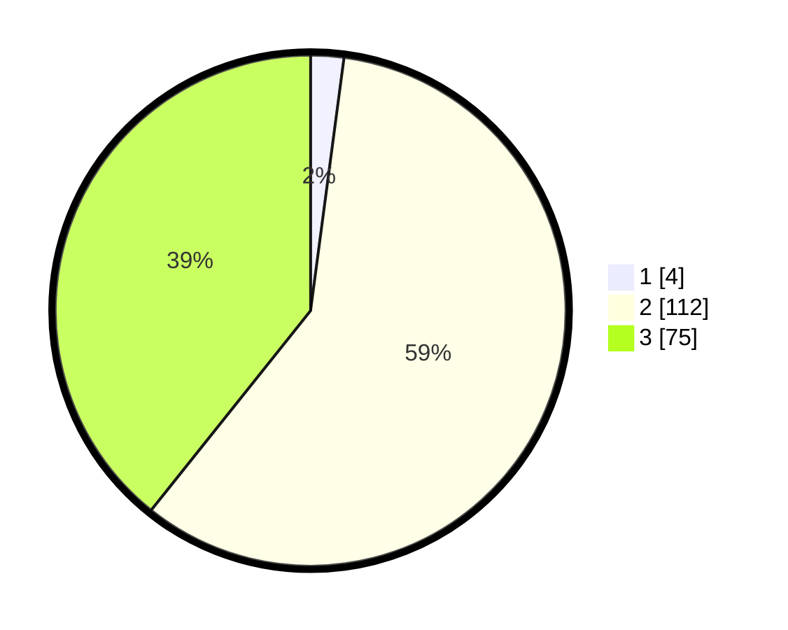

# Hasil

## Grafik

## Tabel

| No. | Nama Paslon    | Suara | Suara (raw) | Persentase |
|:--- |:-------------- | -----:| -----------:| ----------:|
| 1   | ANIES MUHAIMIN | 4     | [4][p-1]    | 2,09       |
| 2   | PRABOWO GIBRAN | 112   | [112][p-2]  | 58,64      |
| 3   | GANJAR MAHFUD  | 75    | [75][p-3]   | 39,27      |

[p-1]: https://github.com/gigit-pemilu/pemilu-2024-16-sumatera-selatan/blob/main/pilpres/hitung-suara/sub/16-sumatera-selatan/sub/05-musi-rawas/sub/12-megang-sakti/sub/2004-megang-sakti-iii/sub/009-tps/sub/paslon-1.txt
[p-2]: https://github.com/gigit-pemilu/pemilu-2024-16-sumatera-selatan/blob/main/pilpres/hitung-suara/sub/16-sumatera-selatan/sub/05-musi-rawas/sub/12-megang-sakti/sub/2004-megang-sakti-iii/sub/009-tps/sub/paslon-2.txt
[p-3]: https://github.com/gigit-pemilu/pemilu-2024-16-sumatera-selatan/blob/main/pilpres/hitung-suara/sub/16-sumatera-selatan/sub/05-musi-rawas/sub/12-megang-sakti/sub/2004-megang-sakti-iii/sub/009-tps/sub/paslon-3.txt

## Foto C Plano

https://sirekap-obj-formc.kpu.go.id/65fe/pemilu/ppwp/16/05/12/20/04/1605122004009-20240214-235627--d062d7fc-bd8a-4260-802e-1f165a6219d5.jpg

https://sirekap-obj-formc.kpu.go.id/65fe/pemilu/ppwp/16/05/12/20/04/1605122004009-20240214-235605--fedb430b-fca4-465b-94ee-f2eb4f1e6458.jpg

https://sirekap-obj-formc.kpu.go.id/65fe/pemilu/ppwp/16/05/12/20/04/1605122004009-20240214-235610--7fb72d39-cba6-49ad-aa96-2ea442088d00.jpg

## Metadata

| Key        | Value               |
| ---------- | ------------------- |
| Time Stamp | 2024-02-24 22:31:28 |

