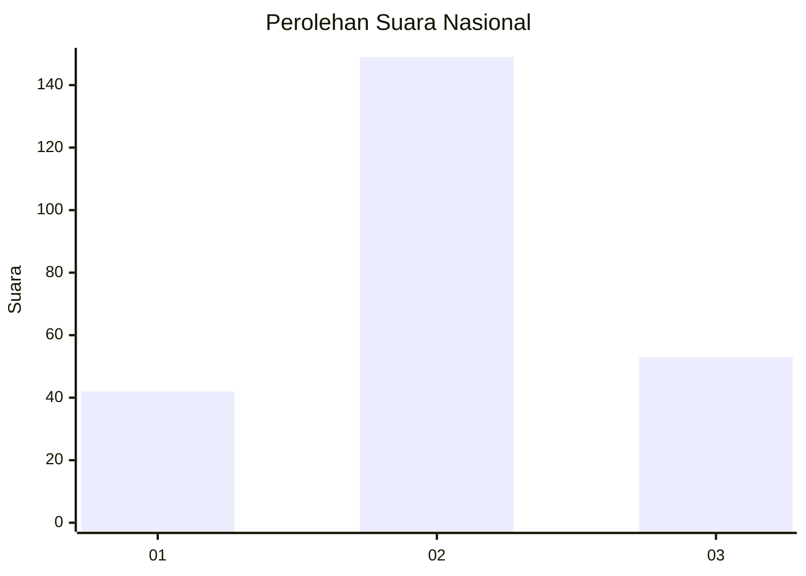
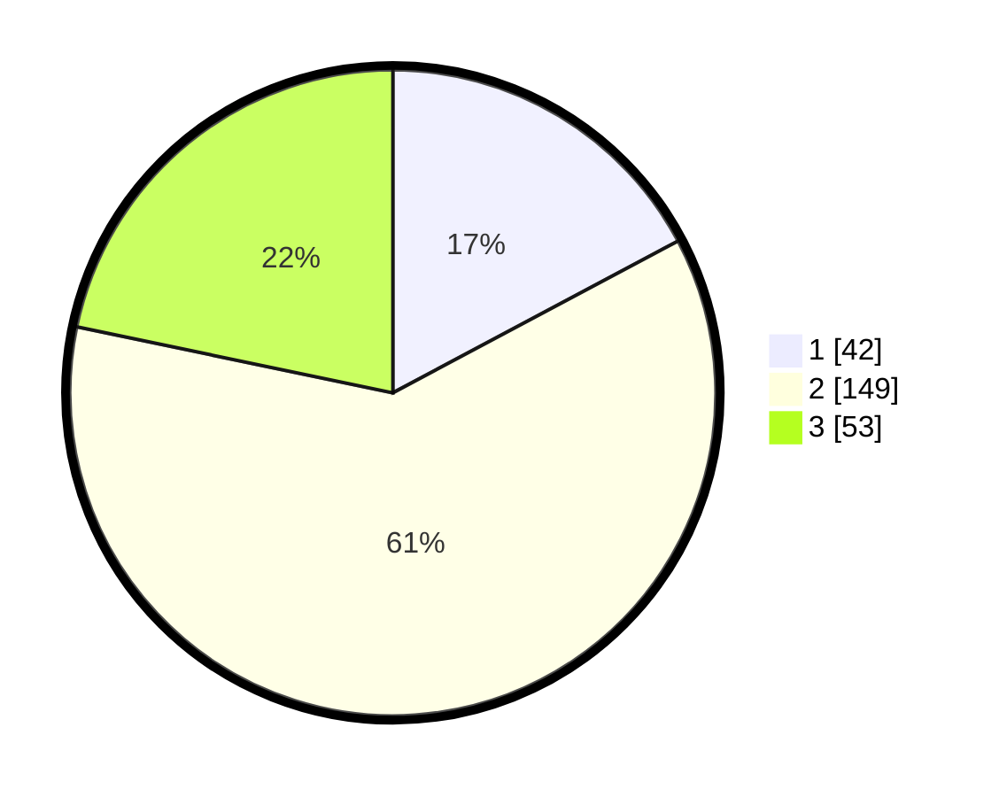

# Hasil

## Grafik

## Tabel

| No. | Nama Paslon    | Suara | Suara (raw) | Persentase |
|:--- |:-------------- | -----:| -----------:| ----------:|
| 1   | ANIES MUHAIMIN | 42    | [42][p-1]   | 17,21      |
| 2   | PRABOWO GIBRAN | 149   | [149][p-2]  | 61,07      |
| 3   | GANJAR MAHFUD  | 53    | [53][p-3]   | 21,72      |

[p-1]: https://github.com/gigit-pemilu/pemilu-2024/blob/main/pilpres/hitung-suara/sub/16-sumatera-selatan/sub/05-musi-rawas/sub/12-megang-sakti/sub/2006-jajaran-baru/sub/001-tps/sub/paslon-1.txt
[p-2]: https://github.com/gigit-pemilu/pemilu-2024/blob/main/pilpres/hitung-suara/sub/16-sumatera-selatan/sub/05-musi-rawas/sub/12-megang-sakti/sub/2006-jajaran-baru/sub/001-tps/sub/paslon-2.txt
[p-3]: https://github.com/gigit-pemilu/pemilu-2024/blob/main/pilpres/hitung-suara/sub/16-sumatera-selatan/sub/05-musi-rawas/sub/12-megang-sakti/sub/2006-jajaran-baru/sub/001-tps/sub/paslon-3.txt

## Foto C Plano

https://sirekap-obj-formc.kpu.go.id/21f6/pemilu/ppwp/16/05/12/20/06/1605122006001-20240218-102200--c5a11545-f865-4b79-9c91-74ac71c81ff1.jpg

https://sirekap-obj-formc.kpu.go.id/21f6/pemilu/ppwp/16/05/12/20/06/1605122006001-20240218-101826--647a12fc-78a1-4047-a909-e7b284bdce6b.jpg

https://sirekap-obj-formc.kpu.go.id/21f6/pemilu/ppwp/16/05/12/20/06/1605122006001-20240218-103410--1f0e7b28-ecc2-47d7-86dd-4c04e5212ff5.jpg

## Metadata

| Key        | Value               |
| ---------- | ------------------- |
| Time Stamp | 2024-02-20 18:00:00 |

