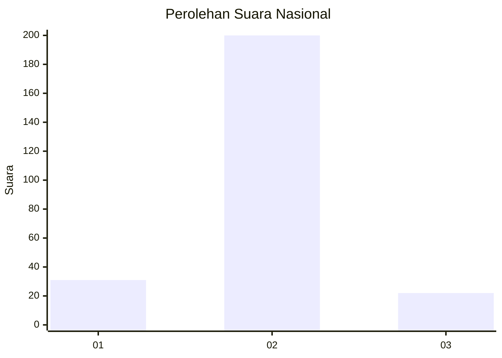
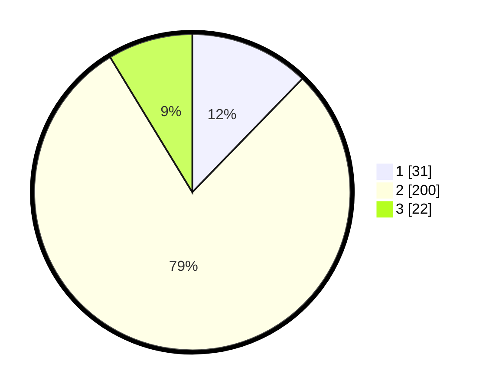

# Hasil

## Grafik

## Tabel

| No. | Nama Paslon    | Suara | Suara (raw) | Persentase |
|:--- |:-------------- | -----:| -----------:| ----------:|
| 1   | ANIES MUHAIMIN | 31    | [31][p-1]   | 12,25      |
| 2   | PRABOWO GIBRAN | 200   | [200][p-2]  | 79,05      |
| 3   | GANJAR MAHFUD  | 22    | [22][p-3]   | 8,70       |

[p-1]: https://github.com/gigit-pemilu/pemilu-2024/blob/main/pilpres/hitung-suara/sub/16-sumatera-selatan/sub/05-musi-rawas/sub/12-megang-sakti/sub/2006-jajaran-baru/sub/002-tps/sub/paslon-1.txt
[p-2]: https://github.com/gigit-pemilu/pemilu-2024/blob/main/pilpres/hitung-suara/sub/16-sumatera-selatan/sub/05-musi-rawas/sub/12-megang-sakti/sub/2006-jajaran-baru/sub/002-tps/sub/paslon-2.txt
[p-3]: https://github.com/gigit-pemilu/pemilu-2024/blob/main/pilpres/hitung-suara/sub/16-sumatera-selatan/sub/05-musi-rawas/sub/12-megang-sakti/sub/2006-jajaran-baru/sub/002-tps/sub/paslon-3.txt

## Foto C Plano

https://sirekap-obj-formc.kpu.go.id/ad65/pemilu/ppwp/16/05/12/20/06/1605122006002-20240214-220502--b5a4c713-a8e0-4b10-baec-5c8d22c13b29.jpg

https://sirekap-obj-formc.kpu.go.id/ad65/pemilu/ppwp/16/05/12/20/06/1605122006002-20240214-190203--ca385112-ad3a-48f5-ae7b-36bcfb122b95.jpg

https://sirekap-obj-formc.kpu.go.id/ad65/pemilu/ppwp/16/05/12/20/06/1605122006002-20240214-214733--99f139e9-b3f9-47ba-842c-beb4e3ad05d9.jpg

## Metadata

| Key        | Value               |
| ---------- | ------------------- |
| Time Stamp | 2024-02-20 17:00:00 |

