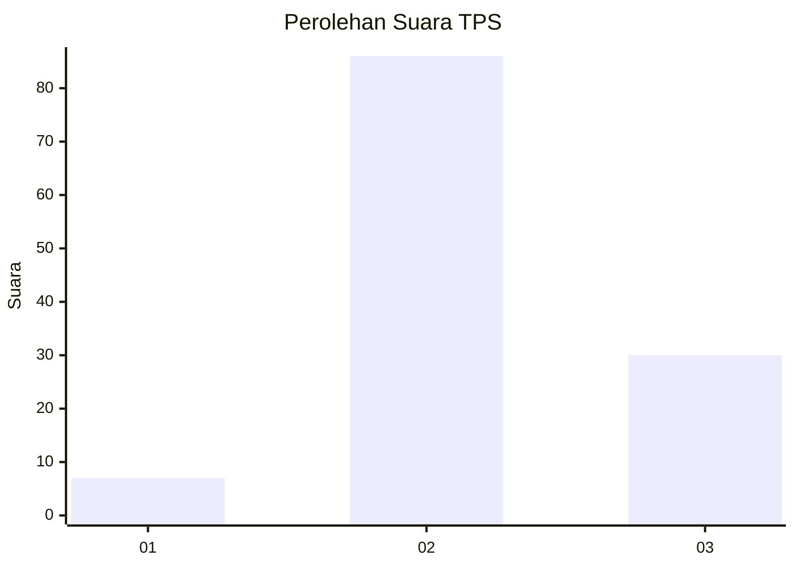
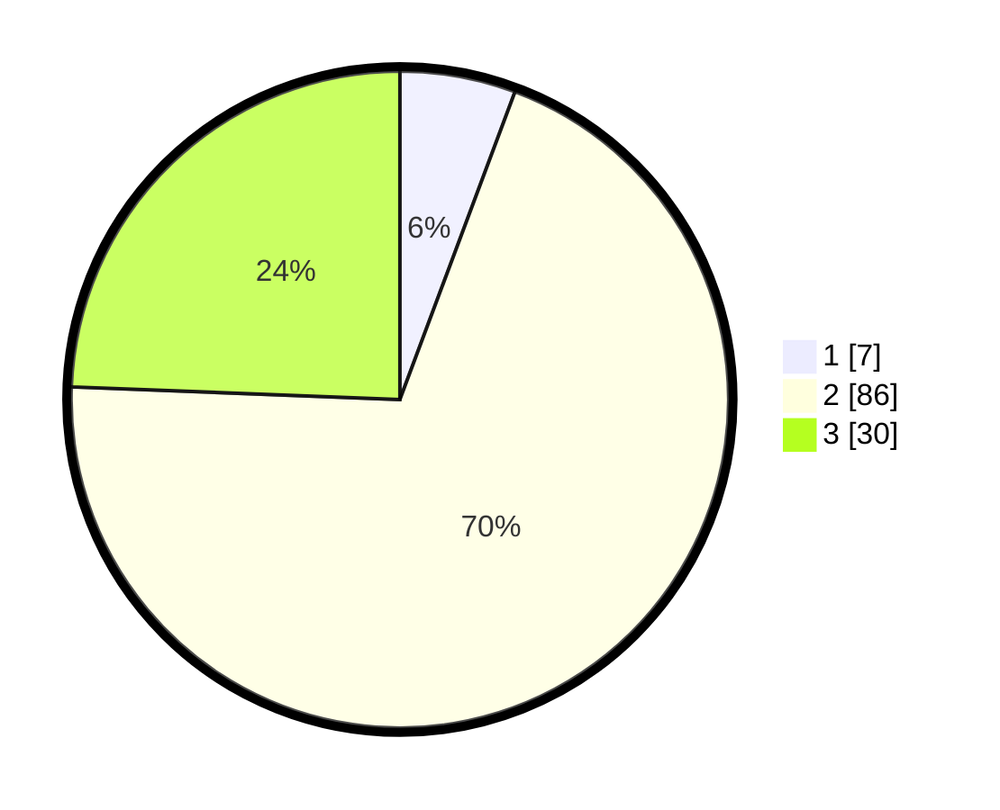

# Hasil

## Grafik

## Tabel

| No. | Nama Paslon    | Suara | Suara (raw) | Persentase |
|:--- |:-------------- | -----:| -----------:| ----------:|
| 1   | ANIES MUHAIMIN | 7     | [7][p-1]    | 5,69       |
| 2   | PRABOWO GIBRAN | 86    | [86][p-2]   | 69,92      |
| 3   | GANJAR MAHFUD  | 30    | [30][p-3]   | 24,39      |

[p-1]: https://github.com/gigit-pemilu/pemilu-2024-16-sumatera-selatan/blob/main/pilpres/hitung-suara/sub/16-sumatera-selatan/sub/05-musi-rawas/sub/12-megang-sakti/sub/2006-jajaran-baru/sub/011-tps/sub/paslon-1.txt
[p-2]: https://github.com/gigit-pemilu/pemilu-2024-16-sumatera-selatan/blob/main/pilpres/hitung-suara/sub/16-sumatera-selatan/sub/05-musi-rawas/sub/12-megang-sakti/sub/2006-jajaran-baru/sub/011-tps/sub/paslon-2.txt
[p-3]: https://github.com/gigit-pemilu/pemilu-2024-16-sumatera-selatan/blob/main/pilpres/hitung-suara/sub/16-sumatera-selatan/sub/05-musi-rawas/sub/12-megang-sakti/sub/2006-jajaran-baru/sub/011-tps/sub/paslon-3.txt

## Foto C Plano

https://sirekap-obj-formc.kpu.go.id/7434/pemilu/ppwp/16/05/12/20/06/1605122006011-20240215-004219--4d7a4d3c-62db-4700-ae54-8e2b81128732.jpg

https://sirekap-obj-formc.kpu.go.id/7434/pemilu/ppwp/16/05/12/20/06/1605122006011-20240215-004331--8ed25c2d-fee8-4a6b-957b-545099ad7419.jpg

https://sirekap-obj-formc.kpu.go.id/7434/pemilu/ppwp/16/05/12/20/06/1605122006011-20240215-004436--ea77d764-a8f7-47f7-a26e-4d12d6a96bd3.jpg

## Metadata

| Key        | Value               |
| ---------- | ------------------- |
| Time Stamp | 2024-02-25 20:00:00 |

