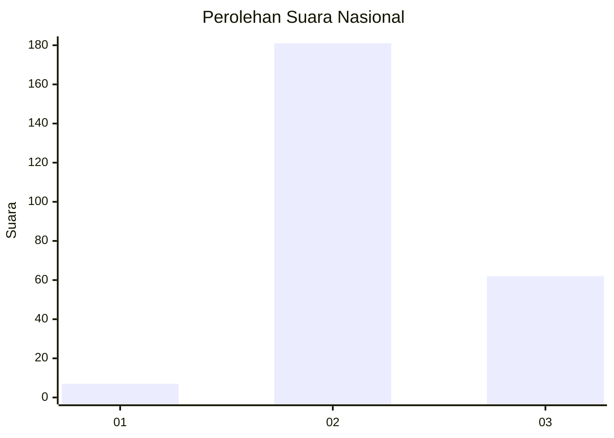
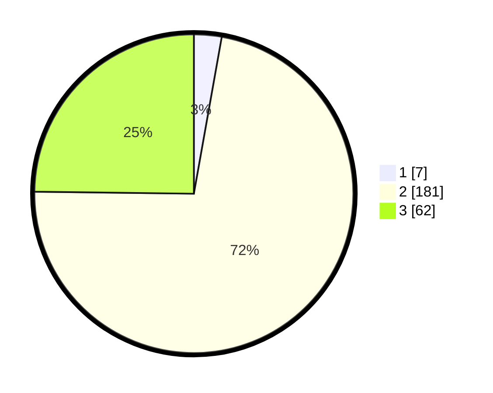

# Hasil

## Grafik

## Tabel

| No. | Nama Paslon    | Suara | Suara (raw) | Persentase |
|:--- |:-------------- | -----:| -----------:| ----------:|
| 1   | ANIES MUHAIMIN | 7     | [7][p-1]    | 2,80       |
| 2   | PRABOWO GIBRAN | 181   | [181][p-2]  | 72,40      |
| 3   | GANJAR MAHFUD  | 62    | [62][p-3]   | 24,80      |

[p-1]: https://github.com/gigit-pemilu/pemilu-2024/blob/main/pilpres/hitung-suara/sub/16-sumatera-selatan/sub/05-musi-rawas/sub/12-megang-sakti/sub/2012-marga-puspita/sub/001-tps/sub/paslon-1.txt
[p-2]: https://github.com/gigit-pemilu/pemilu-2024/blob/main/pilpres/hitung-suara/sub/16-sumatera-selatan/sub/05-musi-rawas/sub/12-megang-sakti/sub/2012-marga-puspita/sub/001-tps/sub/paslon-2.txt
[p-3]: https://github.com/gigit-pemilu/pemilu-2024/blob/main/pilpres/hitung-suara/sub/16-sumatera-selatan/sub/05-musi-rawas/sub/12-megang-sakti/sub/2012-marga-puspita/sub/001-tps/sub/paslon-3.txt

## Foto C Plano

https://sirekap-obj-formc.kpu.go.id/fa78/pemilu/ppwp/16/05/12/20/12/1605122012001-20240214-220857--bf71e52e-cbd8-45ca-9e2b-84bacec1a98e.jpg

https://sirekap-obj-formc.kpu.go.id/fa78/pemilu/ppwp/16/05/12/20/12/1605122012001-20240215-033725--dee51bd3-40f6-4a04-a4a2-14686dc92b76.jpg

https://sirekap-obj-formc.kpu.go.id/fa78/pemilu/ppwp/16/05/12/20/12/1605122012001-20240215-013029--f9e81d8b-c0e7-4546-a2ae-6ebed74f9feb.jpg

## Metadata

| Key        | Value               |
| ---------- | ------------------- |
| Time Stamp | 2024-02-20 19:00:00 |

