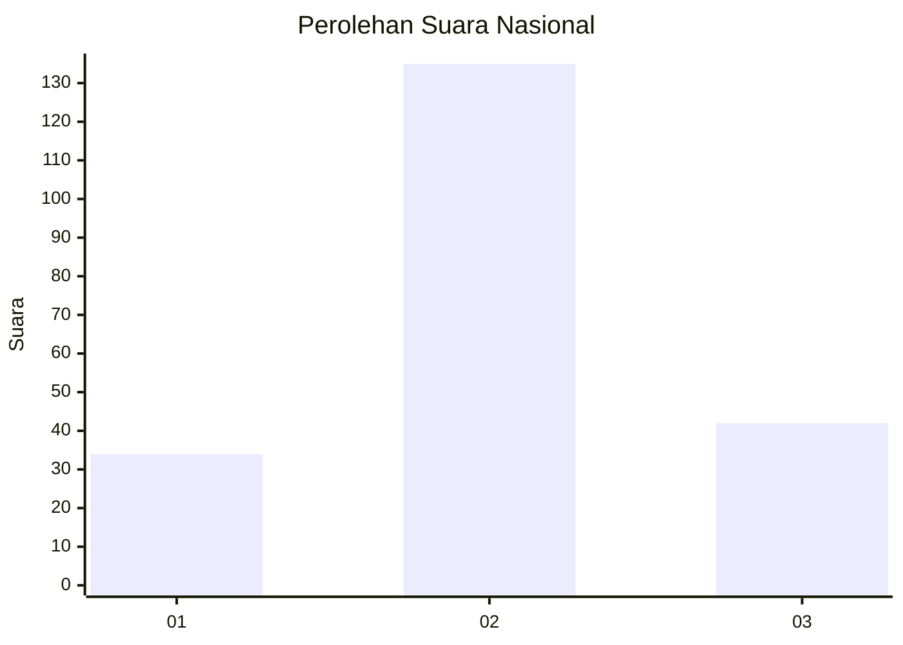
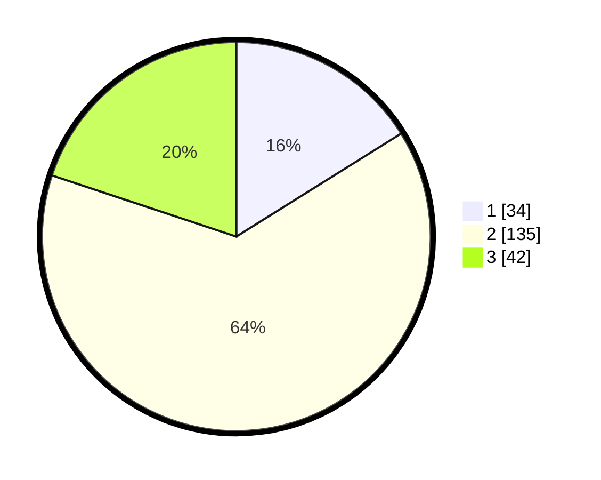

# Hasil

## Grafik

## Tabel

| No. | Nama Paslon    | Suara | Suara (raw) | Persentase |
|:--- |:-------------- | -----:| -----------:| ----------:|
| 1   | ANIES MUHAIMIN | 34    | [34][p-1]   | 16,11      |
| 2   | PRABOWO GIBRAN | 135   | [135][p-2]  | 63,98      |
| 3   | GANJAR MAHFUD  | 42    | [42][p-3]   | 19,91      |

[p-1]: https://github.com/gigit-pemilu/pemilu-2024/blob/main/pilpres/hitung-suara/sub/16-sumatera-selatan/sub/05-musi-rawas/sub/14-bts-ulu/sub/1017-bangun-jaya/sub/002-tps/sub/paslon-1.txt
[p-2]: https://github.com/gigit-pemilu/pemilu-2024/blob/main/pilpres/hitung-suara/sub/16-sumatera-selatan/sub/05-musi-rawas/sub/14-bts-ulu/sub/1017-bangun-jaya/sub/002-tps/sub/paslon-2.txt
[p-3]: https://github.com/gigit-pemilu/pemilu-2024/blob/main/pilpres/hitung-suara/sub/16-sumatera-selatan/sub/05-musi-rawas/sub/14-bts-ulu/sub/1017-bangun-jaya/sub/002-tps/sub/paslon-3.txt

## Foto C Plano

https://sirekap-obj-formc.kpu.go.id/3c94/pemilu/ppwp/16/05/14/10/17/1605141017002-20240215-000300--08768734-c339-4906-b49e-ece6134e08cf.jpg

https://sirekap-obj-formc.kpu.go.id/3c94/pemilu/ppwp/16/05/14/10/17/1605141017002-20240215-000423--3f1353ef-9fbd-48c8-b9bc-9dc059107912.jpg

https://sirekap-obj-formc.kpu.go.id/3c94/pemilu/ppwp/16/05/14/10/17/1605141017002-20240215-000550--5750460b-f30f-434c-8e8b-a35eb594e773.jpg

## Metadata

| Key        | Value               |
| ---------- | ------------------- |
| Time Stamp | 2024-02-25 17:00:00 |

