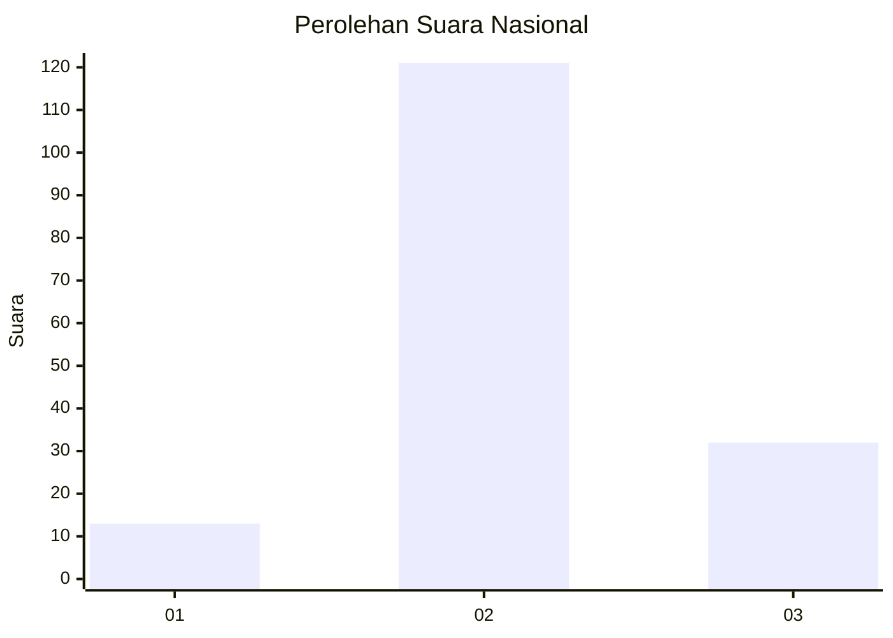
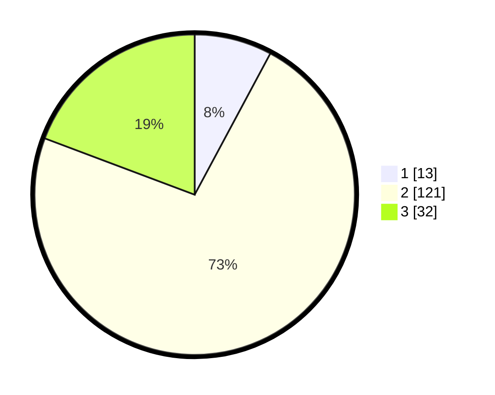

# Hasil

## Grafik

## Tabel

| No. | Nama Paslon    | Suara | Suara (raw) | Persentase |
|:--- |:-------------- | -----:| -----------:| ----------:|
| 1   | ANIES MUHAIMIN | 13    | [13][p-1]   | 7,83       |
| 2   | PRABOWO GIBRAN | 121   | [121][p-2]  | 72,89      |
| 3   | GANJAR MAHFUD  | 32    | [32][p-3]   | 19,28      |

[p-1]: https://github.com/gigit-pemilu/pemilu-2024/blob/main/pilpres/hitung-suara/sub/16-sumatera-selatan/sub/05-musi-rawas/sub/14-bts-ulu/sub/2009-pelawe/sub/001-tps/sub/paslon-1.txt
[p-2]: https://github.com/gigit-pemilu/pemilu-2024/blob/main/pilpres/hitung-suara/sub/16-sumatera-selatan/sub/05-musi-rawas/sub/14-bts-ulu/sub/2009-pelawe/sub/001-tps/sub/paslon-2.txt
[p-3]: https://github.com/gigit-pemilu/pemilu-2024/blob/main/pilpres/hitung-suara/sub/16-sumatera-selatan/sub/05-musi-rawas/sub/14-bts-ulu/sub/2009-pelawe/sub/001-tps/sub/paslon-3.txt

## Foto C Plano

https://sirekap-obj-formc.kpu.go.id/73ec/pemilu/ppwp/16/05/14/20/09/1605142009001-20240214-231432--172ee5b2-1e11-4770-ad46-e5cf434121e2.jpg

https://sirekap-obj-formc.kpu.go.id/73ec/pemilu/ppwp/16/05/14/20/09/1605142009001-20240214-231607--d40e769a-ae3c-4657-87ad-fc0ee6189dac.jpg

https://sirekap-obj-formc.kpu.go.id/73ec/pemilu/ppwp/16/05/14/20/09/1605142009001-20240214-231805--3c5f8c72-5716-4254-bfb4-7dfc2053657b.jpg

## Metadata

| Key        | Value               |
| ---------- | ------------------- |
| Time Stamp | 2024-02-25 18:00:00 |

