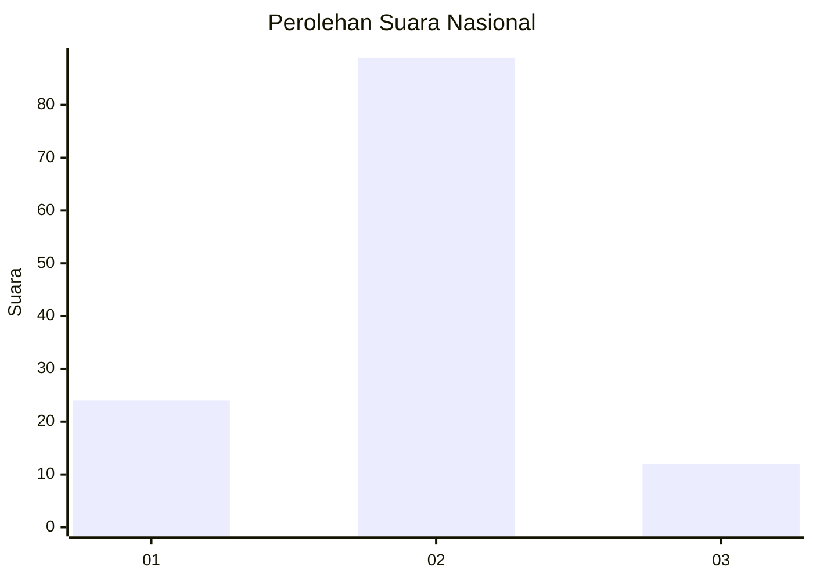
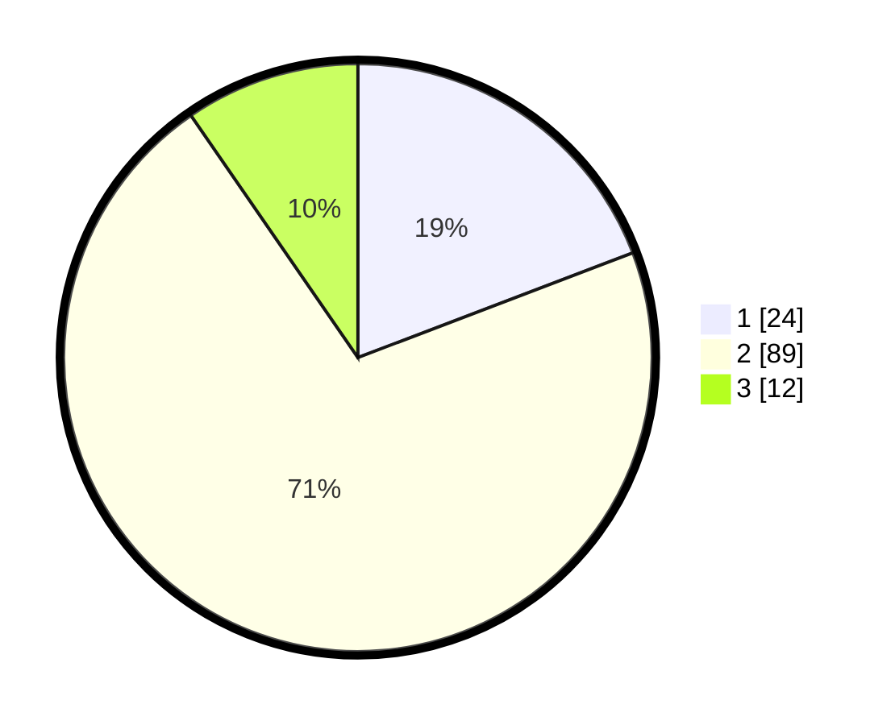

# Hasil

## Grafik

## Tabel

| No. | Nama Paslon    | Suara | Suara (raw) | Persentase |
|:--- |:-------------- | -----:| -----------:| ----------:|
| 1   | ANIES MUHAIMIN | 24    | [24][p-1]   | 19,20      |
| 2   | PRABOWO GIBRAN | 89    | [89][p-2]   | 71,20      |
| 3   | GANJAR MAHFUD  | 12    | [12][p-3]   | 9,60       |

[p-1]: https://github.com/gigit-pemilu/pemilu-2024/blob/main/pilpres/hitung-suara/sub/16-sumatera-selatan/sub/05-musi-rawas/sub/18-tiang-pumpung-kepungut/sub/2001-lubuk-besar/sub/004-tps/sub/paslon-1.txt
[p-2]: https://github.com/gigit-pemilu/pemilu-2024/blob/main/pilpres/hitung-suara/sub/16-sumatera-selatan/sub/05-musi-rawas/sub/18-tiang-pumpung-kepungut/sub/2001-lubuk-besar/sub/004-tps/sub/paslon-2.txt
[p-3]: https://github.com/gigit-pemilu/pemilu-2024/blob/main/pilpres/hitung-suara/sub/16-sumatera-selatan/sub/05-musi-rawas/sub/18-tiang-pumpung-kepungut/sub/2001-lubuk-besar/sub/004-tps/sub/paslon-3.txt

## Foto C Plano

https://sirekap-obj-formc.kpu.go.id/011d/pemilu/ppwp/16/05/18/20/01/1605182001004-20240217-085827--36989165-e302-4376-b663-abcc58146af8.jpg

https://sirekap-obj-formc.kpu.go.id/011d/pemilu/ppwp/16/05/18/20/01/1605182001004-20240217-085829--6d1a5e8a-f967-4145-a603-d986e56e0a3f.jpg

https://sirekap-obj-formc.kpu.go.id/011d/pemilu/ppwp/16/05/18/20/01/1605182001004-20240217-085828--044b9ce0-30af-402a-b813-5119e9f956a0.jpg

## Metadata

| Key        | Value               |
| ---------- | ------------------- |
| Time Stamp | 2024-02-20 16:00:00 |

## DATA PEMILIH TETAP

Jumlah pemilih dalam DPT: **160**.
 * L: **74**.
 * P: **86**.

## DATA PENGGUNA HAK PILIH

Jumlah pengguna hak pilih dalam DPT: **131**.
 * L: **62**.
 * P: **69**.

Jumlah pengguna hak pilih dalam DPTb: **0**.
 * L: **0**.
 * P: **0**.

Jumlah pengguna hak pilih dalam DPK: **0**.
 * L: **0**.
 * P: **0**.

Jumlah pengguna hak pilih: **131**.
 * L: **62**.
 * P: **69**.

## JUMLAH SUARA SAH DAN TIDAK SAH

JUMLAH SELURUH SUARA SAH: **125**.

JUMLAH SUARA TIDAK SAH: **6**.

JUMLAH SELURUH SUARA SAH DAN SUARA TIDAK SAH: **131**.

