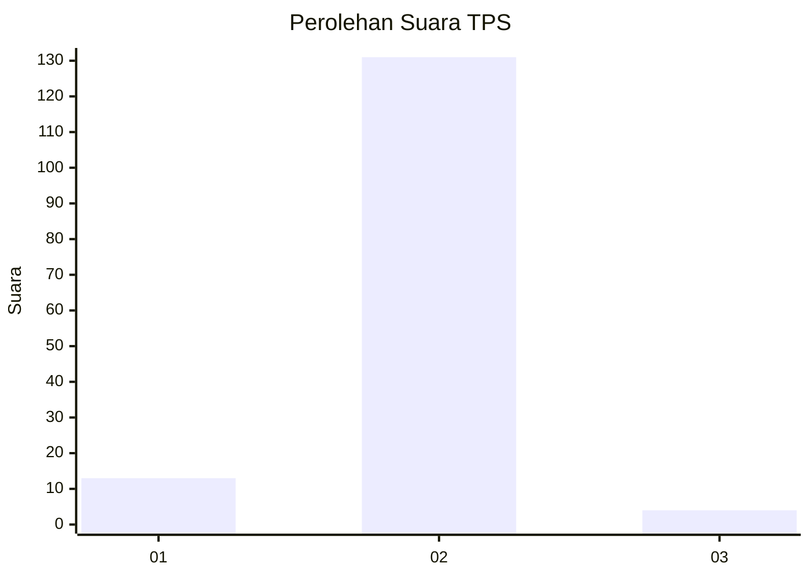
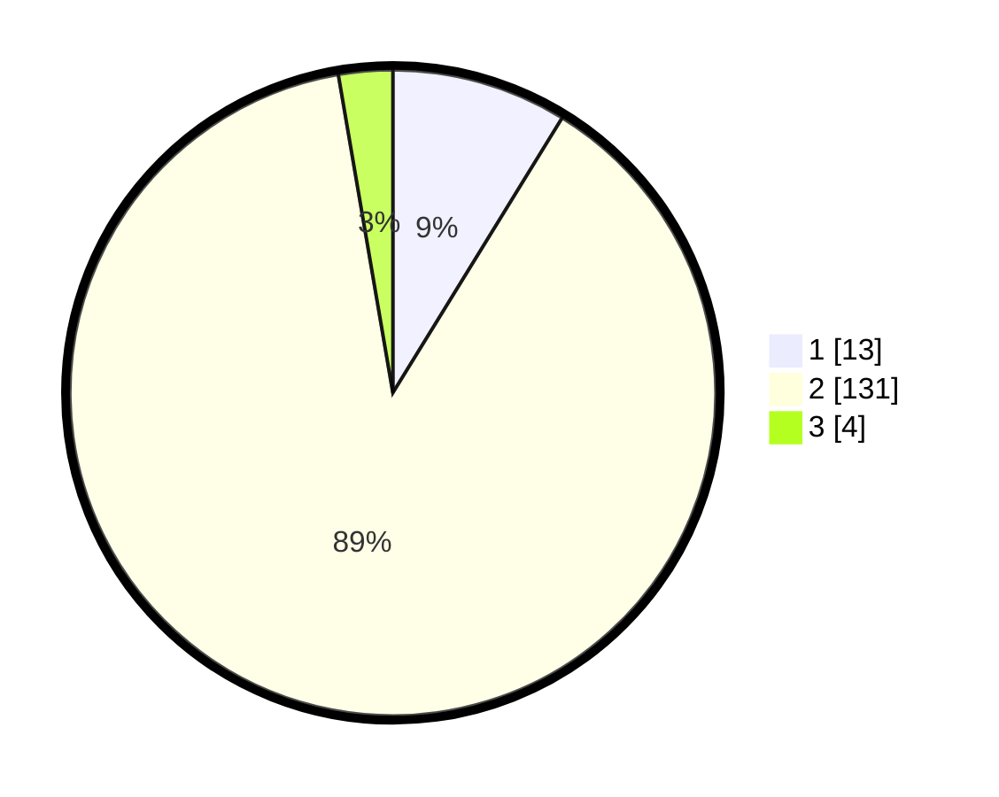

# Hasil

## Grafik

## Tabel

| No. | Nama Paslon    | Suara | Suara (raw) | Persentase |
|:--- |:-------------- | -----:| -----------:| ----------:|
| 1   | ANIES MUHAIMIN | 13    | [13][p-1]   | 8,78       |
| 2   | PRABOWO GIBRAN | 131   | [131][p-2]  | 88,51      |
| 3   | GANJAR MAHFUD  | 4     | [4][p-3]    | 2,70       |

[p-1]: https://github.com/gigit-pemilu/pemilu-2024-16-sumatera-selatan/blob/main/pilpres/hitung-suara/sub/16-sumatera-selatan/sub/05-musi-rawas/sub/18-tiang-pumpung-kepungut/sub/2008-kebur/sub/001-tps/sub/paslon-1.txt
[p-2]: https://github.com/gigit-pemilu/pemilu-2024-16-sumatera-selatan/blob/main/pilpres/hitung-suara/sub/16-sumatera-selatan/sub/05-musi-rawas/sub/18-tiang-pumpung-kepungut/sub/2008-kebur/sub/001-tps/sub/paslon-2.txt
[p-3]: https://github.com/gigit-pemilu/pemilu-2024-16-sumatera-selatan/blob/main/pilpres/hitung-suara/sub/16-sumatera-selatan/sub/05-musi-rawas/sub/18-tiang-pumpung-kepungut/sub/2008-kebur/sub/001-tps/sub/paslon-3.txt

## Foto C Plano

https://sirekap-obj-formc.kpu.go.id/9593/pemilu/ppwp/16/05/18/20/08/1605182008001-20240214-203016--8b28bd16-c15b-4b8f-870e-629e65f7f9fe.jpg

https://sirekap-obj-formc.kpu.go.id/9593/pemilu/ppwp/16/05/18/20/08/1605182008001-20240214-203126--a2940218-24eb-4db7-92ee-6b2db24f0e1c.jpg

https://sirekap-obj-formc.kpu.go.id/9593/pemilu/ppwp/16/05/18/20/08/1605182008001-20240214-203227--89131076-941f-4521-aac2-9759fbcab348.jpg

## Metadata

| Key        | Value               |
| ---------- | ------------------- |
| Time Stamp | 2024-02-24 22:31:28 |

