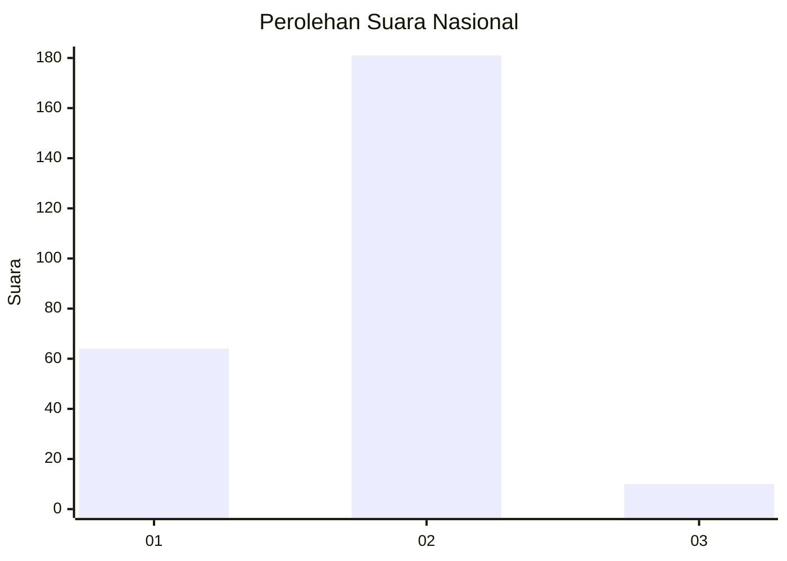
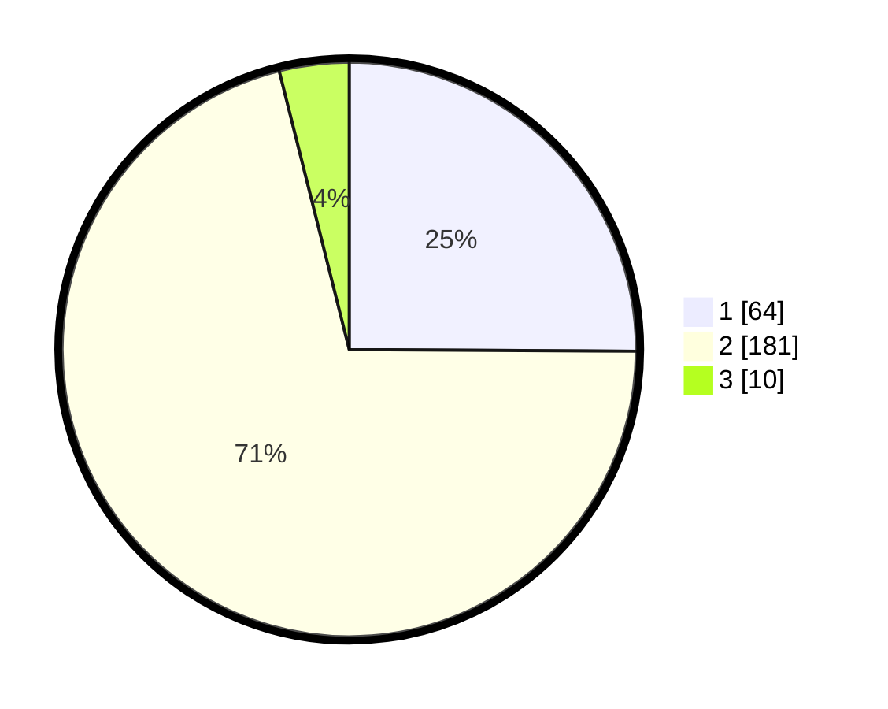

# Hasil

## Grafik

## Tabel

| No. | Nama Paslon    | Suara | Suara (raw) | Persentase |
|:--- |:-------------- | -----:| -----------:| ----------:|
| 1   | ANIES MUHAIMIN | 64    | [64][p-1]   | 25,10      |
| 2   | PRABOWO GIBRAN | 181   | [181][p-2]  | 70,98      |
| 3   | GANJAR MAHFUD  | 10    | [10][p-3]   | 3,92       |

[p-1]: https://github.com/gigit-pemilu/pemilu-2024/blob/main/pilpres/hitung-suara/sub/16-sumatera-selatan/sub/05-musi-rawas/sub/19-sumber-harta/sub/1002-sumber-harta/sub/004-tps/sub/paslon-1.txt
[p-2]: https://github.com/gigit-pemilu/pemilu-2024/blob/main/pilpres/hitung-suara/sub/16-sumatera-selatan/sub/05-musi-rawas/sub/19-sumber-harta/sub/1002-sumber-harta/sub/004-tps/sub/paslon-2.txt
[p-3]: https://github.com/gigit-pemilu/pemilu-2024/blob/main/pilpres/hitung-suara/sub/16-sumatera-selatan/sub/05-musi-rawas/sub/19-sumber-harta/sub/1002-sumber-harta/sub/004-tps/sub/paslon-3.txt

## Foto C Plano

https://sirekap-obj-formc.kpu.go.id/e2e4/pemilu/ppwp/16/05/19/10/02/1605191002004-20240216-083814--cb8c6905-ce97-48ed-9e7c-9e5ad52ef07c.jpg

https://sirekap-obj-formc.kpu.go.id/e2e4/pemilu/ppwp/16/05/19/10/02/1605191002004-20240216-083821--cb5aa177-6b89-4cd2-aa6e-617f376fd240.jpg

https://sirekap-obj-formc.kpu.go.id/e2e4/pemilu/ppwp/16/05/19/10/02/1605191002004-20240216-083816--c0b62f8b-db0d-4765-95ce-c85334203c6b.jpg

## Metadata

| Key        | Value               |
| ---------- | ------------------- |
| Time Stamp | 2024-02-20 16:00:00 |

## DATA PEMILIH TETAP

Jumlah pemilih dalam DPT: **288**.
 * L: **150**.
 * P: **138**.

## DATA PENGGUNA HAK PILIH

Jumlah pengguna hak pilih dalam DPT: **253**.
 * L: **137**.
 * P: **116**.

Jumlah pengguna hak pilih dalam DPTb: **1**.
 * L: **1**.
 * P: **0**.

Jumlah pengguna hak pilih dalam DPK: **3**.
 * L: **1**.
 * P: **2**.

Jumlah pengguna hak pilih: **257**.
 * L: **139**.
 * P: **118**.

## JUMLAH SUARA SAH DAN TIDAK SAH

JUMLAH SELURUH SUARA SAH: **255**.

JUMLAH SUARA TIDAK SAH: **2**.

JUMLAH SELURUH SUARA SAH DAN SUARA TIDAK SAH: **257**.

