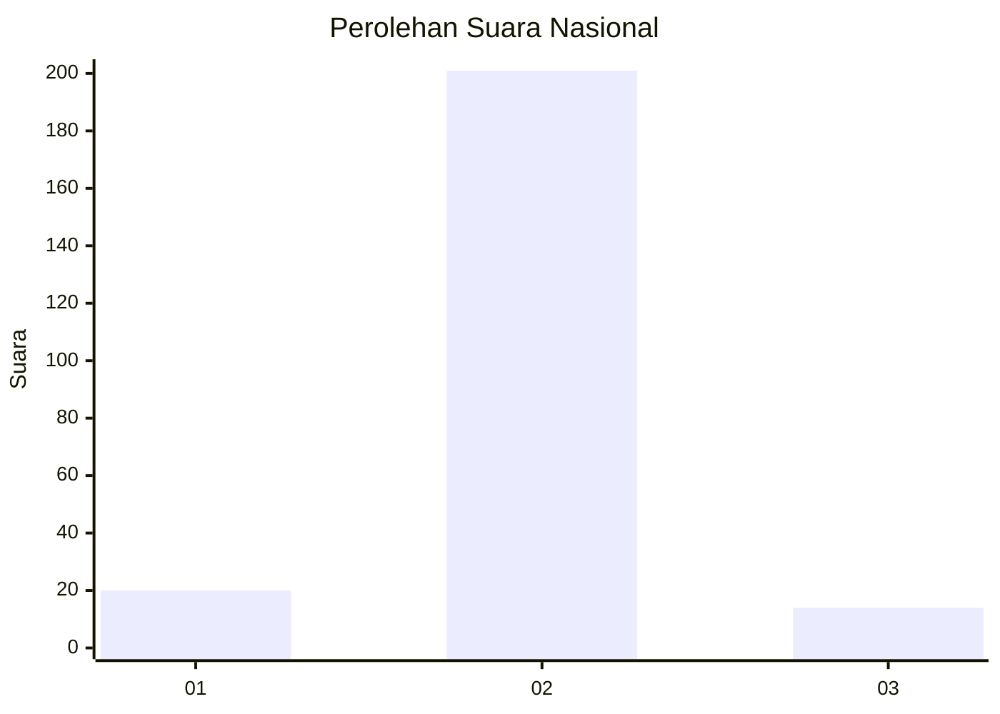
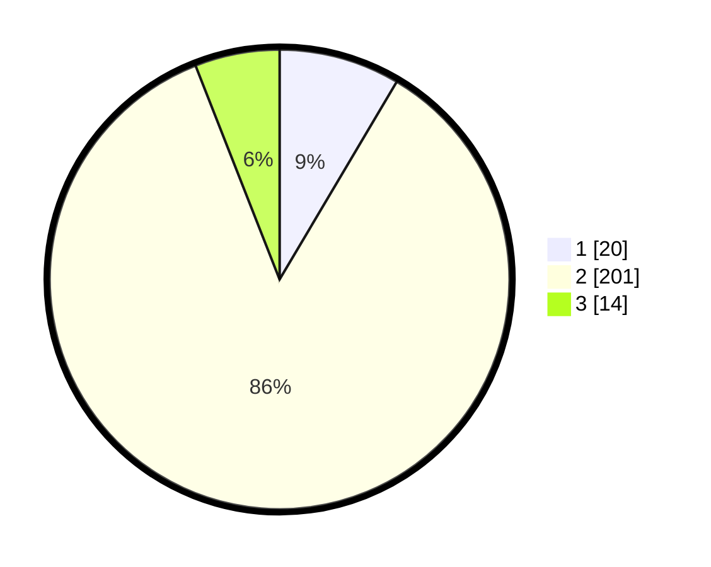

# Hasil

## Grafik

## Tabel

| No. | Nama Paslon    | Suara | Suara (raw) | Persentase |
|:--- |:-------------- | -----:| -----------:| ----------:|
| 1   | ANIES MUHAIMIN | 20    | [20][p-1]   | 8,51       |
| 2   | PRABOWO GIBRAN | 201   | [201][p-2]  | 85,53      |
| 3   | GANJAR MAHFUD  | 14    | [14][p-3]   | 5,96       |

[p-1]: https://github.com/gigit-pemilu/pemilu-2024/blob/main/pilpres/hitung-suara/sub/16-sumatera-selatan/sub/05-musi-rawas/sub/19-sumber-harta/sub/2009-sukarami-jaya/sub/003-tps/sub/paslon-1.txt
[p-2]: https://github.com/gigit-pemilu/pemilu-2024/blob/main/pilpres/hitung-suara/sub/16-sumatera-selatan/sub/05-musi-rawas/sub/19-sumber-harta/sub/2009-sukarami-jaya/sub/003-tps/sub/paslon-2.txt
[p-3]: https://github.com/gigit-pemilu/pemilu-2024/blob/main/pilpres/hitung-suara/sub/16-sumatera-selatan/sub/05-musi-rawas/sub/19-sumber-harta/sub/2009-sukarami-jaya/sub/003-tps/sub/paslon-3.txt

## Foto C Plano

https://sirekap-obj-formc.kpu.go.id/4f24/pemilu/ppwp/16/05/19/20/09/1605192009003-20240214-193414--b53238e0-92db-48df-9d9e-4c7ef13814f4.jpg

https://sirekap-obj-formc.kpu.go.id/4f24/pemilu/ppwp/16/05/19/20/09/1605192009003-20240214-192500--cefc7ee0-83b4-47bc-9176-d6696c256fb7.jpg

https://sirekap-obj-formc.kpu.go.id/4f24/pemilu/ppwp/16/05/19/20/09/1605192009003-20240214-192944--028f7b71-416f-4f68-a1b6-879f0403abf9.jpg

## Metadata

| Key        | Value               |
| ---------- | ------------------- |
| Time Stamp | 2024-02-25 18:00:00 |

