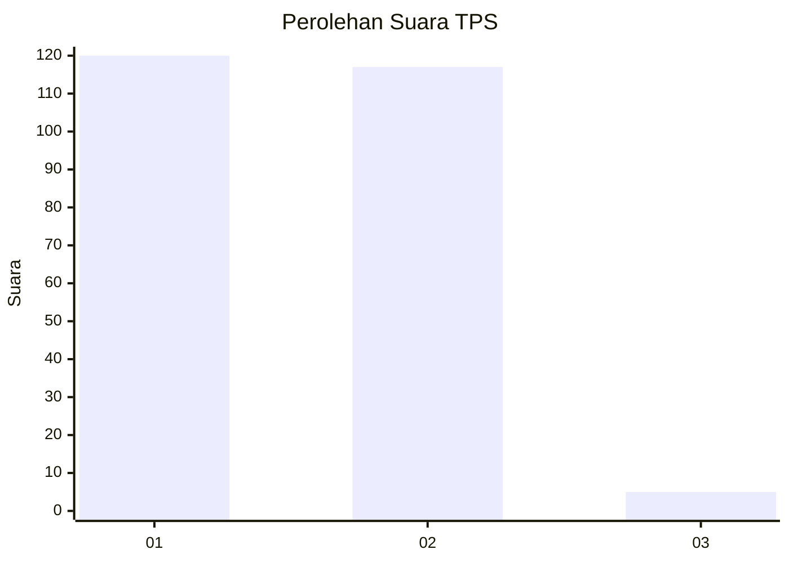
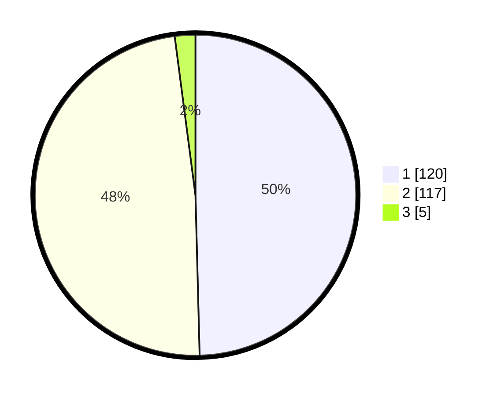

# Hasil

## Grafik

## Tabel

| No. | Nama Paslon    | Suara | Suara (raw) | Persentase |
|:--- |:-------------- | -----:| -----------:| ----------:|
| 1   | ANIES MUHAIMIN | 120   | [120][p-1]  | 49,59      |
| 2   | PRABOWO GIBRAN | 117   | [117][p-2]  | 48,35      |
| 3   | GANJAR MAHFUD  | 5     | [5][p-3]    | 2,07       |

[p-1]: https://github.com/gigit-pemilu/pemilu-2024-16-sumatera-selatan/blob/main/pilpres/hitung-suara/sub/16-sumatera-selatan/sub/06-musi-banyuasin/sub/01-sekayu/sub/1009-kayu-ara/sub/002-tps/sub/paslon-1.txt
[p-2]: https://github.com/gigit-pemilu/pemilu-2024-16-sumatera-selatan/blob/main/pilpres/hitung-suara/sub/16-sumatera-selatan/sub/06-musi-banyuasin/sub/01-sekayu/sub/1009-kayu-ara/sub/002-tps/sub/paslon-2.txt
[p-3]: https://github.com/gigit-pemilu/pemilu-2024-16-sumatera-selatan/blob/main/pilpres/hitung-suara/sub/16-sumatera-selatan/sub/06-musi-banyuasin/sub/01-sekayu/sub/1009-kayu-ara/sub/002-tps/sub/paslon-3.txt

## Foto C Plano

https://sirekap-obj-formc.kpu.go.id/a623/pemilu/ppwp/16/06/01/10/09/1606011009002-20240214-224413--15fca5ef-1140-4110-a70a-28ef0b6ef79b.jpg

https://sirekap-obj-formc.kpu.go.id/a623/pemilu/ppwp/16/06/01/10/09/1606011009002-20240214-224532--42936f7b-0938-43f3-81f5-a5fba23f3e9a.jpg

https://sirekap-obj-formc.kpu.go.id/a623/pemilu/ppwp/16/06/01/10/09/1606011009002-20240214-224633--41423cf3-98dc-4f6d-911f-c270bd8d0c84.jpg

## Metadata

| Key        | Value               |
| ---------- | ------------------- |
| Time Stamp | 2024-02-16 12:51:22 |

