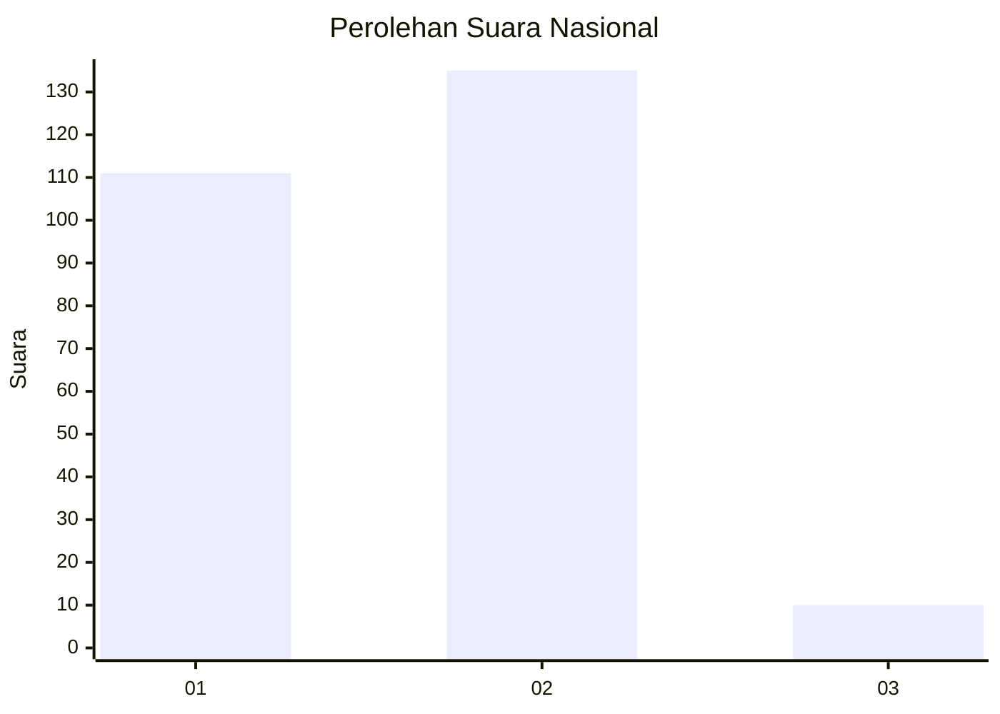
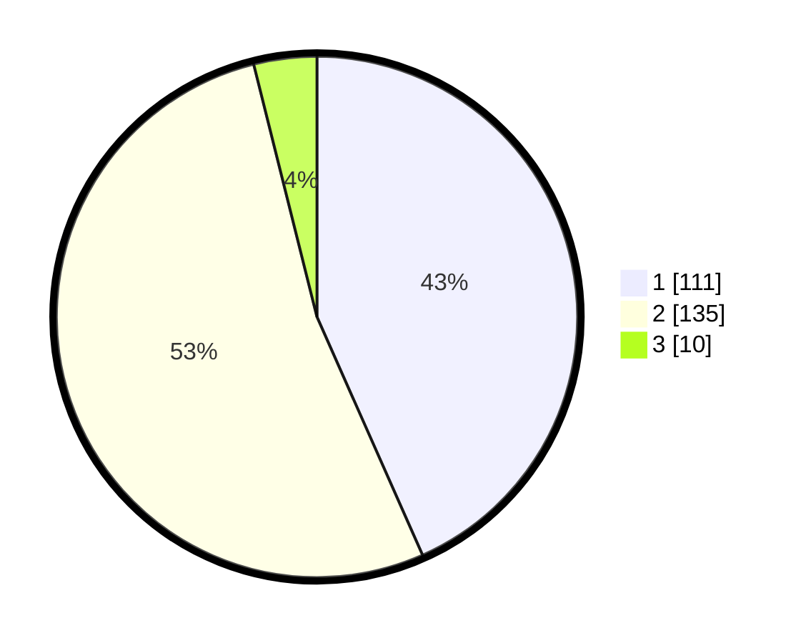

# Hasil

## Grafik

## Tabel

| No. | Nama Paslon    | Suara | Suara (raw) | Persentase |
|:--- |:-------------- | -----:| -----------:| ----------:|
| 1   | ANIES MUHAIMIN | 111   | [111][p-1]  | 43,36      |
| 2   | PRABOWO GIBRAN | 135   | [135][p-2]  | 52,73      |
| 3   | GANJAR MAHFUD  | 10    | [10][p-3]   | 3,91       |

[p-1]: https://github.com/gigit-pemilu/pemilu-2024/blob/main/pilpres/hitung-suara/sub/16-sumatera-selatan/sub/06-musi-banyuasin/sub/01-sekayu/sub/1009-kayu-ara/sub/003-tps/sub/paslon-1.txt
[p-2]: https://github.com/gigit-pemilu/pemilu-2024/blob/main/pilpres/hitung-suara/sub/16-sumatera-selatan/sub/06-musi-banyuasin/sub/01-sekayu/sub/1009-kayu-ara/sub/003-tps/sub/paslon-2.txt
[p-3]: https://github.com/gigit-pemilu/pemilu-2024/blob/main/pilpres/hitung-suara/sub/16-sumatera-selatan/sub/06-musi-banyuasin/sub/01-sekayu/sub/1009-kayu-ara/sub/003-tps/sub/paslon-3.txt

## Foto C Plano

https://sirekap-obj-formc.kpu.go.id/c6d0/pemilu/ppwp/16/06/01/10/09/1606011009003-20240214-220223--15c382ed-40c2-4217-881e-fe2e70ce8b7b.jpg

https://sirekap-obj-formc.kpu.go.id/c6d0/pemilu/ppwp/16/06/01/10/09/1606011009003-20240214-220405--eff0e906-b62c-4001-bd9d-237fe6d9171c.jpg

https://sirekap-obj-formc.kpu.go.id/c6d0/pemilu/ppwp/16/06/01/10/09/1606011009003-20240214-220657--728676e4-051a-4772-a07f-41a0362603e8.jpg

## Metadata

| Key        | Value               |
| ---------- | ------------------- |
| Time Stamp | 2024-02-15 15:00:29 |

