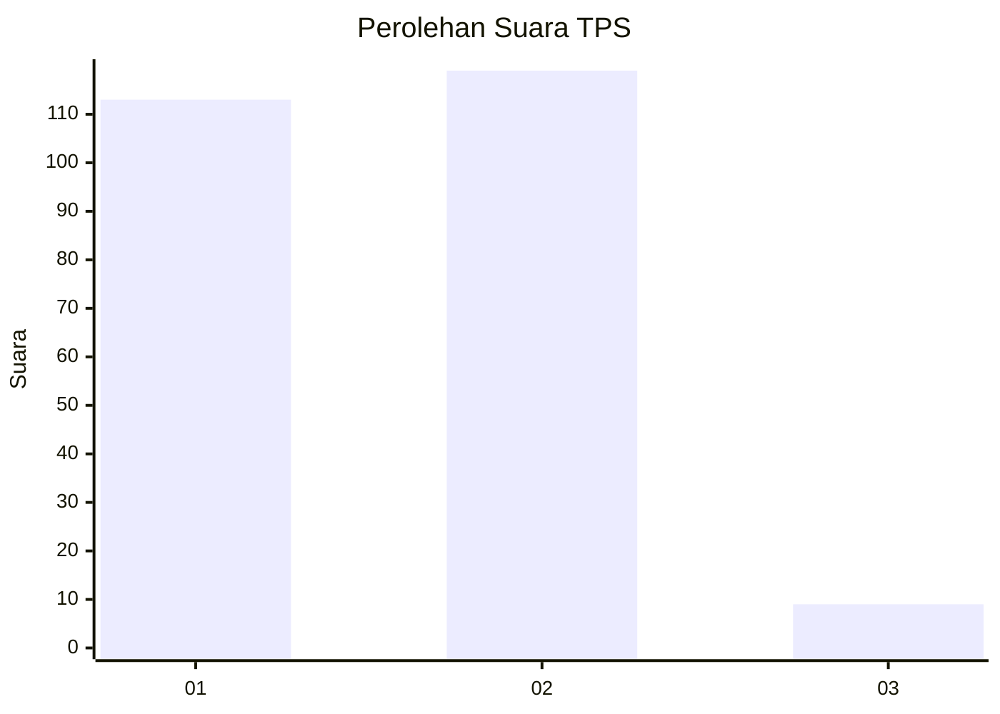
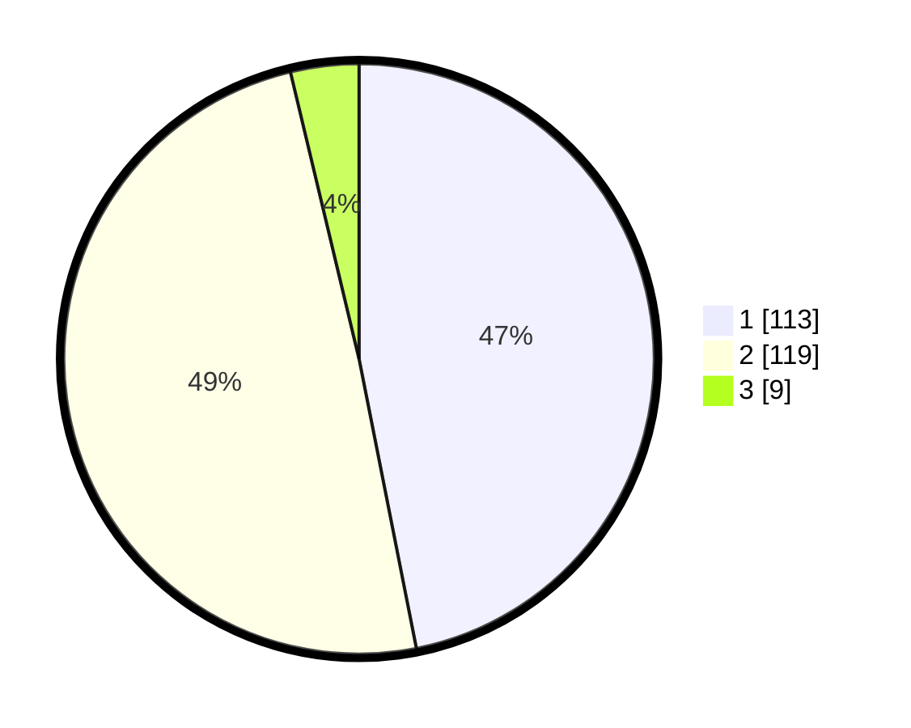

# Hasil

## Grafik

## Tabel

| No. | Nama Paslon    | Suara | Suara (raw) | Persentase |
|:--- |:-------------- | -----:| -----------:| ----------:|
| 1   | ANIES MUHAIMIN | 113   | [113][p-1]  | 46,89      |
| 2   | PRABOWO GIBRAN | 119   | [119][p-2]  | 49,38      |
| 3   | GANJAR MAHFUD  | 9     | [9][p-3]    | 3,73       |

[p-1]: https://github.com/gigit-pemilu/pemilu-2024-16-sumatera-selatan/blob/main/pilpres/hitung-suara/sub/16-sumatera-selatan/sub/06-musi-banyuasin/sub/01-sekayu/sub/1009-kayu-ara/sub/004-tps/sub/paslon-1.txt
[p-2]: https://github.com/gigit-pemilu/pemilu-2024-16-sumatera-selatan/blob/main/pilpres/hitung-suara/sub/16-sumatera-selatan/sub/06-musi-banyuasin/sub/01-sekayu/sub/1009-kayu-ara/sub/004-tps/sub/paslon-2.txt
[p-3]: https://github.com/gigit-pemilu/pemilu-2024-16-sumatera-selatan/blob/main/pilpres/hitung-suara/sub/16-sumatera-selatan/sub/06-musi-banyuasin/sub/01-sekayu/sub/1009-kayu-ara/sub/004-tps/sub/paslon-3.txt

## Foto C Plano

https://sirekap-obj-formc.kpu.go.id/45dc/pemilu/ppwp/16/06/01/10/09/1606011009004-20240220-094708--736b6562-bc4a-4bf9-977c-c48f11334387.jpg

https://sirekap-obj-formc.kpu.go.id/45dc/pemilu/ppwp/16/06/01/10/09/1606011009004-20240215-204612--e913835b-36f1-4f72-9a84-05e3412ec23c.jpg

https://sirekap-obj-formc.kpu.go.id/45dc/pemilu/ppwp/16/06/01/10/09/1606011009004-20240215-204844--519d313f-7cac-41c1-be21-ec45d221d872.jpg

## Metadata

| Key        | Value               |
| ---------- | ------------------- |
| Time Stamp | 2024-02-20 10:00:00 |

