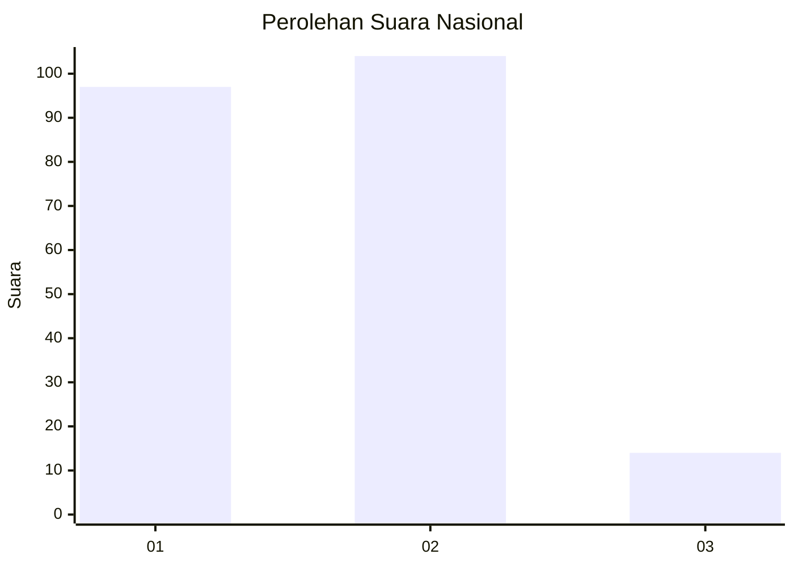
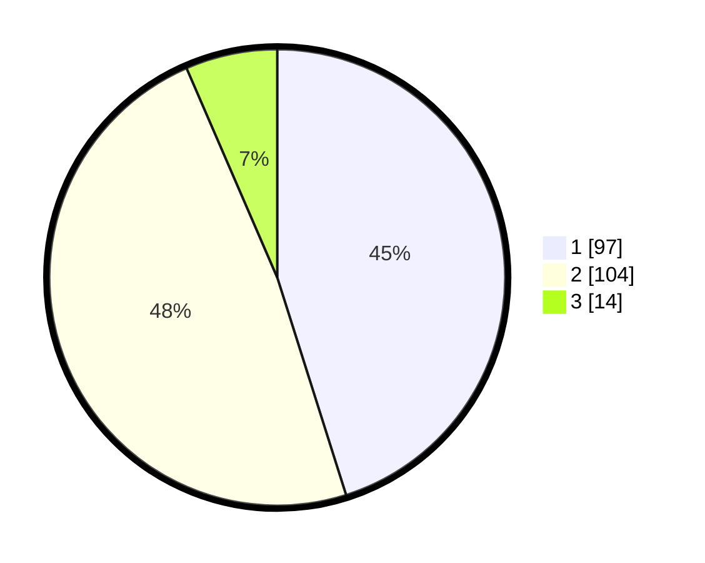

# Hasil

## Grafik

## Tabel

| No. | Nama Paslon    | Suara | Suara (raw) | Persentase |
|:--- |:-------------- | -----:| -----------:| ----------:|
| 1   | ANIES MUHAIMIN | 97    | [97][p-1]   | 45,12      |
| 2   | PRABOWO GIBRAN | 104   | [104][p-2]  | 48,37      |
| 3   | GANJAR MAHFUD  | 14    | [14][p-3]   | 6,51       |

[p-1]: https://github.com/gigit-pemilu/pemilu-2024/blob/main/pilpres/hitung-suara/sub/16-sumatera-selatan/sub/06-musi-banyuasin/sub/01-sekayu/sub/1009-kayu-ara/sub/005-tps/sub/paslon-1.txt
[p-2]: https://github.com/gigit-pemilu/pemilu-2024/blob/main/pilpres/hitung-suara/sub/16-sumatera-selatan/sub/06-musi-banyuasin/sub/01-sekayu/sub/1009-kayu-ara/sub/005-tps/sub/paslon-2.txt
[p-3]: https://github.com/gigit-pemilu/pemilu-2024/blob/main/pilpres/hitung-suara/sub/16-sumatera-selatan/sub/06-musi-banyuasin/sub/01-sekayu/sub/1009-kayu-ara/sub/005-tps/sub/paslon-3.txt

## Foto C Plano

https://sirekap-obj-formc.kpu.go.id/789d/pemilu/ppwp/16/06/01/10/09/1606011009005-20240216-210412--697c3111-c781-4a94-919b-1fac03f11d9f.jpg

https://sirekap-obj-formc.kpu.go.id/789d/pemilu/ppwp/16/06/01/10/09/1606011009005-20240216-210413--cf3a6436-b54a-41b1-8a03-cc2470e50c74.jpg

https://sirekap-obj-formc.kpu.go.id/789d/pemilu/ppwp/16/06/01/10/09/1606011009005-20240216-210412--1650d996-bf22-4040-8565-d93b8d0ccd13.jpg

## Metadata

| Key        | Value               |
| ---------- | ------------------- |
| Time Stamp | 2024-02-17 11:30:03 |

## DATA PEMILIH TETAP

Jumlah pemilih dalam DPT: **250**.
 * L: **124**.
 * P: **126**.

## DATA PENGGUNA HAK PILIH

Jumlah pengguna hak pilih dalam DPT: **204**.
 * L: **98**.
 * P: **106**.

Jumlah pengguna hak pilih dalam DPTb: **4**.
 * L: **3**.
 * P: **1**.

Jumlah pengguna hak pilih dalam DPK: **11**.
 * L: **2**.
 * P: **9**.

Jumlah pengguna hak pilih: **219**.
 * L: **103**.
 * P: **116**.

## JUMLAH SUARA SAH DAN TIDAK SAH

JUMLAH SELURUH SUARA SAH: **215**.

JUMLAH SUARA TIDAK SAH: **4**.

JUMLAH SELURUH SUARA SAH DAN SUARA TIDAK SAH: **219**.

