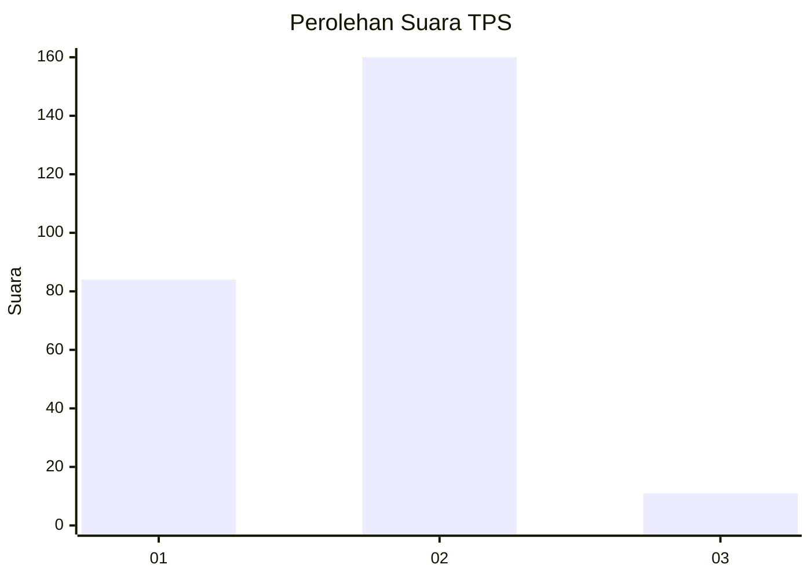
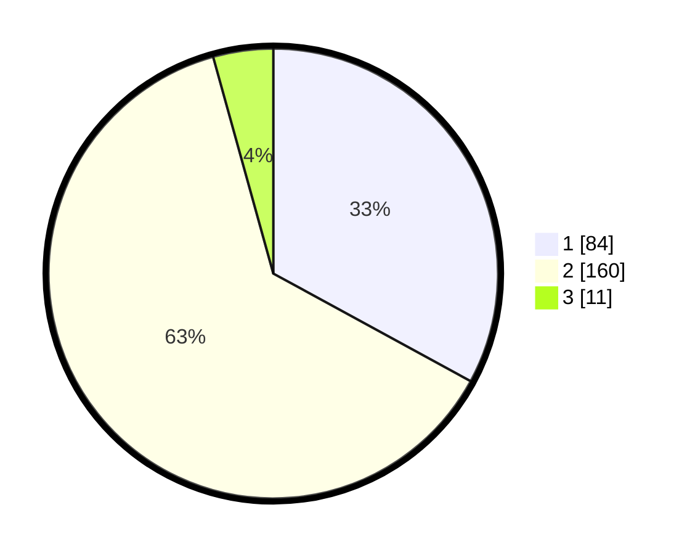

# Hasil

## Grafik

## Tabel

| No. | Nama Paslon    | Suara | Suara (raw) | Persentase |
|:--- |:-------------- | -----:| -----------:| ----------:|
| 1   | ANIES MUHAIMIN | 84    | [84][p-1]   | 32,94      |
| 2   | PRABOWO GIBRAN | 160   | [160][p-2]  | 62,75      |
| 3   | GANJAR MAHFUD  | 11    | [11][p-3]   | 4,31       |

[p-1]: https://github.com/gigit-pemilu/pemilu-2024-16-sumatera-selatan/blob/main/pilpres/hitung-suara/sub/16-sumatera-selatan/sub/06-musi-banyuasin/sub/01-sekayu/sub/1009-kayu-ara/sub/007-tps/sub/paslon-1.txt
[p-2]: https://github.com/gigit-pemilu/pemilu-2024-16-sumatera-selatan/blob/main/pilpres/hitung-suara/sub/16-sumatera-selatan/sub/06-musi-banyuasin/sub/01-sekayu/sub/1009-kayu-ara/sub/007-tps/sub/paslon-2.txt
[p-3]: https://github.com/gigit-pemilu/pemilu-2024-16-sumatera-selatan/blob/main/pilpres/hitung-suara/sub/16-sumatera-selatan/sub/06-musi-banyuasin/sub/01-sekayu/sub/1009-kayu-ara/sub/007-tps/sub/paslon-3.txt

## Foto C Plano

https://sirekap-obj-formc.kpu.go.id/622b/pemilu/ppwp/16/06/01/10/09/1606011009007-20240220-103631--1201848d-c41f-4580-bfbe-ffdabe92ded3.jpg

https://sirekap-obj-formc.kpu.go.id/622b/pemilu/ppwp/16/06/01/10/09/1606011009007-20240216-143114--e25d5d33-e34e-423e-b8ce-a6dd4a4d430b.jpg

https://sirekap-obj-formc.kpu.go.id/622b/pemilu/ppwp/16/06/01/10/09/1606011009007-20240216-143031--94cf8b90-59b8-46fd-81b7-e0ea5e772d3e.jpg

## Metadata

| Key        | Value               |
| ---------- | ------------------- |
| Time Stamp | 2024-02-20 11:00:00 |

