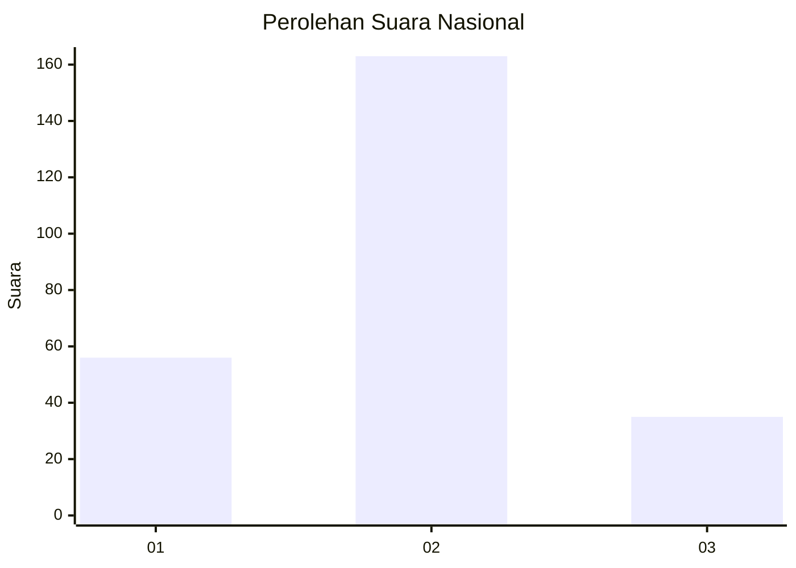
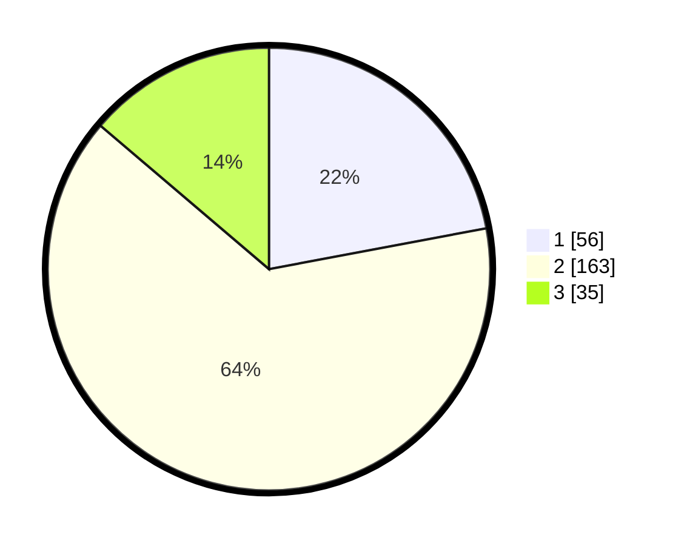

# Hasil

## Grafik

## Tabel

| No. | Nama Paslon    | Suara | Suara (raw) | Persentase |
|:--- |:-------------- | -----:| -----------:| ----------:|
| 1   | ANIES MUHAIMIN | 56    | [56][p-1]   | 22,05      |
| 2   | PRABOWO GIBRAN | 163   | [163][p-2]  | 64,17      |
| 3   | GANJAR MAHFUD  | 35    | [35][p-3]   | 13,78      |

[p-1]: https://github.com/gigit-pemilu/pemilu-2024/blob/main/pilpres/hitung-suara/sub/16-sumatera-selatan/sub/06-musi-banyuasin/sub/01-sekayu/sub/1009-kayu-ara/sub/008-tps/sub/paslon-1.txt
[p-2]: https://github.com/gigit-pemilu/pemilu-2024/blob/main/pilpres/hitung-suara/sub/16-sumatera-selatan/sub/06-musi-banyuasin/sub/01-sekayu/sub/1009-kayu-ara/sub/008-tps/sub/paslon-2.txt
[p-3]: https://github.com/gigit-pemilu/pemilu-2024/blob/main/pilpres/hitung-suara/sub/16-sumatera-selatan/sub/06-musi-banyuasin/sub/01-sekayu/sub/1009-kayu-ara/sub/008-tps/sub/paslon-3.txt

## Foto C Plano

https://sirekap-obj-formc.kpu.go.id/dc5e/pemilu/ppwp/16/06/01/10/09/1606011009008-20240220-103941--0d7baaa8-73ff-4e69-8f2a-a1072008a5f9.jpg

https://sirekap-obj-formc.kpu.go.id/dc5e/pemilu/ppwp/16/06/01/10/09/1606011009008-20240220-104052--0872155e-9491-4502-85d6-687f1687ab44.jpg

https://sirekap-obj-formc.kpu.go.id/dc5e/pemilu/ppwp/16/06/01/10/09/1606011009008-20240220-104134--e9775196-dff3-442c-a603-714a3be70f0a.jpg

## Metadata

| Key        | Value               |
| ---------- | ------------------- |
| Time Stamp | 2024-02-24 22:31:28 |

