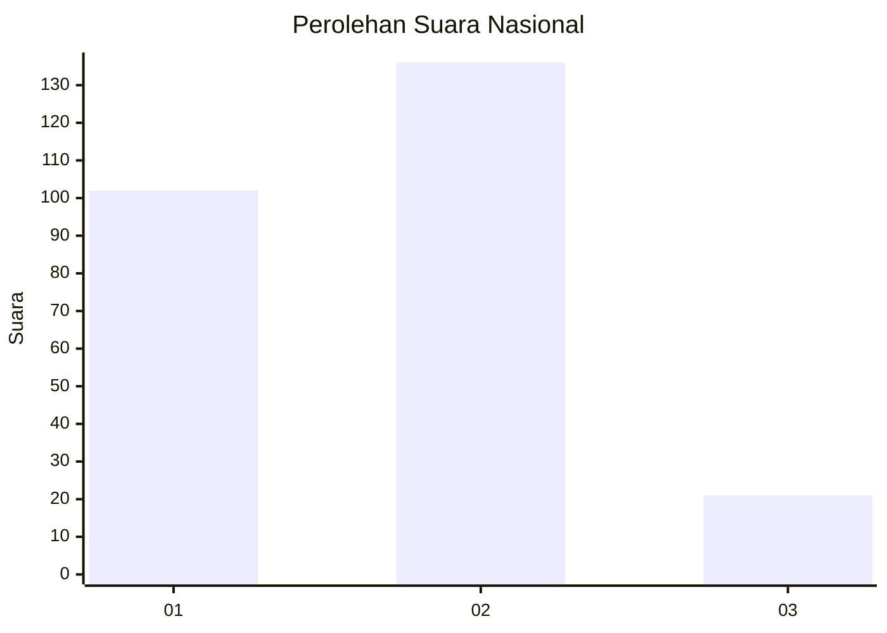
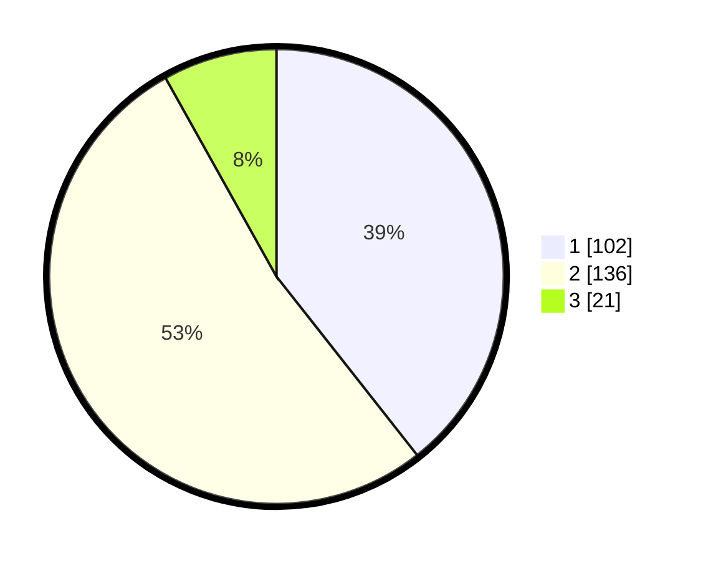

# Hasil

## Grafik

## Tabel

| No. | Nama Paslon    | Suara | Suara (raw) | Persentase |
|:--- |:-------------- | -----:| -----------:| ----------:|
| 1   | ANIES MUHAIMIN | 102   | [102][p-1]  | 39,38      |
| 2   | PRABOWO GIBRAN | 136   | [136][p-2]  | 52,51      |
| 3   | GANJAR MAHFUD  | 21    | [21][p-3]   | 8,11       |

[p-1]: https://github.com/gigit-pemilu/pemilu-2024/blob/main/pilpres/hitung-suara/sub/16-sumatera-selatan/sub/06-musi-banyuasin/sub/01-sekayu/sub/1009-kayu-ara/sub/012-tps/sub/paslon-1.txt
[p-2]: https://github.com/gigit-pemilu/pemilu-2024/blob/main/pilpres/hitung-suara/sub/16-sumatera-selatan/sub/06-musi-banyuasin/sub/01-sekayu/sub/1009-kayu-ara/sub/012-tps/sub/paslon-2.txt
[p-3]: https://github.com/gigit-pemilu/pemilu-2024/blob/main/pilpres/hitung-suara/sub/16-sumatera-selatan/sub/06-musi-banyuasin/sub/01-sekayu/sub/1009-kayu-ara/sub/012-tps/sub/paslon-3.txt

## Foto C Plano

https://sirekap-obj-formc.kpu.go.id/fa8f/pemilu/ppwp/16/06/01/10/09/1606011009012-20240220-111117--aee95df2-67e4-4b44-8fc3-0dd96670fbda.jpg

https://sirekap-obj-formc.kpu.go.id/fa8f/pemilu/ppwp/16/06/01/10/09/1606011009012-20240220-111225--a741054b-2dc7-4450-82aa-1ec89c4f7c0f.jpg

https://sirekap-obj-formc.kpu.go.id/fa8f/pemilu/ppwp/16/06/01/10/09/1606011009012-20240220-111324--00f6df26-cf39-4beb-8cd9-18b2e6ba940c.jpg

## Metadata

| Key        | Value               |
| ---------- | ------------------- |
| Time Stamp | 2024-02-24 22:31:28 |

