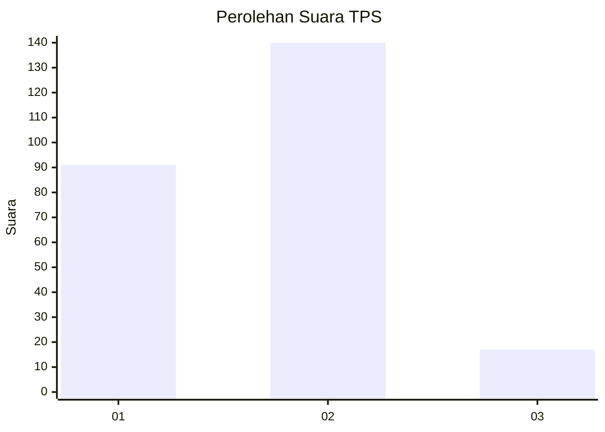
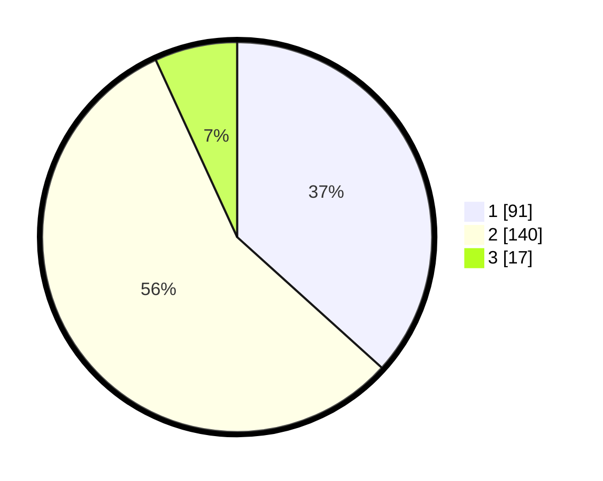

# Hasil

## Grafik

## Tabel

| No. | Nama Paslon    | Suara | Suara (raw) | Persentase |
|:--- |:-------------- | -----:| -----------:| ----------:|
| 1   | ANIES MUHAIMIN | 91    | [91][p-1]   | 36,69      |
| 2   | PRABOWO GIBRAN | 140   | [140][p-2]  | 56,45      |
| 3   | GANJAR MAHFUD  | 17    | [17][p-3]   | 6,85       |

[p-1]: https://github.com/gigit-pemilu/pemilu-2024-16-sumatera-selatan/blob/main/pilpres/hitung-suara/sub/16-sumatera-selatan/sub/06-musi-banyuasin/sub/01-sekayu/sub/1009-kayu-ara/sub/017-tps/sub/paslon-1.txt
[p-2]: https://github.com/gigit-pemilu/pemilu-2024-16-sumatera-selatan/blob/main/pilpres/hitung-suara/sub/16-sumatera-selatan/sub/06-musi-banyuasin/sub/01-sekayu/sub/1009-kayu-ara/sub/017-tps/sub/paslon-2.txt
[p-3]: https://github.com/gigit-pemilu/pemilu-2024-16-sumatera-selatan/blob/main/pilpres/hitung-suara/sub/16-sumatera-selatan/sub/06-musi-banyuasin/sub/01-sekayu/sub/1009-kayu-ara/sub/017-tps/sub/paslon-3.txt

## Foto C Plano

https://sirekap-obj-formc.kpu.go.id/547c/pemilu/ppwp/16/06/01/10/09/1606011009017-20240220-114454--f298ed93-9f09-4c1f-9e5e-d43f1742f763.jpg

https://sirekap-obj-formc.kpu.go.id/547c/pemilu/ppwp/16/06/01/10/09/1606011009017-20240220-114550--c8d4cee0-f09d-47a5-8097-f74d76696ce1.jpg

https://sirekap-obj-formc.kpu.go.id/547c/pemilu/ppwp/16/06/01/10/09/1606011009017-20240220-114637--885e86eb-26f9-41d5-9bb1-9888d9b0d942.jpg

## Metadata

| Key        | Value               |
| ---------- | ------------------- |
| Time Stamp | 2024-02-25 16:00:00 |

