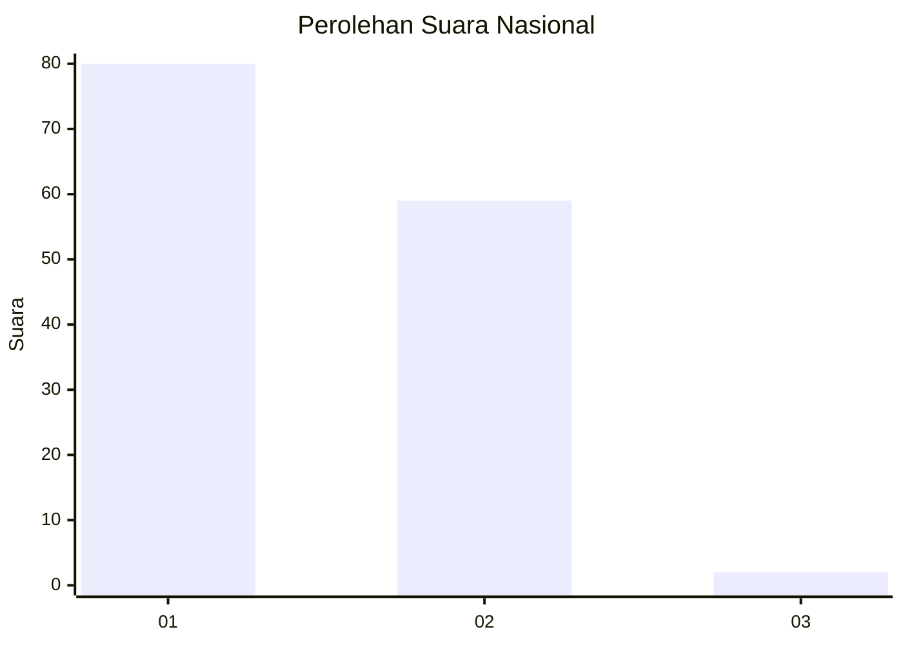
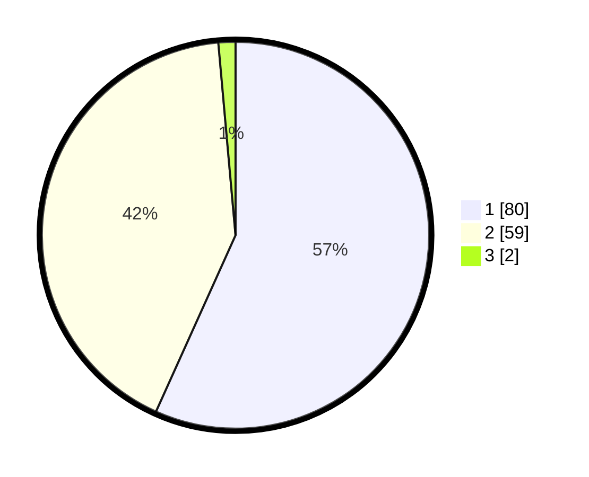

# Hasil

## Grafik

## Tabel

| No. | Nama Paslon    | Suara | Suara (raw) | Persentase |
|:--- |:-------------- | -----:| -----------:| ----------:|
| 1   | ANIES MUHAIMIN | 80    | [80][p-1]   | 56,74      |
| 2   | PRABOWO GIBRAN | 59    | [59][p-2]   | 41,84      |
| 3   | GANJAR MAHFUD  | 2     | [2][p-3]    | 1,42       |

[p-1]: https://github.com/gigit-pemilu/pemilu-2024/blob/main/pilpres/hitung-suara/sub/16-sumatera-selatan/sub/06-musi-banyuasin/sub/01-sekayu/sub/1009-kayu-ara/sub/025-tps/sub/paslon-1.txt
[p-2]: https://github.com/gigit-pemilu/pemilu-2024/blob/main/pilpres/hitung-suara/sub/16-sumatera-selatan/sub/06-musi-banyuasin/sub/01-sekayu/sub/1009-kayu-ara/sub/025-tps/sub/paslon-2.txt
[p-3]: https://github.com/gigit-pemilu/pemilu-2024/blob/main/pilpres/hitung-suara/sub/16-sumatera-selatan/sub/06-musi-banyuasin/sub/01-sekayu/sub/1009-kayu-ara/sub/025-tps/sub/paslon-3.txt

## Foto C Plano

https://sirekap-obj-formc.kpu.go.id/b15a/pemilu/ppwp/16/06/01/10/09/1606011009025-20240220-135205--7803b14f-c67c-4488-9f66-5371106cf77b.jpg

https://sirekap-obj-formc.kpu.go.id/b15a/pemilu/ppwp/16/06/01/10/09/1606011009025-20240220-135305--0bba9938-a7da-45ed-957a-52a1bd0350ca.jpg

https://sirekap-obj-formc.kpu.go.id/b15a/pemilu/ppwp/16/06/01/10/09/1606011009025-20240220-135408--1824c168-cc01-482b-aa98-db1e9ab9a636.jpg

## Metadata

| Key        | Value               |
| ---------- | ------------------- |
| Time Stamp | 2024-02-25 00:00:00 |

