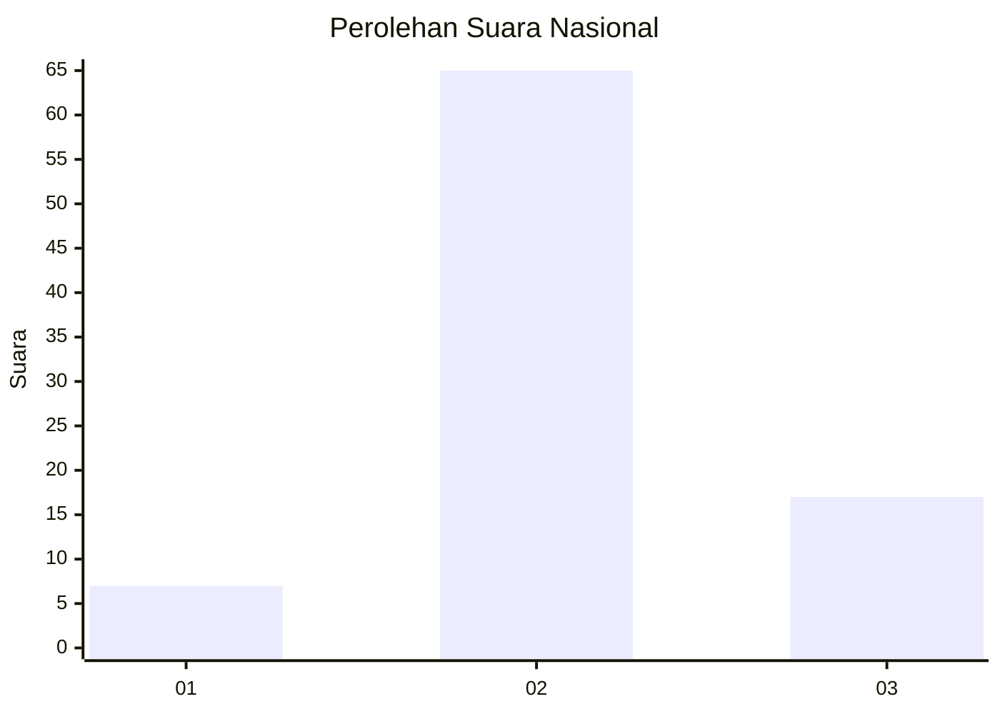
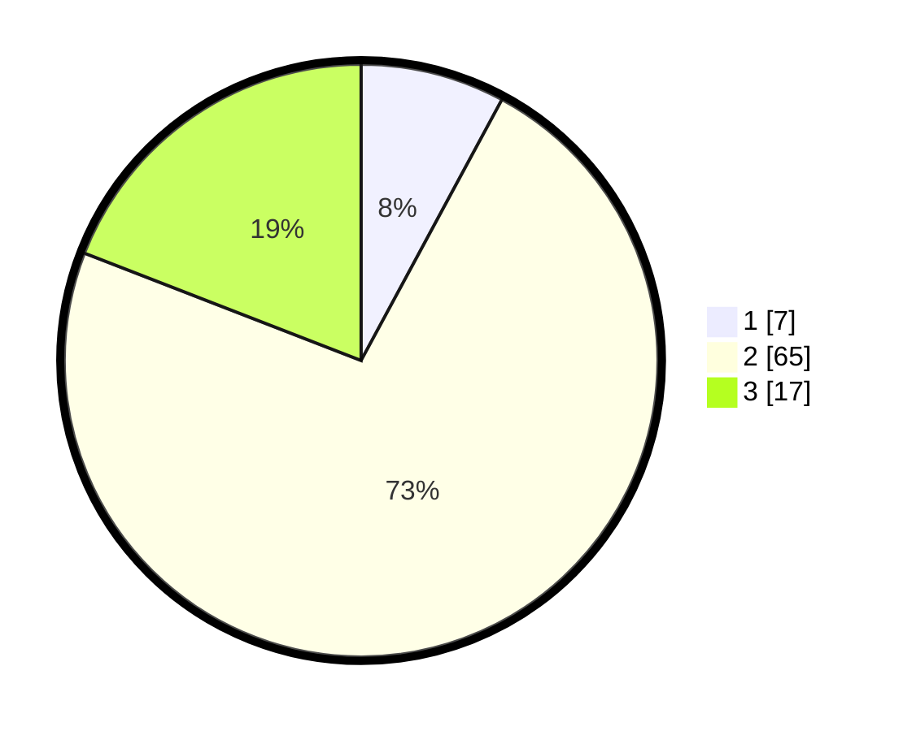

# Hasil

## Grafik

## Tabel

| No. | Nama Paslon    | Suara | Suara (raw) | Persentase |
|:--- |:-------------- | -----:| -----------:| ----------:|
| 1   | ANIES MUHAIMIN | 7     | [7][p-1]    | 7,87       |
| 2   | PRABOWO GIBRAN | 65    | [65][p-2]   | 73,03      |
| 3   | GANJAR MAHFUD  | 17    | [17][p-3]   | 19,10      |

[p-1]: https://github.com/gigit-pemilu/pemilu-2024/blob/main/pilpres/hitung-suara/sub/16-sumatera-selatan/sub/06-musi-banyuasin/sub/01-sekayu/sub/1009-kayu-ara/sub/027-tps/sub/paslon-1.txt
[p-2]: https://github.com/gigit-pemilu/pemilu-2024/blob/main/pilpres/hitung-suara/sub/16-sumatera-selatan/sub/06-musi-banyuasin/sub/01-sekayu/sub/1009-kayu-ara/sub/027-tps/sub/paslon-2.txt
[p-3]: https://github.com/gigit-pemilu/pemilu-2024/blob/main/pilpres/hitung-suara/sub/16-sumatera-selatan/sub/06-musi-banyuasin/sub/01-sekayu/sub/1009-kayu-ara/sub/027-tps/sub/paslon-3.txt

## Foto C Plano

https://sirekap-obj-formc.kpu.go.id/48d5/pemilu/ppwp/16/06/01/10/09/1606011009027-20240221-224502--82d4507b-0119-409a-a278-a50a03615020.jpg

https://sirekap-obj-formc.kpu.go.id/48d5/pemilu/ppwp/16/06/01/10/09/1606011009027-20240221-224550--48ff3ae7-b57e-4f60-97cd-5ed39e922230.jpg

https://sirekap-obj-formc.kpu.go.id/48d5/pemilu/ppwp/16/06/01/10/09/1606011009027-20240221-224420--2a58f9e4-86ae-4a0d-a358-21b3b4285996.jpg

## Metadata

| Key        | Value               |
| ---------- | ------------------- |
| Time Stamp | 2024-02-24 22:31:28 |

