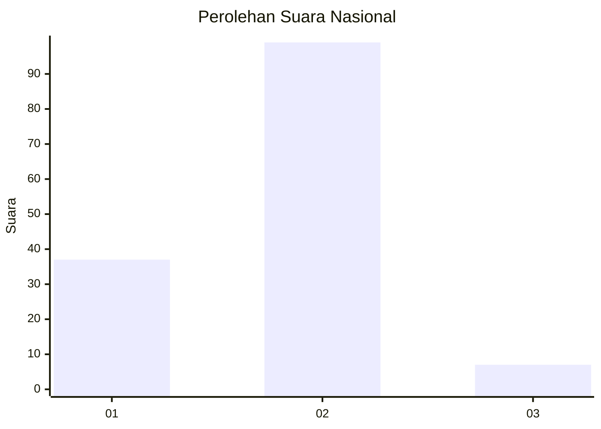
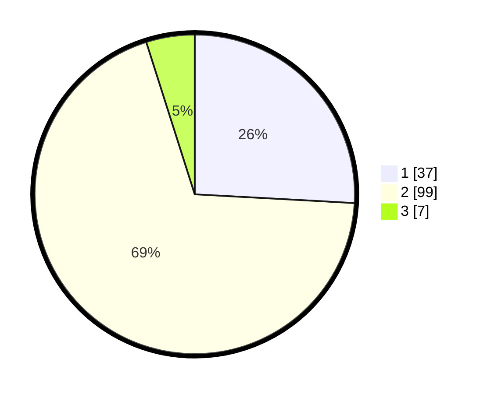

# Hasil

## Grafik

## Tabel

| No. | Nama Paslon    | Suara | Suara (raw) | Persentase |
|:--- |:-------------- | -----:| -----------:| ----------:|
| 1   | ANIES MUHAIMIN | 37    | [37][p-1]   | 25,87      |
| 2   | PRABOWO GIBRAN | 99    | [99][p-2]   | 69,23      |
| 3   | GANJAR MAHFUD  | 7     | [7][p-3]    | 4,90       |

[p-1]: https://github.com/gigit-pemilu/pemilu-2024/blob/main/pilpres/hitung-suara/sub/16-sumatera-selatan/sub/06-musi-banyuasin/sub/01-sekayu/sub/1009-kayu-ara/sub/029-tps/sub/paslon-1.txt
[p-2]: https://github.com/gigit-pemilu/pemilu-2024/blob/main/pilpres/hitung-suara/sub/16-sumatera-selatan/sub/06-musi-banyuasin/sub/01-sekayu/sub/1009-kayu-ara/sub/029-tps/sub/paslon-2.txt
[p-3]: https://github.com/gigit-pemilu/pemilu-2024/blob/main/pilpres/hitung-suara/sub/16-sumatera-selatan/sub/06-musi-banyuasin/sub/01-sekayu/sub/1009-kayu-ara/sub/029-tps/sub/paslon-3.txt

## Foto C Plano

https://sirekap-obj-formc.kpu.go.id/204b/pemilu/ppwp/16/06/01/10/09/1606011009029-20240220-142545--1bbda474-e6df-41d6-82d3-af17a986421e.jpg

https://sirekap-obj-formc.kpu.go.id/204b/pemilu/ppwp/16/06/01/10/09/1606011009029-20240220-142637--2758d154-1728-4e54-842d-3b92d8befd96.jpg

https://sirekap-obj-formc.kpu.go.id/204b/pemilu/ppwp/16/06/01/10/09/1606011009029-20240220-142729--0a7060f3-7f5f-451f-a7fc-a4300658f473.jpg

## Metadata

| Key        | Value               |
| ---------- | ------------------- |
| Time Stamp | 2024-02-24 23:00:00 |

