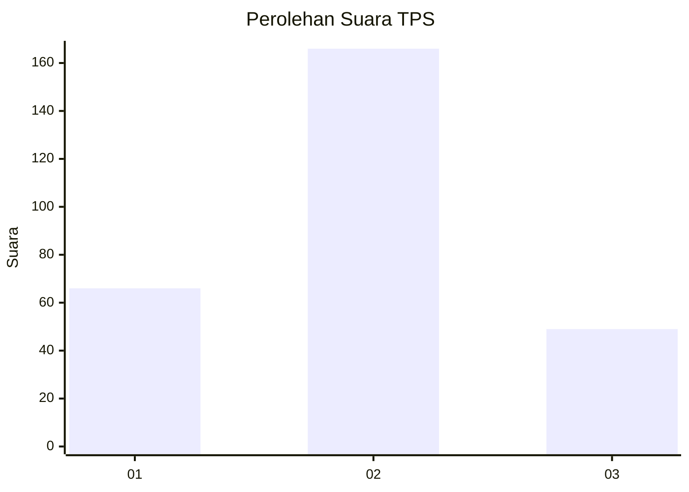
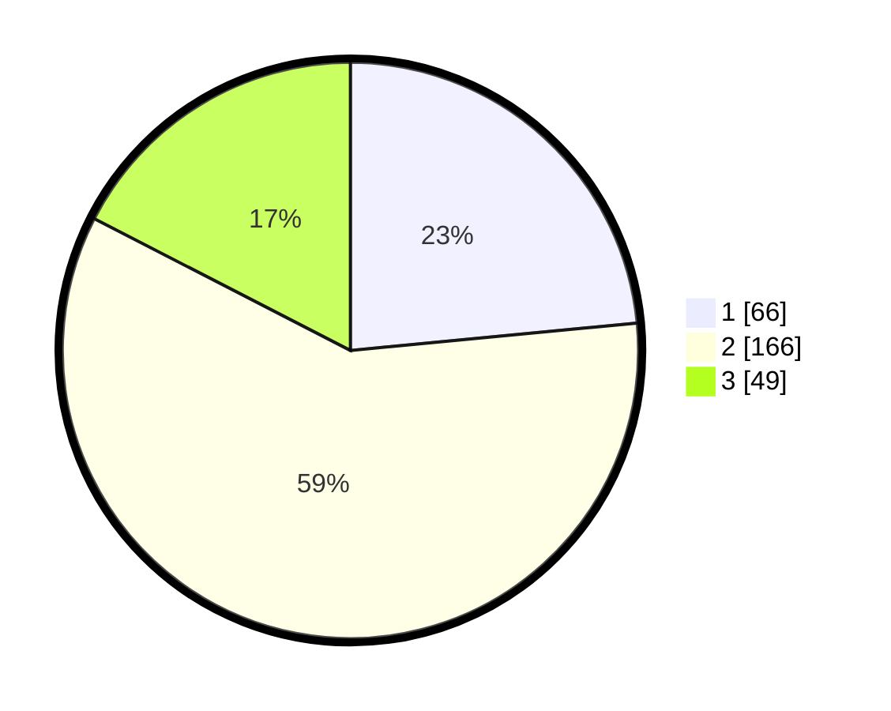

# Hasil

## Grafik

## Tabel

| No. | Nama Paslon    | Suara | Suara (raw) | Persentase |
|:--- |:-------------- | -----:| -----------:| ----------:|
| 1   | ANIES MUHAIMIN | 66    | [66][p-1]   | 23,49      |
| 2   | PRABOWO GIBRAN | 166   | [166][p-2]  | 59,07      |
| 3   | GANJAR MAHFUD  | 49    | [49][p-3]   | 17,44      |

[p-1]: https://github.com/gigit-pemilu/pemilu-2024-16-sumatera-selatan/blob/main/pilpres/hitung-suara/sub/16-sumatera-selatan/sub/06-musi-banyuasin/sub/01-sekayu/sub/1010-serasan-jaya/sub/002-tps/sub/paslon-1.txt
[p-2]: https://github.com/gigit-pemilu/pemilu-2024-16-sumatera-selatan/blob/main/pilpres/hitung-suara/sub/16-sumatera-selatan/sub/06-musi-banyuasin/sub/01-sekayu/sub/1010-serasan-jaya/sub/002-tps/sub/paslon-2.txt
[p-3]: https://github.com/gigit-pemilu/pemilu-2024-16-sumatera-selatan/blob/main/pilpres/hitung-suara/sub/16-sumatera-selatan/sub/06-musi-banyuasin/sub/01-sekayu/sub/1010-serasan-jaya/sub/002-tps/sub/paslon-3.txt

## Foto C Plano

https://sirekap-obj-formc.kpu.go.id/f10f/pemilu/ppwp/16/06/01/10/10/1606011010002-20240220-202109--8382eac5-6155-4e9e-9123-a2ab923a9251.jpg

https://sirekap-obj-formc.kpu.go.id/f10f/pemilu/ppwp/16/06/01/10/10/1606011010002-20240220-201953--d7d52f86-92f8-4406-b182-0b3da3c05482.jpg

https://sirekap-obj-formc.kpu.go.id/f10f/pemilu/ppwp/16/06/01/10/10/1606011010002-20240220-201859--8bc8bfc3-c0f2-4d40-99ab-a1bf35e07e56.jpg

## Metadata

| Key        | Value               |
| ---------- | ------------------- |
| Time Stamp | 2024-02-25 03:00:00 |

