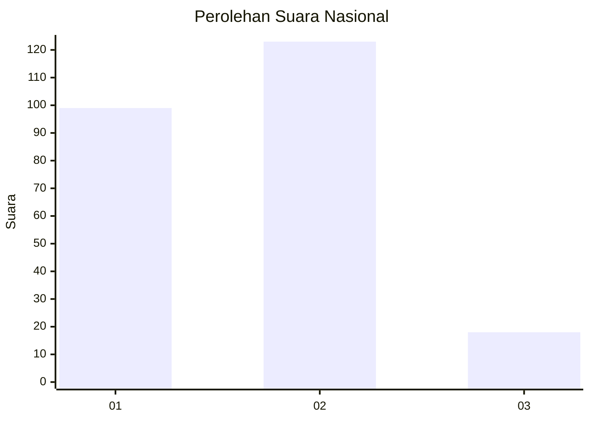
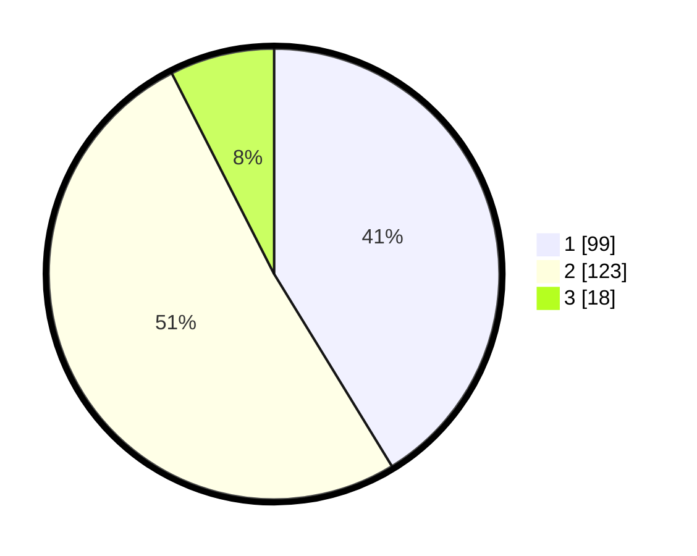

# Hasil

## Grafik

## Tabel

| No. | Nama Paslon    | Suara | Suara (raw) | Persentase |
|:--- |:-------------- | -----:| -----------:| ----------:|
| 1   | ANIES MUHAIMIN | 99    | [99][p-1]   | 41,25      |
| 2   | PRABOWO GIBRAN | 123   | [123][p-2]  | 51,25      |
| 3   | GANJAR MAHFUD  | 18    | [18][p-3]   | 7,50       |

[p-1]: https://github.com/gigit-pemilu/pemilu-2024/blob/main/pilpres/hitung-suara/sub/16-sumatera-selatan/sub/06-musi-banyuasin/sub/01-sekayu/sub/1010-serasan-jaya/sub/004-tps/sub/paslon-1.txt
[p-2]: https://github.com/gigit-pemilu/pemilu-2024/blob/main/pilpres/hitung-suara/sub/16-sumatera-selatan/sub/06-musi-banyuasin/sub/01-sekayu/sub/1010-serasan-jaya/sub/004-tps/sub/paslon-2.txt
[p-3]: https://github.com/gigit-pemilu/pemilu-2024/blob/main/pilpres/hitung-suara/sub/16-sumatera-selatan/sub/06-musi-banyuasin/sub/01-sekayu/sub/1010-serasan-jaya/sub/004-tps/sub/paslon-3.txt

## Foto C Plano

https://sirekap-obj-formc.kpu.go.id/0cff/pemilu/ppwp/16/06/01/10/10/1606011010004-20240220-205113--4061a74c-0b36-4101-ae87-143dff1e3a6f.jpg

https://sirekap-obj-formc.kpu.go.id/0cff/pemilu/ppwp/16/06/01/10/10/1606011010004-20240215-041640--7a668a9e-26ab-40f5-8252-72c065311536.jpg

https://sirekap-obj-formc.kpu.go.id/0cff/pemilu/ppwp/16/06/01/10/10/1606011010004-20240215-041644--8903762a-8526-4d09-8a5b-1fd32961a7ae.jpg

## Metadata

| Key        | Value               |
| ---------- | ------------------- |
| Time Stamp | 2024-02-20 21:00:00 |

