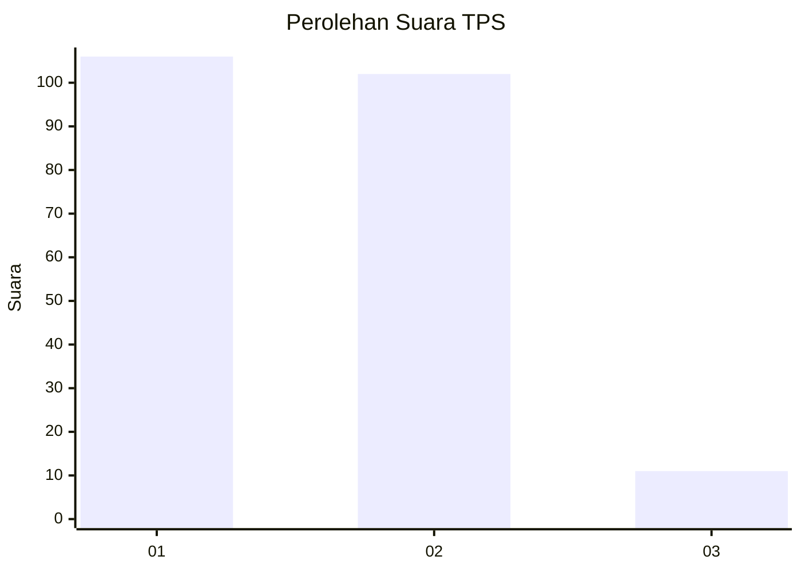
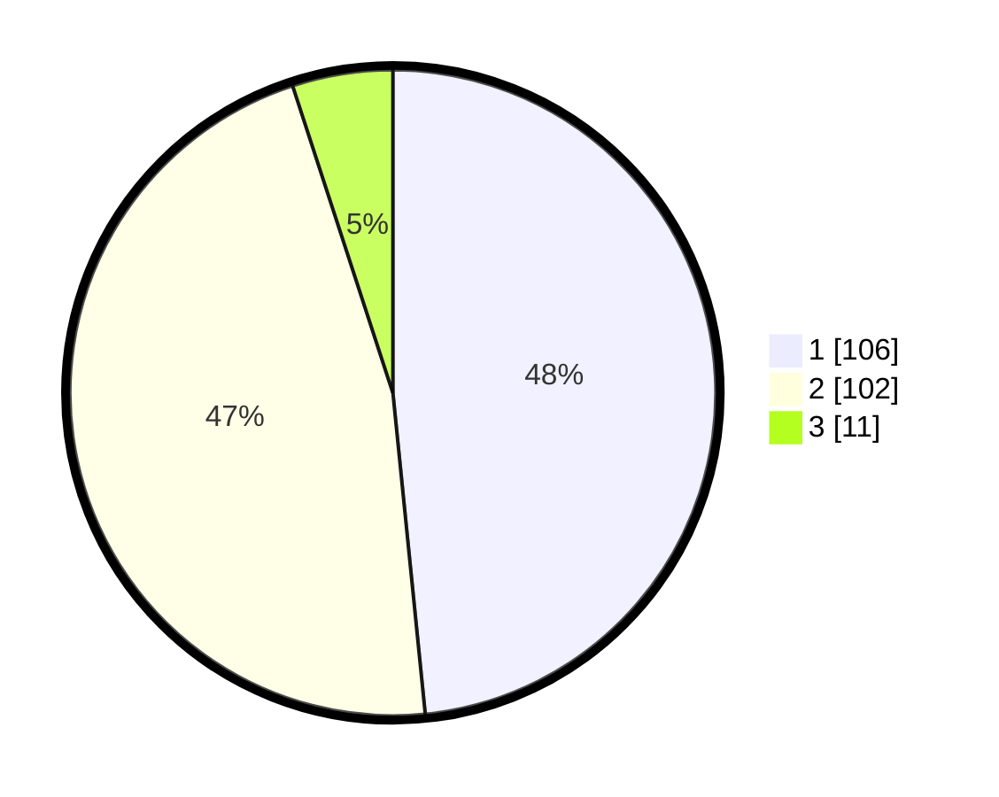

# Hasil

## Grafik

## Tabel

| No. | Nama Paslon    | Suara | Suara (raw) | Persentase |
|:--- |:-------------- | -----:| -----------:| ----------:|
| 1   | ANIES MUHAIMIN | 106   | [106][p-1]  | 48,40      |
| 2   | PRABOWO GIBRAN | 102   | [102][p-2]  | 46,58      |
| 3   | GANJAR MAHFUD  | 11    | [11][p-3]   | 5,02       |

[p-1]: https://github.com/gigit-pemilu/pemilu-2024-16-sumatera-selatan/blob/main/pilpres/hitung-suara/sub/16-sumatera-selatan/sub/06-musi-banyuasin/sub/01-sekayu/sub/1010-serasan-jaya/sub/012-tps/sub/paslon-1.txt
[p-2]: https://github.com/gigit-pemilu/pemilu-2024-16-sumatera-selatan/blob/main/pilpres/hitung-suara/sub/16-sumatera-selatan/sub/06-musi-banyuasin/sub/01-sekayu/sub/1010-serasan-jaya/sub/012-tps/sub/paslon-2.txt
[p-3]: https://github.com/gigit-pemilu/pemilu-2024-16-sumatera-selatan/blob/main/pilpres/hitung-suara/sub/16-sumatera-selatan/sub/06-musi-banyuasin/sub/01-sekayu/sub/1010-serasan-jaya/sub/012-tps/sub/paslon-3.txt

## Foto C Plano

https://sirekap-obj-formc.kpu.go.id/4e3d/pemilu/ppwp/16/06/01/10/10/1606011010012-20240220-214959--965e3df6-5079-459d-b91f-c78866cf64fb.jpg

https://sirekap-obj-formc.kpu.go.id/4e3d/pemilu/ppwp/16/06/01/10/10/1606011010012-20240220-215056--b2f6349f-c2de-48b2-b48a-fe10ad42bd25.jpg

https://sirekap-obj-formc.kpu.go.id/4e3d/pemilu/ppwp/16/06/01/10/10/1606011010012-20240220-215447--0e450272-19de-4bc1-92ed-d54e54c28e00.jpg

## Metadata

| Key        | Value               |
| ---------- | ------------------- |
| Time Stamp | 2024-02-24 22:31:28 |

