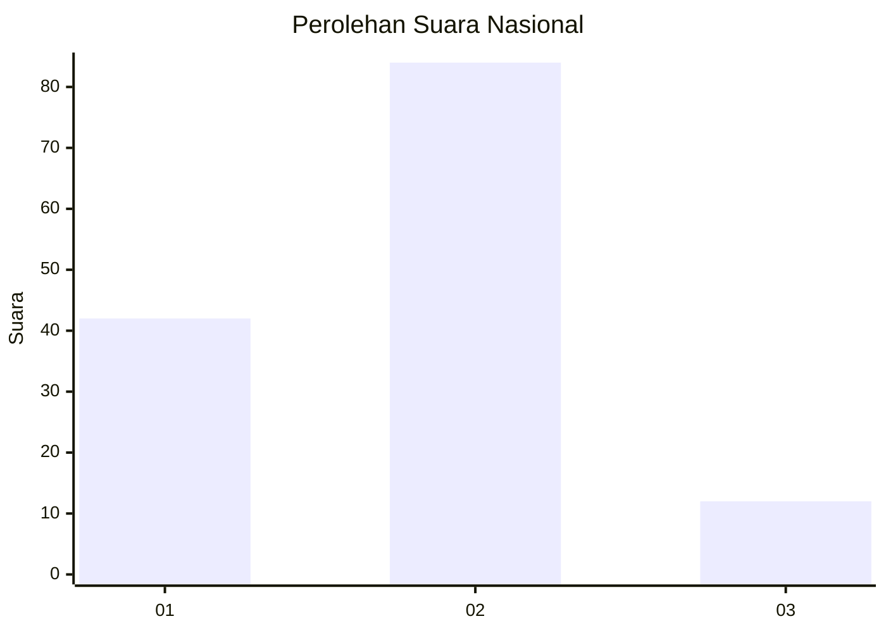
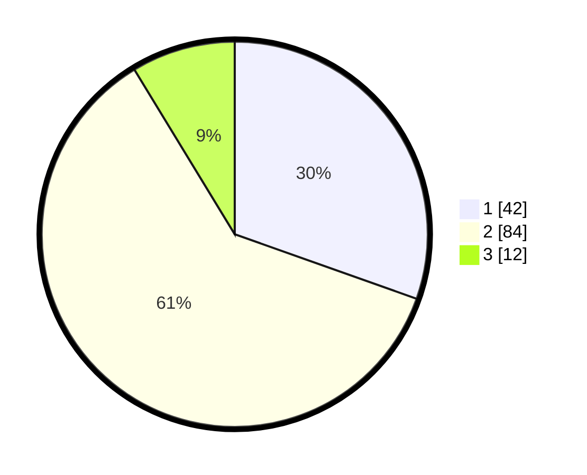

# Hasil

## Grafik

## Tabel

| No. | Nama Paslon    | Suara | Suara (raw) | Persentase |
|:--- |:-------------- | -----:| -----------:| ----------:|
| 1   | ANIES MUHAIMIN | 42    | [42][p-1]   | 30,43      |
| 2   | PRABOWO GIBRAN | 84    | [84][p-2]   | 60,87      |
| 3   | GANJAR MAHFUD  | 12    | [12][p-3]   | 8,70       |

[p-1]: https://github.com/gigit-pemilu/pemilu-2024/blob/main/pilpres/hitung-suara/sub/16-sumatera-selatan/sub/06-musi-banyuasin/sub/01-sekayu/sub/1010-serasan-jaya/sub/017-tps/sub/paslon-1.txt
[p-2]: https://github.com/gigit-pemilu/pemilu-2024/blob/main/pilpres/hitung-suara/sub/16-sumatera-selatan/sub/06-musi-banyuasin/sub/01-sekayu/sub/1010-serasan-jaya/sub/017-tps/sub/paslon-2.txt
[p-3]: https://github.com/gigit-pemilu/pemilu-2024/blob/main/pilpres/hitung-suara/sub/16-sumatera-selatan/sub/06-musi-banyuasin/sub/01-sekayu/sub/1010-serasan-jaya/sub/017-tps/sub/paslon-3.txt

## Foto C Plano

https://sirekap-obj-formc.kpu.go.id/d1bc/pemilu/ppwp/16/06/01/10/10/1606011010017-20240220-223428--2b6966e9-1d1b-4d65-bcff-9b5362c55657.jpg

https://sirekap-obj-formc.kpu.go.id/d1bc/pemilu/ppwp/16/06/01/10/10/1606011010017-20240214-220725--5fac27ec-d9a7-4e87-a1ce-be105b3f2ee0.jpg

https://sirekap-obj-formc.kpu.go.id/d1bc/pemilu/ppwp/16/06/01/10/10/1606011010017-20240214-222119--1ce5c560-1670-42ec-a147-95015154afb3.jpg

## Metadata

| Key        | Value               |
| ---------- | ------------------- |
| Time Stamp | 2024-02-20 23:00:00 |

