# Hasil

## Grafik

```mermaid
%%{init: {"pie": {"textPosition": 0.5}, "themeVariables": {"pieOuterStrokeWidth": "5px"}} }%%
pie showData
    "1" : 58
    "2" : 86
    "3" : 9
```

## Tabel

| No. | Nama Paslon    | Suara | Suara (raw) | Persentase |
|:--- |:-------------- | -----:| -----------:| ----------:|
| 1   | ANIES MUHAIMIN | 58    | [58][p-1]   | 37,91      |
| 2   | PRABOWO GIBRAN | 86    | [86][p-2]   | 56,21      |
| 3   | GANJAR MAHFUD  | 9     | [9][p-3]    | 5,88       |

[p-1]: https://github.com/gigit-pemilu/pemilu-2024-16-sumatera-selatan/blob/main/pilpres/hitung-suara/sub/16-sumatera-selatan/sub/06-musi-banyuasin/sub/01-sekayu/sub/1010-serasan-jaya/sub/020-tps/sub/paslon-1.txt
[p-2]: https://github.com/gigit-pemilu/pemilu-2024-16-sumatera-selatan/blob/main/pilpres/hitung-suara/sub/16-sumatera-selatan/sub/06-musi-banyuasin/sub/01-sekayu/sub/1010-serasan-jaya/sub/020-tps/sub/paslon-2.txt
[p-3]: https://github.com/gigit-pemilu/pemilu-2024-16-sumatera-selatan/blob/main/pilpres/hitung-suara/sub/16-sumatera-selatan/sub/06-musi-banyuasin/sub/01-sekayu/sub/1010-serasan-jaya/sub/020-tps/sub/paslon-3.txt

## Foto C Plano

https://sirekap-obj-formc.kpu.go.id/4bbf/pemilu/ppwp/16/06/01/10/10/1606011010020-20240220-224524--1abd252d-75a4-41ce-aeda-3b6e5297b30c.jpg

https://sirekap-obj-formc.kpu.go.id/4bbf/pemilu/ppwp/16/06/01/10/10/1606011010020-20240220-224622--594d552c-8423-423b-9357-30f4fb4d3273.jpg

https://sirekap-obj-formc.kpu.go.id/4bbf/pemilu/ppwp/16/06/01/10/10/1606011010020-20240220-224719--f9aa88b0-c8be-4c19-aecd-58beea486e97.jpg

## Metadata

| Key        | Value               |
| ---------- | ------------------- |
| Time Stamp | 2024-02-24 22:31:28 |

