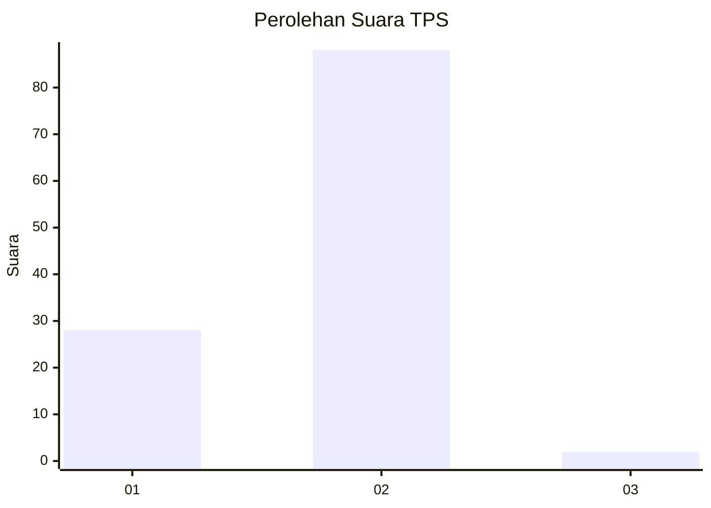
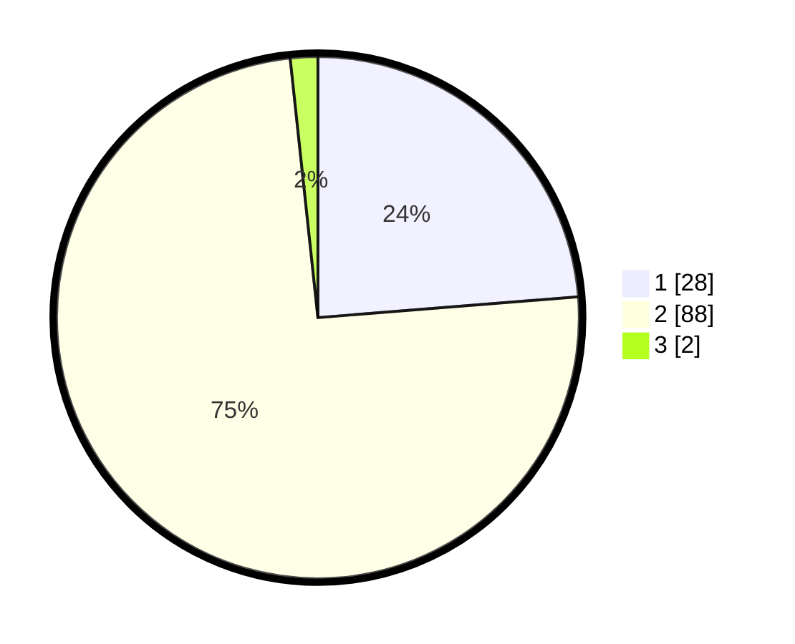

# Hasil

## Grafik

## Tabel

| No. | Nama Paslon    | Suara | Suara (raw) | Persentase |
|:--- |:-------------- | -----:| -----------:| ----------:|
| 1   | ANIES MUHAIMIN | 28    | [28][p-1]   | 23,73      |
| 2   | PRABOWO GIBRAN | 88    | [88][p-2]   | 74,58      |
| 3   | GANJAR MAHFUD  | 2     | [2][p-3]    | 1,69       |

[p-1]: https://github.com/gigit-pemilu/pemilu-2024-16-sumatera-selatan/blob/main/pilpres/hitung-suara/sub/16-sumatera-selatan/sub/06-musi-banyuasin/sub/01-sekayu/sub/1010-serasan-jaya/sub/021-tps/sub/paslon-1.txt
[p-2]: https://github.com/gigit-pemilu/pemilu-2024-16-sumatera-selatan/blob/main/pilpres/hitung-suara/sub/16-sumatera-selatan/sub/06-musi-banyuasin/sub/01-sekayu/sub/1010-serasan-jaya/sub/021-tps/sub/paslon-2.txt
[p-3]: https://github.com/gigit-pemilu/pemilu-2024-16-sumatera-selatan/blob/main/pilpres/hitung-suara/sub/16-sumatera-selatan/sub/06-musi-banyuasin/sub/01-sekayu/sub/1010-serasan-jaya/sub/021-tps/sub/paslon-3.txt

## Foto C Plano

https://sirekap-obj-formc.kpu.go.id/bb3a/pemilu/ppwp/16/06/01/10/10/1606011010021-20240220-225502--f1245f70-3d97-43d7-96ee-a08e31d3b901.jpg

https://sirekap-obj-formc.kpu.go.id/bb3a/pemilu/ppwp/16/06/01/10/10/1606011010021-20240220-225044--ae616617-b8c0-47d6-954d-8397ec3b518b.jpg

https://sirekap-obj-formc.kpu.go.id/bb3a/pemilu/ppwp/16/06/01/10/10/1606011010021-20240220-225135--f029a4b8-7da3-4fdd-9e18-ae78a1461cd4.jpg

## Metadata

| Key        | Value               |
| ---------- | ------------------- |
| Time Stamp | 2024-02-25 12:00:00 |

