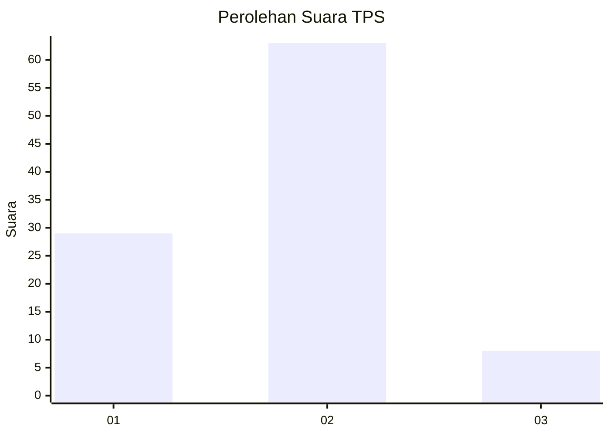
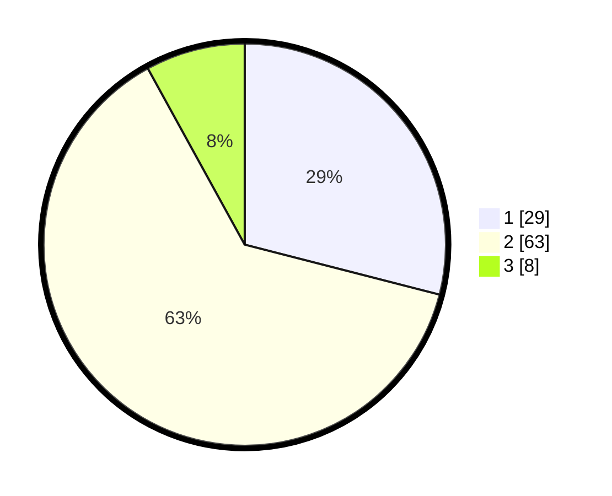

# Hasil

## Grafik

## Tabel

| No. | Nama Paslon    | Suara | Suara (raw) | Persentase |
|:--- |:-------------- | -----:| -----------:| ----------:|
| 1   | ANIES MUHAIMIN | 29    | [29][p-1]   | 29,00      |
| 2   | PRABOWO GIBRAN | 63    | [63][p-2]   | 63,00      |
| 3   | GANJAR MAHFUD  | 8     | [8][p-3]    | 8,00       |

[p-1]: https://github.com/gigit-pemilu/pemilu-2024-16-sumatera-selatan/blob/main/pilpres/hitung-suara/sub/16-sumatera-selatan/sub/06-musi-banyuasin/sub/01-sekayu/sub/1010-serasan-jaya/sub/023-tps/sub/paslon-1.txt
[p-2]: https://github.com/gigit-pemilu/pemilu-2024-16-sumatera-selatan/blob/main/pilpres/hitung-suara/sub/16-sumatera-selatan/sub/06-musi-banyuasin/sub/01-sekayu/sub/1010-serasan-jaya/sub/023-tps/sub/paslon-2.txt
[p-3]: https://github.com/gigit-pemilu/pemilu-2024-16-sumatera-selatan/blob/main/pilpres/hitung-suara/sub/16-sumatera-selatan/sub/06-musi-banyuasin/sub/01-sekayu/sub/1010-serasan-jaya/sub/023-tps/sub/paslon-3.txt

## Foto C Plano

https://sirekap-obj-formc.kpu.go.id/3b8f/pemilu/ppwp/16/06/01/10/10/1606011010023-20240220-230258--b5068996-3b38-48e0-8640-38727d2e1b2d.jpg

https://sirekap-obj-formc.kpu.go.id/3b8f/pemilu/ppwp/16/06/01/10/10/1606011010023-20240220-230037--769d70c1-302a-4188-9a6c-06e0ed3edcdb.jpg

https://sirekap-obj-formc.kpu.go.id/3b8f/pemilu/ppwp/16/06/01/10/10/1606011010023-20240220-230130--d9f5172d-a8e3-488c-b981-8cff975e27bd.jpg

## Metadata

| Key        | Value               |
| ---------- | ------------------- |
| Time Stamp | 2024-02-21 22:00:00 |

