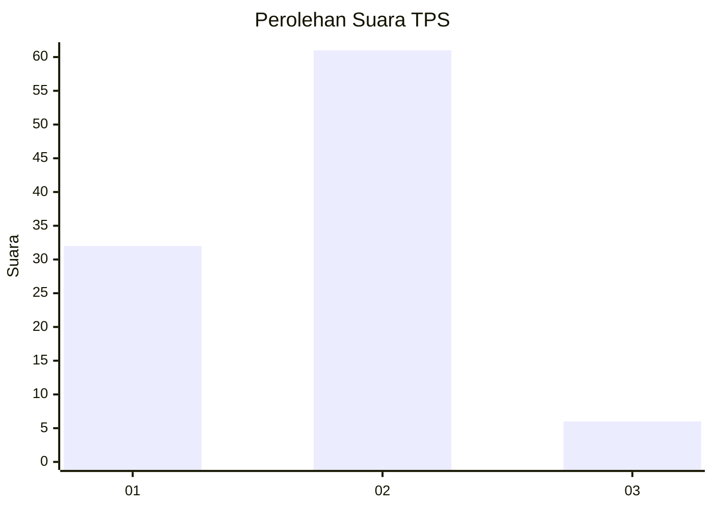
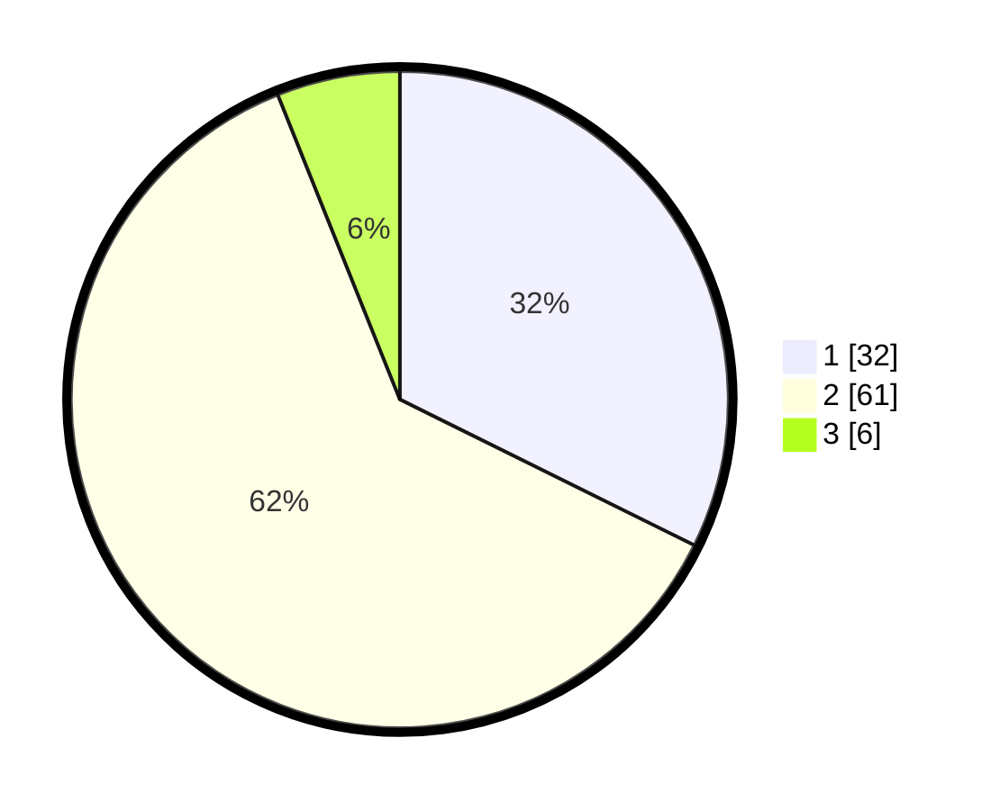

# Hasil

## Grafik

## Tabel

| No. | Nama Paslon    | Suara | Suara (raw) | Persentase |
|:--- |:-------------- | -----:| -----------:| ----------:|
| 1   | ANIES MUHAIMIN | 32    | [32][p-1]   | 32,32      |
| 2   | PRABOWO GIBRAN | 61    | [61][p-2]   | 61,62      |
| 3   | GANJAR MAHFUD  | 6     | [6][p-3]    | 6,06       |

[p-1]: https://github.com/gigit-pemilu/pemilu-2024-16-sumatera-selatan/blob/main/pilpres/hitung-suara/sub/16-sumatera-selatan/sub/06-musi-banyuasin/sub/01-sekayu/sub/1010-serasan-jaya/sub/024-tps/sub/paslon-1.txt
[p-2]: https://github.com/gigit-pemilu/pemilu-2024-16-sumatera-selatan/blob/main/pilpres/hitung-suara/sub/16-sumatera-selatan/sub/06-musi-banyuasin/sub/01-sekayu/sub/1010-serasan-jaya/sub/024-tps/sub/paslon-2.txt
[p-3]: https://github.com/gigit-pemilu/pemilu-2024-16-sumatera-selatan/blob/main/pilpres/hitung-suara/sub/16-sumatera-selatan/sub/06-musi-banyuasin/sub/01-sekayu/sub/1010-serasan-jaya/sub/024-tps/sub/paslon-3.txt

## Foto C Plano

https://sirekap-obj-formc.kpu.go.id/9a17/pemilu/ppwp/16/06/01/10/10/1606011010024-20240220-230847--4025d755-3712-4e7b-b79d-62d00acedeea.jpg

https://sirekap-obj-formc.kpu.go.id/9a17/pemilu/ppwp/16/06/01/10/10/1606011010024-20240220-230745--cc806c7a-9871-4bc6-a6bf-38d7075ebc76.jpg

https://sirekap-obj-formc.kpu.go.id/9a17/pemilu/ppwp/16/06/01/10/10/1606011010024-20240220-230951--56e66fb9-cc3b-4ca2-9ecd-5197f362031d.jpg

## Metadata

| Key        | Value               |
| ---------- | ------------------- |
| Time Stamp | 2024-02-24 22:31:28 |

