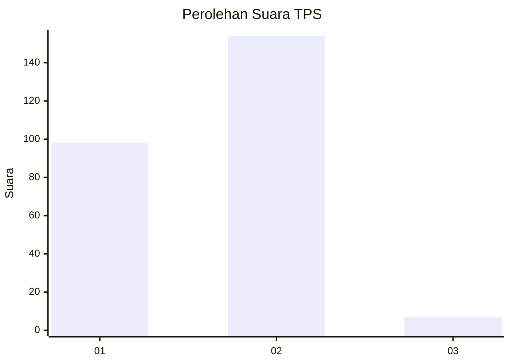
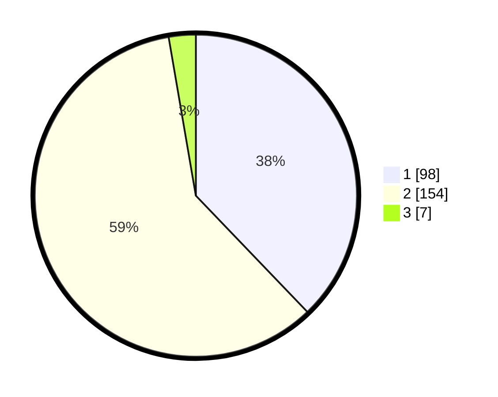

# Hasil

## Grafik

## Tabel

| No. | Nama Paslon    | Suara | Suara (raw) | Persentase |
|:--- |:-------------- | -----:| -----------:| ----------:|
| 1   | ANIES MUHAIMIN | 98    | [98][p-1]   | 37,84      |
| 2   | PRABOWO GIBRAN | 154   | [154][p-2]  | 59,46      |
| 3   | GANJAR MAHFUD  | 7     | [7][p-3]    | 2,70       |

[p-1]: https://github.com/gigit-pemilu/pemilu-2024-16-sumatera-selatan/blob/main/pilpres/hitung-suara/sub/16-sumatera-selatan/sub/06-musi-banyuasin/sub/01-sekayu/sub/1010-serasan-jaya/sub/028-tps/sub/paslon-1.txt
[p-2]: https://github.com/gigit-pemilu/pemilu-2024-16-sumatera-selatan/blob/main/pilpres/hitung-suara/sub/16-sumatera-selatan/sub/06-musi-banyuasin/sub/01-sekayu/sub/1010-serasan-jaya/sub/028-tps/sub/paslon-2.txt
[p-3]: https://github.com/gigit-pemilu/pemilu-2024-16-sumatera-selatan/blob/main/pilpres/hitung-suara/sub/16-sumatera-selatan/sub/06-musi-banyuasin/sub/01-sekayu/sub/1010-serasan-jaya/sub/028-tps/sub/paslon-3.txt

## Foto C Plano

https://sirekap-obj-formc.kpu.go.id/67c2/pemilu/ppwp/16/06/01/10/10/1606011010028-20240220-233522--c0d8722c-19fa-40d0-b2db-f50ee36bf2f6.jpg

https://sirekap-obj-formc.kpu.go.id/67c2/pemilu/ppwp/16/06/01/10/10/1606011010028-20240220-233132--7e95d86d-57c8-45ba-a43b-5d752d76f6e4.jpg

https://sirekap-obj-formc.kpu.go.id/67c2/pemilu/ppwp/16/06/01/10/10/1606011010028-20240220-233224--a47baeac-88e5-43d0-b1da-7ba0b2aaf352.jpg

## Metadata

| Key        | Value               |
| ---------- | ------------------- |
| Time Stamp | 2024-02-24 22:31:28 |

