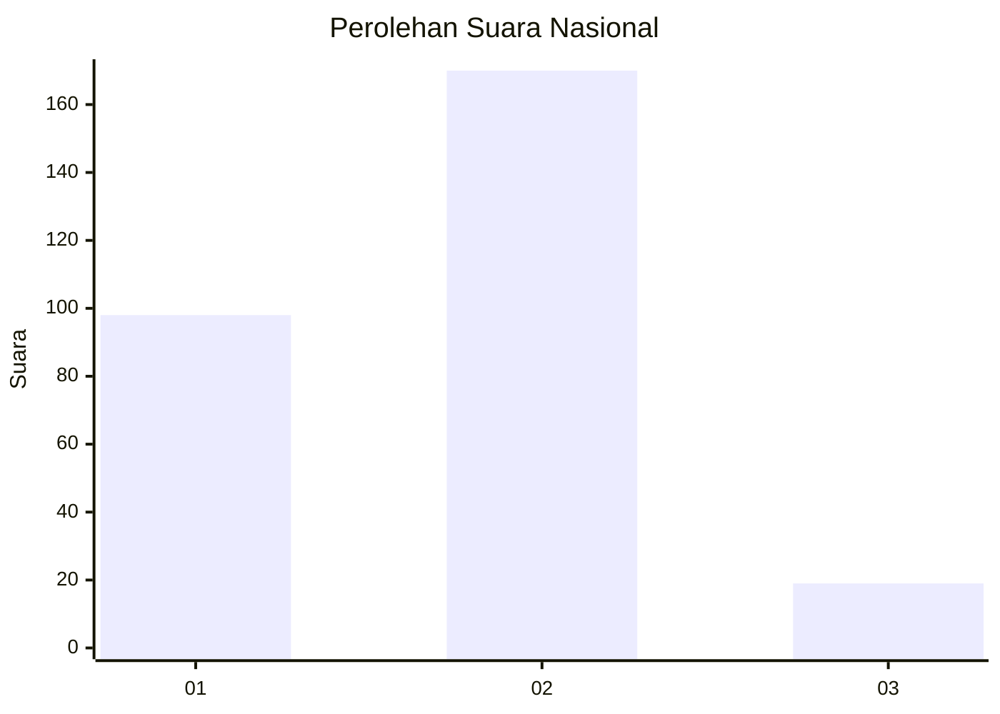
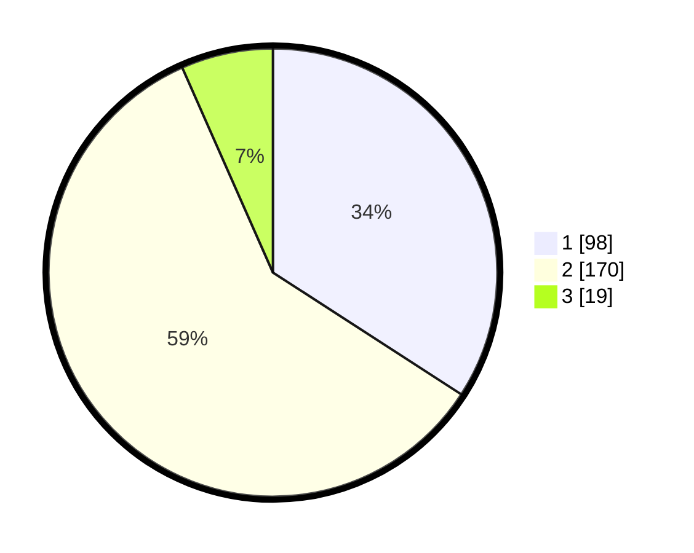

# Hasil

## Grafik

## Tabel

| No. | Nama Paslon    | Suara | Suara (raw) | Persentase |
|:--- |:-------------- | -----:| -----------:| ----------:|
| 1   | ANIES MUHAIMIN | 98    | [98][p-1]   | 34,15      |
| 2   | PRABOWO GIBRAN | 170   | [170][p-2]  | 59,23      |
| 3   | GANJAR MAHFUD  | 19    | [19][p-3]   | 6,62       |

[p-1]: https://github.com/gigit-pemilu/pemilu-2024/blob/main/pilpres/hitung-suara/sub/16-sumatera-selatan/sub/06-musi-banyuasin/sub/01-sekayu/sub/1010-serasan-jaya/sub/032-tps/sub/paslon-1.txt
[p-2]: https://github.com/gigit-pemilu/pemilu-2024/blob/main/pilpres/hitung-suara/sub/16-sumatera-selatan/sub/06-musi-banyuasin/sub/01-sekayu/sub/1010-serasan-jaya/sub/032-tps/sub/paslon-2.txt
[p-3]: https://github.com/gigit-pemilu/pemilu-2024/blob/main/pilpres/hitung-suara/sub/16-sumatera-selatan/sub/06-musi-banyuasin/sub/01-sekayu/sub/1010-serasan-jaya/sub/032-tps/sub/paslon-3.txt

## Foto C Plano

https://sirekap-obj-formc.kpu.go.id/a641/pemilu/ppwp/16/06/01/10/10/1606011010032-20240220-235127--7cd1e0b5-65b8-490c-b2cb-3041dc9546a2.jpg

https://sirekap-obj-formc.kpu.go.id/a641/pemilu/ppwp/16/06/01/10/10/1606011010032-20240214-190108--b66cd74b-5eec-45a2-b9e4-bdc7b02b496e.jpg

https://sirekap-obj-formc.kpu.go.id/a641/pemilu/ppwp/16/06/01/10/10/1606011010032-20240220-235230--997b159b-49f7-4a31-bc30-41996ac5dbe2.jpg

## Metadata

| Key        | Value               |
| ---------- | ------------------- |
| Time Stamp | 2024-02-21 18:00:00 |

