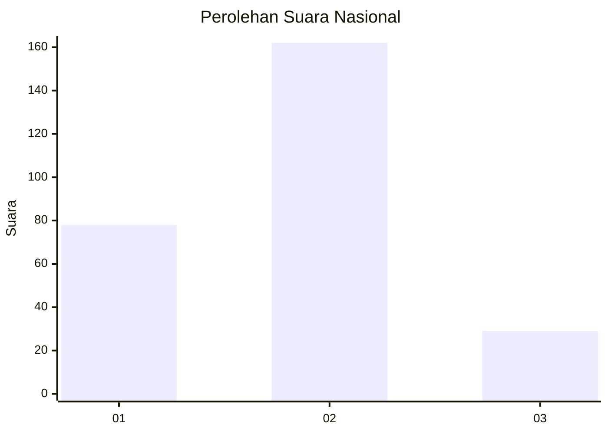
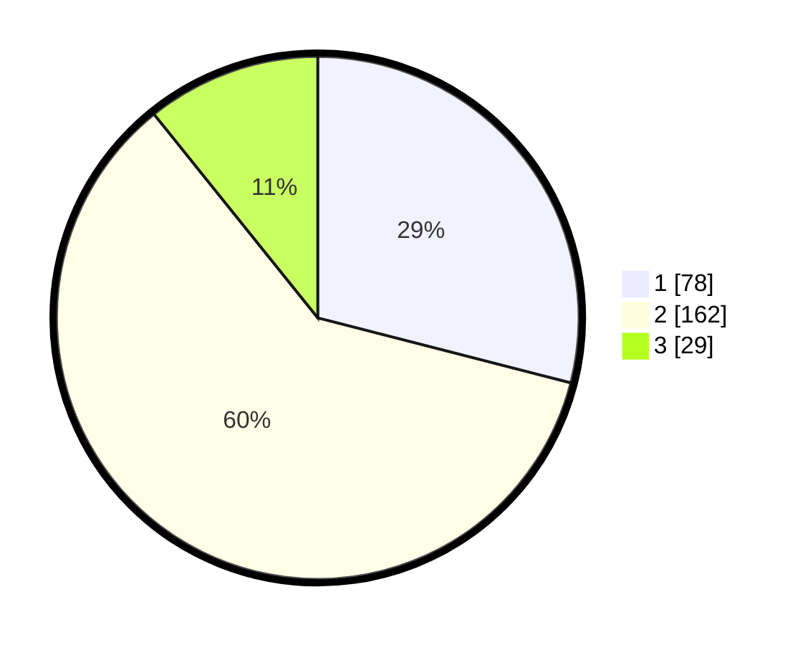

# Hasil

## Grafik

## Tabel

| No. | Nama Paslon    | Suara | Suara (raw) | Persentase |
|:--- |:-------------- | -----:| -----------:| ----------:|
| 1   | ANIES MUHAIMIN | 78    | [78][p-1]   | 29,00      |
| 2   | PRABOWO GIBRAN | 162   | [162][p-2]  | 60,22      |
| 3   | GANJAR MAHFUD  | 29    | [29][p-3]   | 10,78      |

[p-1]: https://github.com/gigit-pemilu/pemilu-2024/blob/main/pilpres/hitung-suara/sub/16-sumatera-selatan/sub/06-musi-banyuasin/sub/01-sekayu/sub/1011-soak-baru/sub/001-tps/sub/paslon-1.txt
[p-2]: https://github.com/gigit-pemilu/pemilu-2024/blob/main/pilpres/hitung-suara/sub/16-sumatera-selatan/sub/06-musi-banyuasin/sub/01-sekayu/sub/1011-soak-baru/sub/001-tps/sub/paslon-2.txt
[p-3]: https://github.com/gigit-pemilu/pemilu-2024/blob/main/pilpres/hitung-suara/sub/16-sumatera-selatan/sub/06-musi-banyuasin/sub/01-sekayu/sub/1011-soak-baru/sub/001-tps/sub/paslon-3.txt

## Foto C Plano

https://sirekap-obj-formc.kpu.go.id/83b4/pemilu/ppwp/16/06/01/10/11/1606011011001-20240218-112222--6d549283-4e6c-4255-8e09-c51ac51c8a17.jpg

https://sirekap-obj-formc.kpu.go.id/83b4/pemilu/ppwp/16/06/01/10/11/1606011011001-20240218-112320--ba689558-6209-4f8f-9c0b-899f42acd753.jpg

https://sirekap-obj-formc.kpu.go.id/83b4/pemilu/ppwp/16/06/01/10/11/1606011011001-20240218-112421--8d048d1e-4c1f-440b-8802-69f64d8c7d63.jpg

## Metadata

| Key        | Value               |
| ---------- | ------------------- |
| Time Stamp | 2024-02-19 06:16:00 |

