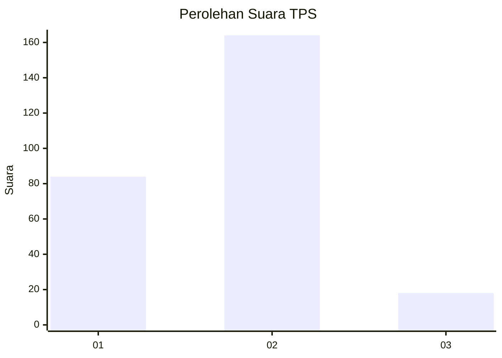
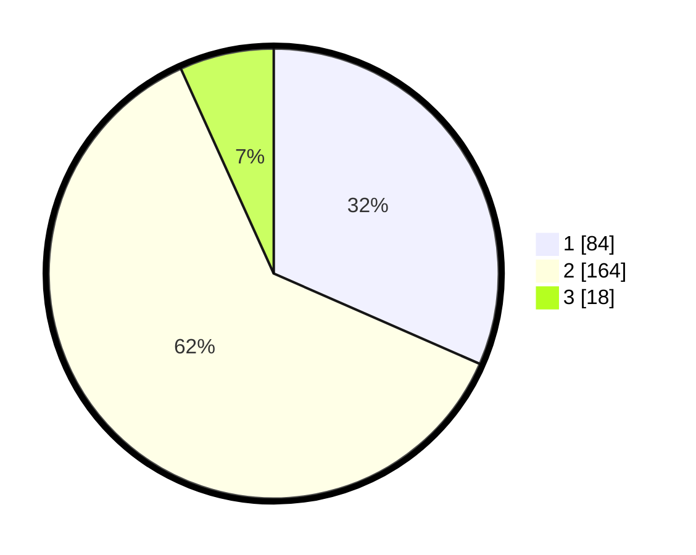

# Hasil

## Grafik

## Tabel

| No. | Nama Paslon    | Suara | Suara (raw) | Persentase |
|:--- |:-------------- | -----:| -----------:| ----------:|
| 1   | ANIES MUHAIMIN | 84    | [84][p-1]   | 31,58      |
| 2   | PRABOWO GIBRAN | 164   | [164][p-2]  | 61,65      |
| 3   | GANJAR MAHFUD  | 18    | [18][p-3]   | 6,77       |

[p-1]: https://github.com/gigit-pemilu/pemilu-2024-16-sumatera-selatan/blob/main/pilpres/hitung-suara/sub/16-sumatera-selatan/sub/06-musi-banyuasin/sub/01-sekayu/sub/1011-soak-baru/sub/021-tps/sub/paslon-1.txt
[p-2]: https://github.com/gigit-pemilu/pemilu-2024-16-sumatera-selatan/blob/main/pilpres/hitung-suara/sub/16-sumatera-selatan/sub/06-musi-banyuasin/sub/01-sekayu/sub/1011-soak-baru/sub/021-tps/sub/paslon-2.txt
[p-3]: https://github.com/gigit-pemilu/pemilu-2024-16-sumatera-selatan/blob/main/pilpres/hitung-suara/sub/16-sumatera-selatan/sub/06-musi-banyuasin/sub/01-sekayu/sub/1011-soak-baru/sub/021-tps/sub/paslon-3.txt

## Foto C Plano

https://sirekap-obj-formc.kpu.go.id/c146/pemilu/ppwp/16/06/01/10/11/1606011011021-20240215-030038--58fbd385-1e3f-4953-9a25-2125b5464934.jpg

https://sirekap-obj-formc.kpu.go.id/c146/pemilu/ppwp/16/06/01/10/11/1606011011021-20240215-025706--3614eb98-ee3c-41d5-ab2c-25742b260fe8.jpg

https://sirekap-obj-formc.kpu.go.id/c146/pemilu/ppwp/16/06/01/10/11/1606011011021-20240215-030226--878d5d73-b5a0-407a-a483-627c33ac291d.jpg

## Metadata

| Key        | Value               |
| ---------- | ------------------- |
| Time Stamp | 2024-02-17 16:00:02 |

