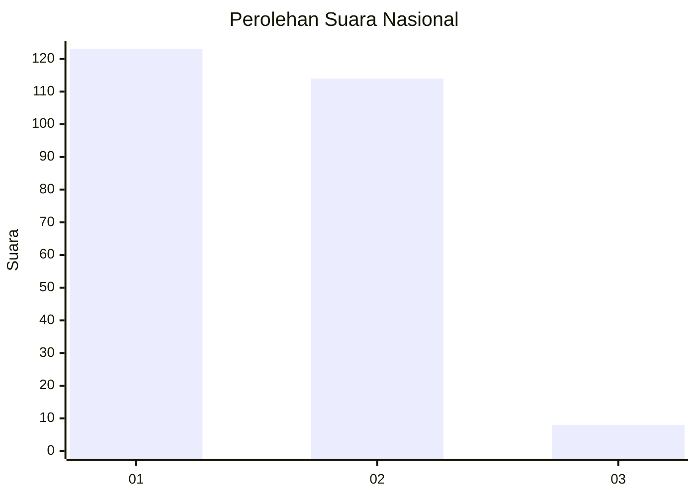
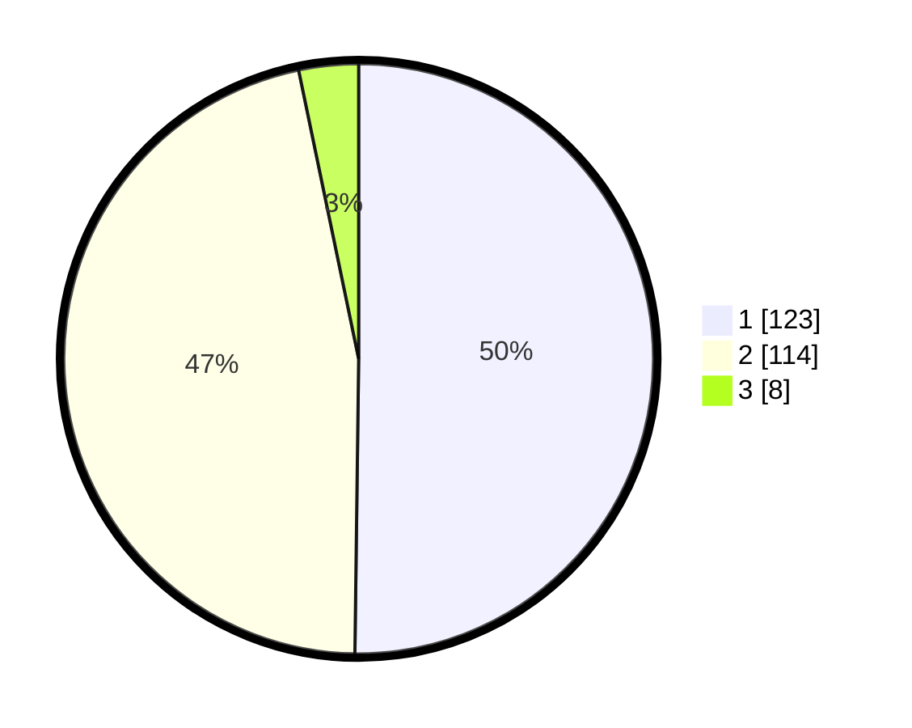

# Hasil

## Grafik

## Tabel

| No. | Nama Paslon    | Suara | Suara (raw) | Persentase |
|:--- |:-------------- | -----:| -----------:| ----------:|
| 1   | ANIES MUHAIMIN | 123   | [123][p-1]  | 50,20      |
| 2   | PRABOWO GIBRAN | 114   | [114][p-2]  | 46,53      |
| 3   | GANJAR MAHFUD  | 8     | [8][p-3]    | 3,27       |

[p-1]: https://github.com/gigit-pemilu/pemilu-2024/blob/main/pilpres/hitung-suara/sub/16-sumatera-selatan/sub/06-musi-banyuasin/sub/01-sekayu/sub/1012-balai-agung/sub/041-tps/sub/paslon-1.txt
[p-2]: https://github.com/gigit-pemilu/pemilu-2024/blob/main/pilpres/hitung-suara/sub/16-sumatera-selatan/sub/06-musi-banyuasin/sub/01-sekayu/sub/1012-balai-agung/sub/041-tps/sub/paslon-2.txt
[p-3]: https://github.com/gigit-pemilu/pemilu-2024/blob/main/pilpres/hitung-suara/sub/16-sumatera-selatan/sub/06-musi-banyuasin/sub/01-sekayu/sub/1012-balai-agung/sub/041-tps/sub/paslon-3.txt

## Foto C Plano

https://sirekap-obj-formc.kpu.go.id/8629/pemilu/ppwp/16/06/01/10/12/1606011012041-20240220-205800--04e7f0b5-4d44-4b85-a326-e517b6ac1e2f.jpg

https://sirekap-obj-formc.kpu.go.id/8629/pemilu/ppwp/16/06/01/10/12/1606011012041-20240220-205919--4ee2cd77-5b4b-41b4-8e3c-9e50c8cbac84.jpg

https://sirekap-obj-formc.kpu.go.id/8629/pemilu/ppwp/16/06/01/10/12/1606011012041-20240220-205947--9c74c4c7-58a1-41f4-adc0-f32ca4b071c0.jpg

## Metadata

| Key        | Value               |
| ---------- | ------------------- |
| Time Stamp | 2024-02-25 21:00:00 |

