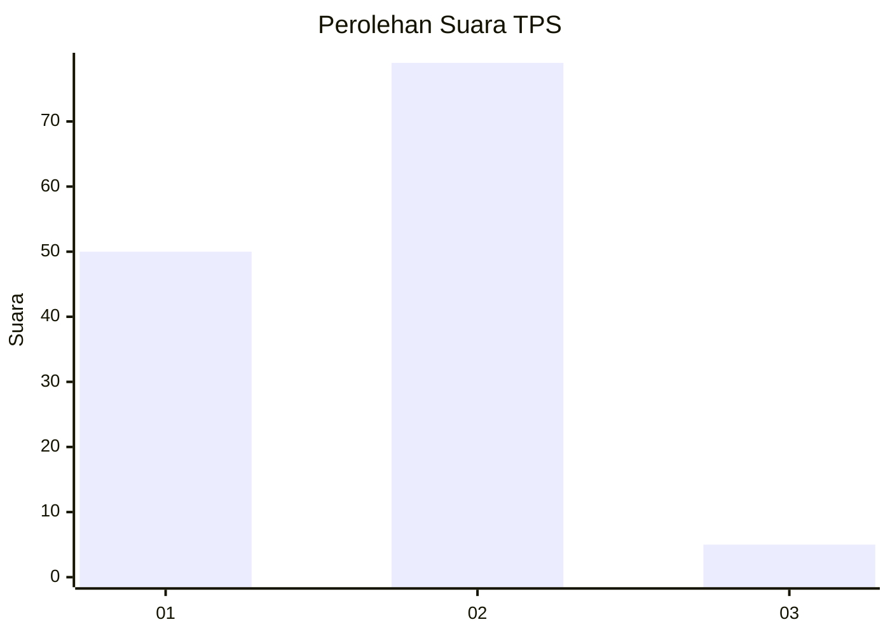
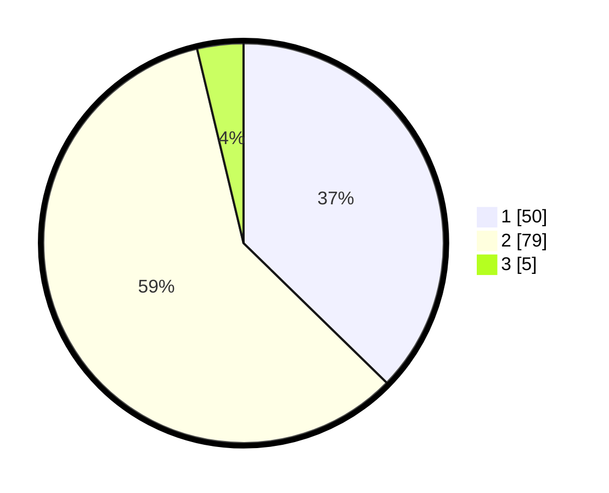

# Hasil

## Grafik

## Tabel

| No. | Nama Paslon    | Suara | Suara (raw) | Persentase |
|:--- |:-------------- | -----:| -----------:| ----------:|
| 1   | ANIES MUHAIMIN | 50    | [50][p-1]   | 37,31      |
| 2   | PRABOWO GIBRAN | 79    | [79][p-2]   | 58,96      |
| 3   | GANJAR MAHFUD  | 5     | [5][p-3]    | 3,73       |

[p-1]: https://github.com/gigit-pemilu/pemilu-2024-16-sumatera-selatan/blob/main/pilpres/hitung-suara/sub/16-sumatera-selatan/sub/06-musi-banyuasin/sub/01-sekayu/sub/1012-balai-agung/sub/051-tps/sub/paslon-1.txt
[p-2]: https://github.com/gigit-pemilu/pemilu-2024-16-sumatera-selatan/blob/main/pilpres/hitung-suara/sub/16-sumatera-selatan/sub/06-musi-banyuasin/sub/01-sekayu/sub/1012-balai-agung/sub/051-tps/sub/paslon-2.txt
[p-3]: https://github.com/gigit-pemilu/pemilu-2024-16-sumatera-selatan/blob/main/pilpres/hitung-suara/sub/16-sumatera-selatan/sub/06-musi-banyuasin/sub/01-sekayu/sub/1012-balai-agung/sub/051-tps/sub/paslon-3.txt

## Foto C Plano

https://sirekap-obj-formc.kpu.go.id/ec3e/pemilu/ppwp/16/06/01/10/12/1606011012051-20240220-220919--e8ed624c-d52c-4a80-8fad-4734c138826a.jpg

https://sirekap-obj-formc.kpu.go.id/ec3e/pemilu/ppwp/16/06/01/10/12/1606011012051-20240214-194618--c684874a-c130-49ea-ae60-89959b447b61.jpg

https://sirekap-obj-formc.kpu.go.id/ec3e/pemilu/ppwp/16/06/01/10/12/1606011012051-20240214-194625--fba35e30-47e1-4edc-9b7e-689ce0ed1f57.jpg

## Metadata

| Key        | Value               |
| ---------- | ------------------- |
| Time Stamp | 2024-02-20 23:00:00 |

