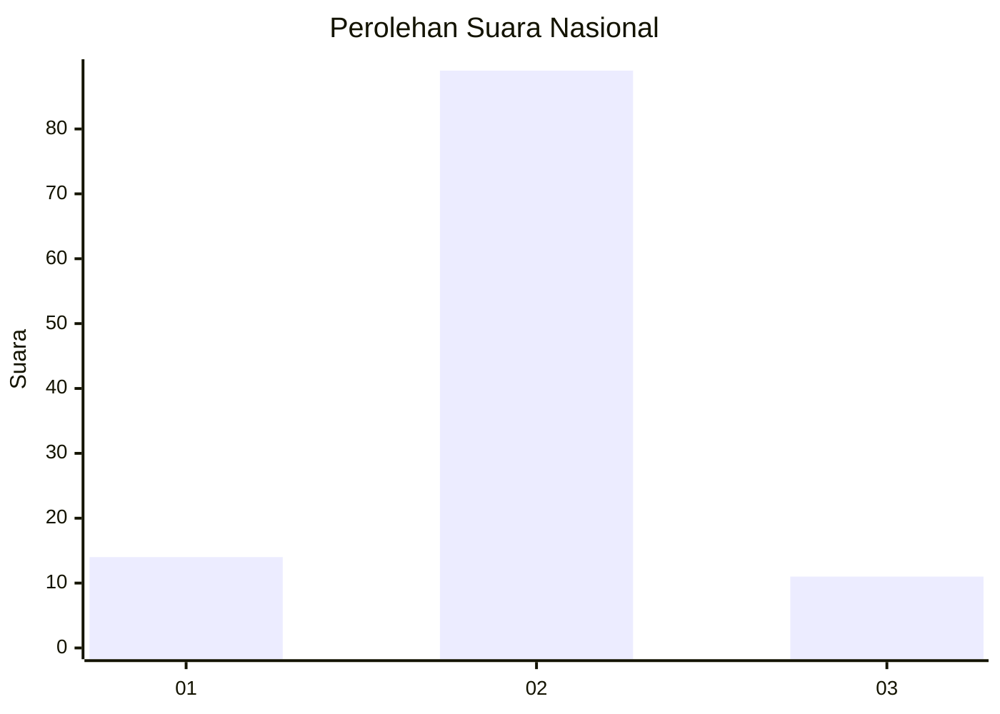
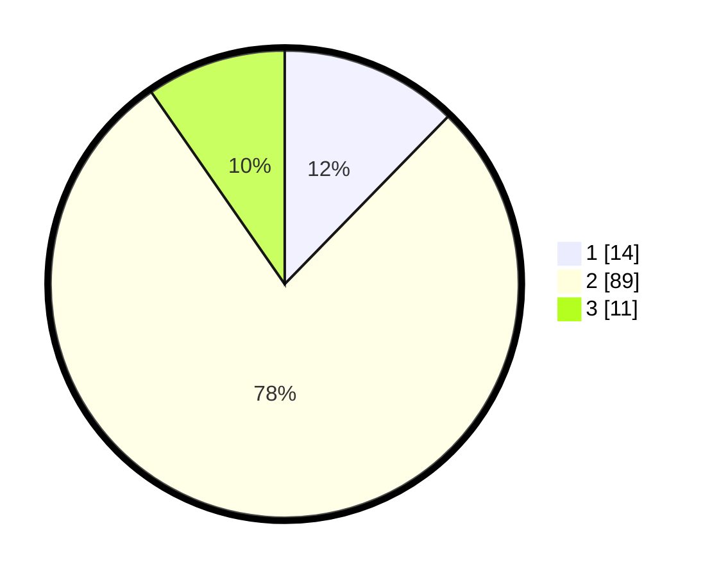

# Hasil

## Grafik

## Tabel

| No. | Nama Paslon    | Suara | Suara (raw) | Persentase |
|:--- |:-------------- | -----:| -----------:| ----------:|
| 1   | ANIES MUHAIMIN | 14    | [14][p-1]   | 12,28      |
| 2   | PRABOWO GIBRAN | 89    | [89][p-2]   | 78,07      |
| 3   | GANJAR MAHFUD  | 11    | [11][p-3]   | 9,65       |

[p-1]: https://github.com/gigit-pemilu/pemilu-2024/blob/main/pilpres/hitung-suara/sub/16-sumatera-selatan/sub/06-musi-banyuasin/sub/01-sekayu/sub/2002-lumpatan/sub/015-tps/sub/paslon-1.txt
[p-2]: https://github.com/gigit-pemilu/pemilu-2024/blob/main/pilpres/hitung-suara/sub/16-sumatera-selatan/sub/06-musi-banyuasin/sub/01-sekayu/sub/2002-lumpatan/sub/015-tps/sub/paslon-2.txt
[p-3]: https://github.com/gigit-pemilu/pemilu-2024/blob/main/pilpres/hitung-suara/sub/16-sumatera-selatan/sub/06-musi-banyuasin/sub/01-sekayu/sub/2002-lumpatan/sub/015-tps/sub/paslon-3.txt

## Foto C Plano

https://sirekap-obj-formc.kpu.go.id/8e73/pemilu/ppwp/16/06/01/20/02/1606012002015-20240225-094506--f9e55828-d1be-47ac-8157-0e02e1d5de6d.jpg

https://sirekap-obj-formc.kpu.go.id/8e73/pemilu/ppwp/16/06/01/20/02/1606012002015-20240217-213113--180d102c-e1b7-4c89-80d4-fa83b6e79f56.jpg

https://sirekap-obj-formc.kpu.go.id/8e73/pemilu/ppwp/16/06/01/20/02/1606012002015-20240217-213204--36e9720f-25f2-4ec3-8e4f-36b04c03f5d7.jpg

## Metadata

| Key        | Value               |
| ---------- | ------------------- |
| Time Stamp | 2024-02-25 10:00:00 |

